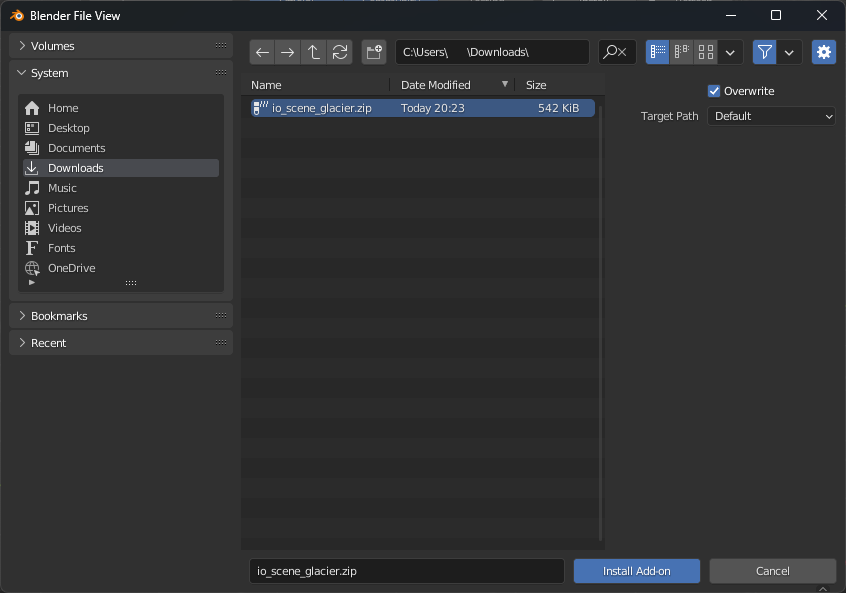
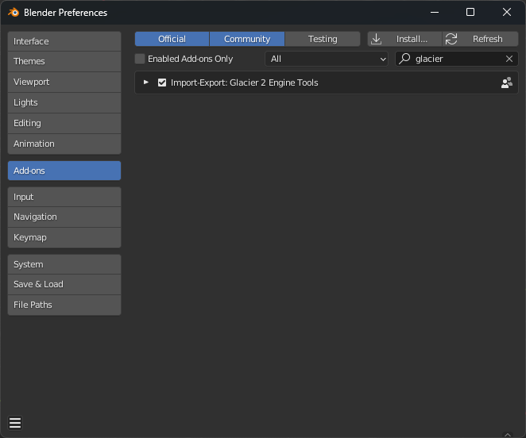

-   Download the Add-on: **[io_scene_glacier](https://github.com/glacier-modding/io_scene_glacier/releases/latest/download/io_scene_glacier-v0.1.0.zip)**.
-   Install the Add-on in Blender like so:
    -   Go to _Edit > Preferences > Add-ons_.
    -   Press the _Install…_ button and use the File Browser to select `io_scene_glacier.zip` and then press the `Install Add-on` button.
        
    -   Once complete you should now find an Add-on called `Glacier 2 Engine Tools` in Blender's Add-ons screen.
        
