# Creating a New Mission

For this tutorial, we will go over creating a new custom mission and location.  
The mission will take place in:
* The country of `Modlandia`
* The city of `Modtown`  

And the name of the mission will be `Modtown Throwdown`.

For this new mission we'll start it off relatively simple, just a flat floor with a small buildings and one NPCs. Since we've already covered creating and editing a mission in detail before, this time around will be a little more abbreviated. There are a lot of new things to cover since this will be a new location / destination as well, so this page will be a bit of a doozy!

> Remember to make small, incremental changes, and to save, deploy, launch the mission, and commit your changes if they are successful. Keep in mind that sometimes the mod will crash on deployment or mission launching if there is a resource that is being referenced but has not been created yet. If you have created all the required resources, double check all the factory and blueprint hashes, and be wary of whether it includes the square brackets (`[` and `]`) and subsequent extension, and whether that extension includes the `pc_` or not. Also make sure everything is in the correct chunk folder.   

## Adding a new Location and Parent Location
Since we are making a new mission from scratch, not based on any existing mission, let's also make a new Location and Parent Location for it, so that it will show up in the Destinations tab. This mainly involves updating the manifest and unlockables, and adding some new images.

## Updating the Manifest
Let's open the `manifest.json` file and add some new entries to the end of the `localisation > english` object:
```json
      "UI_LOCATION_PARENT_MODLANDIA_COUNTRY": "Modlandia",
      "UI_LOCATION_MODTOWN_COUNTRY": "Modlandia",
      "UI_LOCATION_PARENT_MODLANDIA_CITY": "Modtown",
      "UI_LOCATION_MODTOWN_CITY": "Modtown",
      "UI_LOCATION_MODTOWN_TITLE": "Modtown Throwdown",
      "UI_MODTOWN_DESC": "I need to take out Super Targetman.",
      "UI_MODTOWN_TITLE": "Modtown Throwdown mission",
      "UI_STARTING_LOCATION_MODTOWN_OUTSIDE_DEFAULT_NAME": "Outside",
      "UI_STARTING_LOCATION_MODTOWN_OUTSIDE_DESC": "47 has made his way outside in Modtown.",
      "NPC_SUPER_TARGETMAN_NAME": "Super Targetman",
      "NPC_SUPER_TARGETMAN_DESC": "Super Targetman is the villian of Modlandia."
```

Let's create a new packagedefinition entry:
```json
    {
      "type": "entity",
      "partition": "season3",
      "path": "[assembly:/_pro/scenes/missions/hitman_campaign_demo/mission_modtown/scene_modtown.entity].entitytemplate"
    }
```

Note that we set the partition to `season3`. This is because we won't need anything from any chunks other than `chunk0`, `chunk1`, and `chunk2`. For a refresher on chunks, see [Chunk Data](../../glacier2/chunkdata.md).

## Updating the repository file
In GlacierKit, open the `hitman_campaign_demo.repository.json` file and click on the `New item` button.

In the new item, replace the contents with:
```json
{
    "Image": "images/entrances/modtown/modtown_entrance_outside.jpg",
    "Name_LOC": "UI_STARTING_LOCATION_MODTOWN_OUTSIDE_DEFAULT_NAME",
    "Name": "Outside Starting Location",
    "Description": "UI_STARTING_LOCATION_MODTOWN_OUTSIDE_DESC"
}
```

We will need to add a new image: `images/entrances/modtown/modtown_entrance_outside.jpg`, which should have a resolution of 693 x 517.

For now let's reuse the `bank_entrance_ceo.jpg` file from the bank mission:  

and rename it to `modtown_entrance_outside.jpg`.

Click on the `New item` button again. In the new item, replace the contents with:
```json
{
	"CommonName": "Outfit Super Targetman",
	"Description": "Outfit Super Targetman",
	"Name": "Outfit Super Targetman",
	"Category": "",
	"HeroDisguiseAvailable": false,
	"Image": "",
	"ImageTransparent": "",
	"IsHitmanSuit": false,
	"TokenID": ""
}
```
We will need this new outfit's repository entry UUID from under the `Editor` header text.

Click on the `New item` button again. In the new item, replace the contents with:
```json
{
	"CharacterSetIndex": 0.0,
	"Description": "Super Targetman",
	"Description_LOC": "actor_description",
	"Image": "images/campaign_demo/modtown/super_targetman.jpg",
	"Name": "Super Targetman",
	"Outfit": "[NEW OUTFIT REPOSITORY ENTRY UUID]",
	"OutfitVariationIndex": 0.0,
	"Tile": "images/campaign_demo/modtown/super_targetman.jpg"
}
```
Replace `[NEW OUTFIT REPOSITORY ENTRY UUID]` with the UUID of the new outfit repository entry.

We will need to add a new image: `images/campaign_demo/modtown/super_targetman.jpg`, which should have a resolution of 693 x 517.

For now let's reuse the `target_mc_targetface.jpg` file from the bank mission:  

and rename it to `super_targetman.jpg`.

## Updating the Unlockables
In GlacierKit, open the `hitman_campaign_demo.unlockables.json` file and click the `New item` button. In the new Item, replace the contents with:
```json
{
	"Id": "LOCATION_PARENT_MODLANDIA",
	"Guid": "[NEW GENERATED UUID]",
	"Type": "location",
	"Subtype": "location",
	"ImageId": null,
	"RMTPrice": -1,
	"GamePrice": -1,
	"IsPurchasable": false,
	"IsPublished": true,
	"IsDroppable": false,
	"Capabilities": [],
	"Qualities": {},
	"Properties": {
		"Icon": "images/locations/modlandia/tile.jpg",
		"LockedIcon": "images/locations/modlandia/tile.jpg",
		"DlcImage": "images/livetile/dlc/tile_hitman3.jpg",
		"DlcName": "GAME_STORE_METADATA_S3_GAME_TITLE",
		"IsLocked": false,
		"UpcomingContent": false,
		"UpcomingKey": "UI_MENU_LIVETILE_CONTENT_UPCOMING_HEADLINE",
		"Background": "images/locations/modlandia/background.jpg",
		"Order": 0,
		"LimitedLoadout": false,
		"NormalLoadoutUnlock": "",
		"ProgressionKey": "LOCATION_MODLANDIA",
		"Season": 1,
		"RequiredResources": [
			"[assembly:/_pro/scenes/missions/hitman_campaign_demo/mission_modtown/scene_modtown.entity].entitytemplate"
		],
		"Entitlements": [
			"H1_LEGACY_STANDARD"
		]
	},
	"Rarity": null
}
```
Replace `[NEW GENERATED UUID]` with a newly generated UUID using GlacierKit.

We will also need to add new two new images: `images/locations/modlandia/tile.jpg`, which should have a resolution of 693 x 517, and `images/locations/modlandia/background.jpg`, which should be big enough to fit fullscreen (something like 1920 x 1080).

For now let's reuse the `tile.jpg` file from the bank mission:  
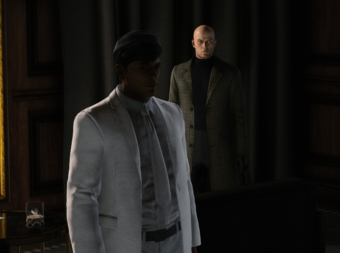

And the `campaign_demo_tile.jpg` file from the campaign folder:  


Now that we have our new parent location, let's add the sublocation.

In GlacierKit, on the `hitman_campaign_demo.unlockables.json` file, click the `New item` button. In the new Item, replace the contents with:
```json
{
  "Id": "LOCATION_MODTOWN",
  "Guid": "[NEW GENERATED UUID]",
  "Type": "location",
  "Subtype": "sublocation",
  "ImageId": null,
  "RMTPrice": -1,
  "GamePrice": -1,
  "IsPurchasable": false,
  "IsPublished": true,
  "IsDroppable": false,
  "Capabilities": [],
  "Qualities": {},
  "Properties": {
    "ParentLocation": "LOCATION_PARENT_MODLANDIA",
    "Icon": "images/campaign_demo/modtown/tile.jpg",
    "LockedIcon": "images/campaign_demo/modtown/tile.jpg",
    "DlcImage": "images/livetile/dlc/tile_hitman3.jpg",
    "DlcName": "GAME_STORE_METADATA_S3_GAME_TITLE",
    "IsLocked": false,
    "UpcomingContent": false,
    "UpcomingKey": "UI_MENU_LIVETILE_CONTENT_UPCOMING_HEADLINE",
    "Background": "images/campaign_demo/modtown/background.jpg",
    "Order": 0,
    "LimitedLoadout": false,
    "ProgressionKey": "LOCATION_MODTOWN",
    "CreateContractId": "[ANOTHER NEW GENERATED UUID]",
    "HideProgression": false,
    "RequiredResources": ["[assembly:/_pro/scenes/missions/hitman_campaign_demo/mission_modtown/scene_modtown.entity].entitytemplate"],
    "Entitlements": ["H1_LEGACY_EXPANSION"]
  },
  "Rarity": null
}
```
Replace `[NEW GENERATED UUID]` with a newly generated UUID using GlacierKit.

Replace `[ANOTHER NEW GENERATED UUID]` with a different newly generated UUID using GlacierKit.

We will also need two more new images here: `images/locations/modtown/tile.jpg`, which should have a resolution of 693 x 517, and `images/locations/modtown/background.jpg`, which should be big enough to fit fullscreen (something like 1920 x 1080).

For now let's also reuse the `tile.jpg` file from the bank mission:  


And the `campaign_demo_tile.jpg` file from the campaign folder:  


Let's also create a new unlockable for the starting location. Click the `New item`. On the new item, set the contents to:
```json
{
  "Id": "STARTING_LOCATION_OUTSIDE",
  "Type": "access",
  "Subtype": "startinglocation",
  "RMTPrice": -1,
  "GamePrice": -1,
  "IsPurchasable": false,
  "IsPublished": true,
  "IsDroppable": false,
  "Capabilities": [],
  "Qualities": {},
  "Properties": {
    "Location": "LOCATION_MODTOWN",
    "RepositoryId": "[NEW STARTING LOCATION REPOSITORY ENTRY UUID]",
    "Equip": [],
    "UnlockOrder": 3
  }
}
```

Replace `[NEW GENERATED UUID]` with a new UUID generated with GlacierKit.

The next steps are similar to what we did for the bank mission, so let's just quickly go through them.

## Update the Story Config
Open the `storyconfig.JSON.patch.json` file. Add a new object in the `StoryData` array:
```json
{
    "Type": "Mission",
    "Id": "[NEW GENERATED UUID]",
    "_comment": "The Modtown Throwdown mission for the Hitman Campaign Demo"
}
```
Replace `[NEW GENERATED UUID]` with a new UUID generated with GlacierKit.

Click the save button.

## Update the Menu Map Setup file
In GlacierKit, open the `menumapsetup_hitman_campaign_demo.entity.json` file. On the `Tree` tab, expand the `Scene > MenuMapSetup_HitmanCampaignDemo` node. Right-click on the `MenuMapSetup_HitmanCampaignDemo` node and click `Create Entity`, and name it `Scene_Modtown`. Replace everything under the `parent` field with:
```json
	"name": "Scene_Modtown",
	"factory": "[assembly:/templates/ui/mapexportentities.template?/menumap.entitytemplate].pc_entitytype",
	"blueprint": "[assembly:/templates/ui/mapexportentities.template?/menumap.entitytemplate].pc_entityblueprint",
	"properties": {
		"m_pMetaDataResource": {
			"type": "ZRuntimeResourceID",
			"value": {
				"resource": "",
				"flag": "5F"
			}
		}
	}
}
```

The `m_pMetaDataResource > value > resource` field is where we will set the planning contract's IOI string for our new mission. Let's use `(planning contract) modlandia modtown`. Add this to the `Custom paths` in the GlacierKit Settings.   

In the `Text tools`, convert `(planning contract) modlandia modtown` to a Hex hash: `001421449C722898`, and enter that in the resource field of the `Scene_Modtown` entity.

Press the save button.

## Creating a new Planning Contract file
In the `content/chunk0/Planning Contracts` folder, create a new folder named `modtown`. Right-click on the new `modtown` folder and click `New file` and set the filename to our new planning contract's hex hash with `.JSON` at the end: `001421449C722898.JSON`.

Open that file and set the contents to:
```json
{
    "scene": "assembly:/_pro/scenes/missions/hitman_campaign_demo/mission_modtown/scene_modtown.entity",
    "actors": [],
    "entrances": [
        {
            "id": "[NEW STARTING LOCATION's REPOSITORY ENTRY'S UUID]",
            "isDefaultSpawn": true,
            "isPreferredSpawn": true,
            "WorldTransform": "0, 0, 0, 0, 0, 0, 0, 0, 1, 0, 0, 0"
        }
	],
	"Exits": [
      {
        "id": "[NEW GENERATED EXIT UUID]",
        "WorldTransform": "0, 0, 0, 0, 0, 0, 0, 0, 1, 0, 0, 0",
        "RequireKey": false
      }
	],
	"AgencyPickups": [
	]
}
```
Replace `[NEW STARTING LOCATION's REPOSITORY ENTRY'S UUID]` with your new starting location's repository entry's UUID.

Replace `[NEW GENERATED EXIT UUID]` with a new UUID generated using GlacierKit.

Press the save button.

## Creating a new Mission Contract file
Right-click on the `content/chunk0/Mission Contracts` folder, click `New file`, and set the filename to `mission_modtown.contract.json`. Open that file and set the contents to:
```json
{
    "Data": {
        "EnableSaving": true,
        "Objectives": [
            {
                "Id": "[NEW GENERATED UUID]",
                "Category": "primary",
                "ObjectiveType": "setpiece",
                "DisplayAsKillObjective": true,
                "ForceShowOnLoadingScreen": true,
                "IsHidden": false,
                "BriefingName": "$($repository [TARGET'S UUID]).Name",
                "Image": "images/campaign_demo/modtown/super_targetman.jpg",
                "HUDTemplate": {
                    "display": "Eliminate Super Targetman"
                },
                "BriefingText": "Eliminate Super Targetman",
                "SuccessEvent": {
                    "EventName": "Kill",
                    "EventValues": {
                        "RepositoryId": "[TARGET'S UUID]"
                    }
                }
            }
        ],
        "GameDifficulties": [
            {
                "Difficulty": "easy",
                "Bricks": []
            },
            {
                "Difficulty": "normal",
                "Bricks": []
            },
            {
                "Difficulty": "hard",
                "Bricks": []
            }
        ],
        "Bricks": [],
        "DevOnlyBricks": [],
        "Entrances": [
            "[ENTRANCE UUID]"
        ],
        "GameChangers": [],
        "GameChangerReferences": []
    },
    "Metadata": {
        "Id": "[ANOTHER NEW GENERATED UUID]",
        "IsPublished": true,
        "Title": "UI_MODTOWN_TITLE",
        "Description": "UI_MODTOWN_DESC",
        "CodeName_Hint": "Modtown",
        "ScenePath": "assembly:/_pro/scenes/missions/hitman_campaign_demo/mission_modtown/scene_modtown.entity",
        "TileImage": "images/campaign_demo/modtown/tile.jpg",
        "Location": "LOCATION_MODTOWN",
        "LastUpdate": "2025-05-02T19:44:00.000Z",
        "CreationTimestamp": "2025-05-02T19:44:00.000Z",
        "CreatorUserId": "a38f1dce-a7af-4a3c-a47a-5a94db8c0ed9",
        "Type": "mission",
        "Release": "3.0.0",
        "Entitlements": [
            "H2_LEGACY_EXPANSION"
        ]
    },
    "UserData": {},
    "SMF": {}
}
```
Replace `[NEW GENERATED UUID]` and `[ANOTHER NEW GENERATED UUID]` with newly generated UUIDs using GlacierKit.

Replace `[TARGET'S UUID]` with the new target's repository entry UUID.  

Replace `[ENTRANCE UUID]` with the new starting location's repository entry UUID.  

Click the save button.

## Creating a new Scene and Scenario
In the `content` folder, create a new folder named `chunk2`.

In GlacierKit, right-click on the new `chunk2` folder, and click `Create file` and name it `scene_modtown.entity.json` and click on it.

In the `Metadata` tab, in the `Factory hash` field, enter:  
`[assembly:/_pro/scenes/missions/hitman_campaign_demo/mission_modtown/scene_modtown.entity].pc_entitytemplate`  
In the `Blueprint hash`, enter:
`[assembly:/_pro/scenes/missions/hitman_campaign_demo/mission_modtown/scene_modtown.entity].pc_entityblueprint`  
In the `External Scenes` section, click the `Add an entry` button, enter:  
`[assembly:/_pro/scenes/missions/hitman_campaign_demo/mission_modtown/scenario_modtown.brick].pc_entitytype`  
and press the `Continue` button.

Press the save button.

Download the [empty_scenario_brick.entity.json](resources/empty_scenario_brick.entity.json) template again and save it as `content/chunk2/scenario_modtown.entity.json` and click it.
In the `Metadata` tab, in the `Factory hash` field, enter:  
`[assembly:/_pro/scenes/missions/hitman_campaign_demo/mission_modtown/scenario_modtown.brick].pc_entitytype`  
In the `Blueprint hash`, enter:
`[assembly:/_pro/scenes/missions/hitman_campaign_demo/mission_modtown/scenario_modtown.brick].pc_entityblueprint`  
In the `External scenes` section, click `Add an entry`, enter:  
`[assembly:/_pro/scenes/missions/hitman_campaign_demo/outfits_modtown.brick].pc_entitytype`  
and press `Continue`.

We will also need a few more external scenes to make the mission load properly. Add all of these as well:  
`[assembly:/_pro/scenes/bricks/gameessentialsbase.brick].pc_entitytype`  
`[assembly:/_pro/scenes/bricks/globaldata.brick].pc_entitytype`  
`[assembly:/_pro/scenes/bricks/ui_hitman_s2.brick].pc_entitytype`  
`[assembly:/_pro/scenes/bricks/ui_hitman_s3.brick].pc_entitytype`  

## Creating a new Starting Location

Switch to the `Tree` tab and rename the `Scenario_Empty` node to `Scenario_Modtown`. Expand the `Scenario_Modtown > Gameplay` node and right-click on the `Starting locations` node and click `Create Entity` and name it `Outside` and click on the `Outside` node. Replace everything in the contents after the `parent` field with:
```json
  "name": "Outside",
  "factory": "[assembly:/_pro/design/levelflow.template?/herospawn.entitytemplate].pc_entitytype",
  "blueprint": "[assembly:/_pro/design/levelflow.template?/herospawn.entitytemplate].pc_entityblueprint",
  "properties": {
    "m_mTransform": {
      "type": "SMatrix43",
      "value": {
        "rotation": {
          "x": 0,
          "y": 0,
          "z": 0
        },
        "position": {
          "x": 0,
          "y": 0,
          "z": 0
        }
      }
    },
    "m_sId": {
      "type": "ZGuid",
      "value": "[OUTSIDE STARTING LOCATION UUID]"
    },
    "m_bDefaultHeroSpawn": {
      "type": "bool",
      "value": true
    },
    "m_bPreferredHeroSpawn": {
      "type": "bool",
      "value": true
    },
    "m_eidParent": {
      "type": "SEntityTemplateReference",
      "value": "fffffffffffffffe",
      "postInit": true
    }
  }
}
```
Replace `[OUTSIDE STARTING LOCATION UUID]` with the new outside starting location's repository entry UUID. 

Right-click on the `Gameplay > Hero` node and click `Create Entity` and set the name to `Agent47_Default`, and click on the new entity node, and in the contents, replace everything after the `parent` field with:
```json
	"name": "Agent47_Default",
	"factory": "[assembly:/_pro/characters/templates/hero/agent47/agent47.template?/agent47_default.entitytemplate].pc_entitytype",
	"blueprint": "[assembly:/_pro/characters/templates/hero/agent47/agent47.template?/agent47_default.entitytemplate].pc_entityblueprint",
	"properties": {
		"m_mTransform": {
			"type": "SMatrix43",
			"value": {
				"rotation": {
					"x": 0,
					"y": 0,
					"z": 0
				},
				"position": {
					"x": 0,
					"y": 0,
					"z": 0
				}
			}
		},
		"m_eidParent": {
			"type": "SEntityTemplateReference",
			"value": "fffffffffffffffe",
			"postInit": true
		}
	}
}
```

## Creating a new Outside Room

Expand the `Environment` node. We have an empty `000_Outside` node, but let's replace it with a more filled out one. First let's delete that node by right-clicking it and pressing `Delete`. The `XXX_Room_Folder_Structure` node has some useful categories, so let's copy it. Right-click that node and press `Clipboard > Copy`. Then right-click the `Environment` node and press `Clipboard > Paste`.

Click the new `XXX_Room_Folder_Structure` node and in the contents, change the name to `000_Outside`.

Next let's make our new `000_Outside` node a `zroomentity`. In the contents for `000_Outside` replace everything after the `parent` field with:
```json
  "name": "000_Outside",
  "factory": "[modules:/zroomentity.class].pc_entitytype",
  "blueprint": "[modules:/zroomentity.class].pc_entityblueprint",
  "properties": {
    "m_vRoomMin": {
      "type": "SVector3",
      "value": {
        "x": -1000,
        "y": -1000,
        "z": -1000
      }
    },
    "m_vRoomMax": {
      "type": "SVector3",
      "value": {
        "x": 1000,
        "y": 1000,
        "z": 1000
      }
    },
    "m_mTransform": {
      "type": "SMatrix43",
      "value": {
        "rotation": {
          "x": 0,
          "y": 0,
          "z": 0
        },
        "position": {
          "x": 0,
          "y": 0,
          "z": 0
        }
      }
    },
    "m_bIsPrivate": {
      "type": "bool",
      "value": false
    },
    "m_bOutside": {
      "type": "bool",
      "value": true
    },
    "m_bCSMRoom": {
      "type": "bool",
      "value": true
    }
  },
  "subsets": {
    "Rooms": [
      "fffffffffffffffe"
    ]
  }
}
```
Right-click the `000_Outside > Geometry` node and click `Create Entity` and name it `Floor`. Click it and in the contents, replace everything after the `parent` field with:
```json
	"name": "Floor",
	"factory": "0065E6850BB157E2",
	"blueprint": "00B6E9D9DA6DE143",
	"properties": {
		"m_mTransform": {
			"type": "SMatrix43",
			"value": {
				"rotation": {
					"x": 0,
					"y": 0,
					"z": 0
				},
				"position": {
					"x": -10.0,
					"y": 10.0,
					"z": 0.0
				}
			}
		},
		"m_PrimitiveScale": {
			"type": "SVector3",
			"value": {
				"x": 20,
				"y": 20,
				"z": 1
			}
		},
		"m_bVisible": {
			"type": "bool",
			"value": true
		},
		"m_eRoomBehaviour": {
			"type": "ZSpatialEntity.ERoomBehaviour",
			"value": "ROOM_DYNAMIC"
		}
	}
}
```
Next, click on the `000_Outside` entity and copy the entity id underneath the `Editor` header text. Then click on the `Floor` node and at the bottom of the properties object, add a new object by adding a comma, then a `"`, and then start typing `m_eidParent`. The autocomplete will pop up. Select `m_eidParent` and press enter, and it will fill out the rest of the object. Replace the `null` value with the entity id you copied. Then it should look something like this:
```json
        ...
		"m_eRoomBehaviour": {
			"type": "ZSpatialEntity.ERoomBehaviour",
			"value": "ROOM_DYNAMIC"
		},
		"m_eidParent": {
			"type": "SEntityTemplateReference",
			"value": "abcd2f7d17f552be"
		}
	}
}
```
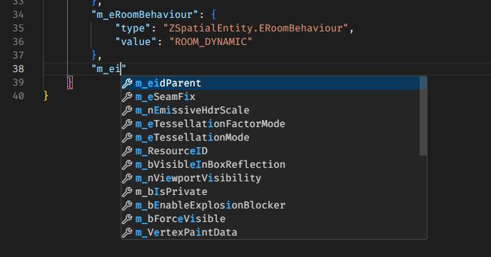

## Creating a new Exit

Next, right-click on the `Gameplay > Exit locations` node and click `Create Entity` and set the name to `Exit`. Click on the new `Exit` node and in the contents, replace everything after the `parent` field with:
```json
	"name": "Exit",
	"factory": "[assembly:/_pro/design/levelflow.template?/exit_pushbutton.entitytemplate].pc_entitytype",
	"blueprint": "[assembly:/_pro/design/levelflow.template?/exit_pushbutton.entitytemplate].pc_entityblueprint",
	"properties": {
		"m_mTransform": {
			"type": "SMatrix43",
			"value": {
				"rotation": {
					"x": 0.0,
					"y": 0.0,
					"z": 0.0
				},
				"position": {
					"x": 5.0,
					"y": 5.0,
					"z": 0.0
				}
			}
		},
		"m_sId": {
			"type": "ZGuid",
			"value": "[EXIT UUID]"
		},
		"Show3dExitSpatial": {
			"type": "bool",
			"value": true
		},
		"m_mTransforminteraction": {
			"type": "SMatrix43",
			"value": {
				"rotation": {
					"x": -0.0,
					"y": 0.0,
					"z": -0.0
				},
				"position": {
					"x": 0.07000000029802322,
					"y": -0.8199999928474426,
					"z": -0.3400000035762787
				}
			}
		},
		"m_mTransformprompt": {
			"type": "SMatrix43",
			"value": {
				"rotation": {
					"x": -0.0,
					"y": 0.0,
					"z": -0.0
				},
				"position": {
					"x": 0.0,
					"y": 0.0,
					"z": 1.2699999809265137
				}
			}
		},
		"m_mTransformexiticon": {
			"type": "SMatrix43",
			"value": {
				"rotation": {
					"x": -0.0,
					"y": 0.0,
					"z": -0.0
				},
				"position": {
					"x": 0.0,
					"y": 0.0,
					"z": 1.6200000047683716
				}
			}
		},
		"m_eidParent": {
			"type": "SEntityTemplateReference",
			"value": "fffffffffffffffe"
		}
	},
	"events": {
		"ExitActivated": {
			"Manual_Exit_Trigger": [
			]
		}
	}
}
```
Replace `[EXIT UUID]` with the exit's UUID from the planning contract. 

In the `events > ExitActivated > Manual_Exit_Trigger` array, add this new `Exit` entity's id.

## Creating a new NPC

Now right-click the `Scenario_Modtown > NPCs` node and click `Create Entity` and set the name to `Super Targetman`. Click on the new `Super Targetman` node and in the contents, replace everything after the `parent` field with:
```json
	"name": "Super Targetman",
	"factory": "[assembly:/templates/gameplay/ai2/actors.template?/npcactor.entitytemplate].pc_entitytype",
	"blueprint": "[assembly:/templates/gameplay/ai2/actors.template?/npcactor.entitytemplate].pc_entityblueprint",
	"properties": {
		"m_mTransform": {
			"type": "SMatrix43",
			"value": {
				"rotation": {
					"x": 0.0,
					"y": 0.0,
					"z": 0.0
				},
				"position": {
					"x": 10.0,
					"y": 0.0,
					"z": 0.0
				}
			}
		},
		"RepositoryId": {
			"type": "ZGuid",
			"value": "[SUPER TARGETMAN'S REPOSITORY ENTRY UUID]"
		},
		"m_OutfitRepositoryID": {
			"type": "ZGuid",
			"value": "[SUPER TARGETMAN'S OUTFIT'S REPOSITORY ENTRY UUID]"
		},
		"m_nOutfitVariation": {
			"type": "int32",
			"value": 0
		},
		"m_sActorName": {
			"type": "ZString",
			"value": "Super Targetman"
		},
		"m_nOutfitCharset": {
			"type": "int32",
			"value": 0
		},
		"m_eRequiredVoiceVariation": {
			"type": "EActorVoiceVariation",
			"value": "eAVV_CIVMALE08"
		},
		"m_aEnforcedOutfits": {
			"type": "TArray<SEntityTemplateReference>",
			"value": [
			]
		},
		"m_eidParent": {
			"type": "SEntityTemplateReference",
			"value": "fffffffffffffffe",
			"postInit": true
		}
	},
	"subsets": {
		"AudioEmitters": [
			"fffffffffffffffe"
		],
		"Replicable": [
			"fffffffffffffffe"
		]
	}
}
```

Replace `[SUPER TARGETMAN'S REPOSITORY ENTRY UUID]` and `[SUPER TARGETMAN'S OUTFIT'S REPOSITORY ENTRY UUID]` with the repository entries for Super Targetman and his outfit respectively.

## Adding a MapMarkup entity

Right-click on the `Gameplay` node and click `Create Entity` and name it `Map`. Right-click on that new node, and click `Create Entity`, name it `Modtown` and in the contents, replace everything after the `parent` field with:
```json
	"name": "Modtown",
	"factory": "[assembly:/templates/ui/mapmarkup.template?/menumap.entitytemplate].pc_entitytype",
	"blueprint": "[assembly:/templates/ui/mapmarkup.template?/menumap.entitytemplate].pc_entityblueprint",
	"properties": {
		"m_pMetaDataResource": {
			"type": "ZRuntimeResourceID",
			"value": {
				"resource": "001421449C722898",
				"flag": "5F"
			}
		}
	}
}
```
Where `001421449C722898` is the hash of our planning contract for this mission.

Press the save button.

## Adding lighting and a sky
Our scenario will also need lighting, a sky, and physics, otherwise everything will be dark and grey.

Download the [tod_day_sunny_clear.entity.json](resources/tod_day_sunny_clear.entity.json) file and save it to your `content/chunk2` folder as `tod_day_sunny_clear.entity.json`. This is a basic "time of day" brick that we can drop into any custom scene, that sets up a sunny clear day and blue sky.

Let's add some IOI strings for the time of day brick as well. In GlacierKit, on the `Settings` tab, in the `Custom paths` section, click the `Add an entry` button and enter:    
`[assembly:/_pro/scenes/missions/hitman_campaign_demo/tod_day_sunny_clear.brick].pc_entitytype`  
and press `Continue`. Click the `Add an entry` button again and enter:  
`[assembly:/_pro/scenes/missions/hitman_campaign_demo/tod_day_sunny_clear.brick].pc_entityblueprint`  
and press `Continue`.

In GlacierKit, go to the `scenario_modtown.entity.json` file and in the `External scenes` section click the `Add an entry` button, enter `[assembly:/_pro/scenes/missions/hitman_campaign_demo/tod_day_sunny_clear.brick].pc_entitytype`, and press `Continue`.

We will also need to set an override on this brick so that it's parent is our `000_Outside` room. Switch to the `Overrides` tab and on the `Property overrides` tab, paste this snippet into the array:
```json
    {
        "entities": [
            {
                "ref": "cafe9e975eba0134",
                "externalScene": "[assembly:/_pro/scenes/missions/hitman_campaign_demo/tod_day_sunny_clear.brick].pc_entitytype"
            }
        ],
        "properties": {
            "m_eidParent": {
                "type": "SEntityTemplateReference",
                "value": "[ENTITY ID OF THE 000_Outside ENTITY]"
            }
        }
    }
```
Replace `[ENTITY ID OF THE 000_Outside ENTITY]` with the entity id of the `000_Outside` entity from `scenario_modtown.entity.json`.

Press the save button.

## Adding Physics
We will also need the Scenario to have some physics entities defined. In GlacierKit, on the `scenario_modtown.entity.json` file, switch to the `Tree` view. Right-click on the `Physics` node and click `Create Entity`, name it `VolumeBox_WorldBounds` and click on the new entity, and in the contents, replace everything after the `parent` field with:
```json
	"name": "VolumeBox_WorldBounds",
	"factory": "[modules:/zboxvolumeentity.class].pc_entitytype",
	"blueprint": "[modules:/zboxvolumeentity.class].pc_entityblueprint",
	"properties": {
		"m_mTransform": {
			"type": "SMatrix43",
			"value": {
				"rotation": {
					"x": 0,
					"y": 0,
					"z": 0
				},
				"position": {
					"x": 0,
					"y": 0,
					"z": 0
				}
			}
		},
		"m_vGlobalSize": {
			"type": "SVector3",
			"value": {
				"x": 200,
				"y": 200,
				"z": 200
			}
		},
		"m_eidParent": {
			"type": "SEntityTemplateReference",
			"value": "fffffffffffffffe",
			"postInit": true
		}
	}
}
```
Then right-click on the `Physics` node again and click `Create Entity`, name it `FX_Logic_PhysicsWorld`, and click on it, and in the contents, replace everything after the `parent` field with:
```json
	"name": "FX_Logic_PhysicsWorld",
	"factory": "[assembly:/_pro/effects/templates/logic/fx_logic_physicsworld.template?/fx_logic_physicsworld.entitytemplate].pc_entitytype",
	"blueprint": "[assembly:/_pro/effects/templates/logic/fx_logic_physicsworld.template?/fx_logic_physicsworld.entitytemplate].pc_entityblueprint",
	"properties": {
		"m_WorldBounds": {
			"type": "SEntityTemplateReference",
			"value": null
		}
	}
}
```
Replace the `null` value for the `m_WorldBounds` property with the entity id of the `VolumeBox_WorldBounds` entity, for instance `"cafe047b052d1376"`

Press the save button.

## Updating the Charset
For simplicity, let's copy our entire outfit folder from `content/chunk12/Outfits` to `content/chunk2`. This cannot be done from GlacierKit, so in GlacierKit right-click on the `chunk12` folder and click `Show in Explorer`. Copy the outfit folder, then go to the `content/chunk2` folder and paste it.

In GlacierKit, the new folder should have appeared. Let's modify the files to fit our new mission and NPCs.

First rename the `chunk2/Outfits/charset_target_mctargetface.entity.json` file to `charset_super_targetman.entity.json`, then click on that file.

Rename the `CHARSET_TargetMcTargetface` to `CHARSET_SuperTargetman`. Expand the `CHARSET_SuperTargetman > Actor > 0` node and click on the `0` node. Replace the `properties > m_Outfit > value > resource` value with:  
`[assembly:/_pro/characters/templates/hitman_campaign_demo/outfit_super_targetman_actor_v0.entitytemplate].pc_entitytemplate`  

Next expand the `HeroA` node and click on `Var0`. Replace the `properties > m_Outfit > value > resource` value with:  
`[assembly:/_pro/characters/templates/hitman_campaign_demo/outfit_super_targetman_actor_v0.entitytemplate].pc_entitytemplate`  

Next expand the `Nude` node and click on `Var0`. Replace the `properties > m_Outfit > value > resource` value with:  
`[assembly:/_pro/characters/templates/hitman_campaign_demo/outfit_super_targetman_actor_v0.entitytemplate].pc_entitytemplate`

Next, switch to the `Metadata` tab. In the `Factory hash` text field enter:  
`[assembly:/_pro/characters/templates/hitman_campaign_demo/charset_super_targetman.entitytemplate].pc_entitytemplate`  
In the `Blueprint hash` text field enter:  
`[assembly:/_pro/characters/templates/hitman_campaign_demo/charset_super_targetman.entitytemplate].pc_entityblueprint`  
Press the save button.

## Updating the Outfit
Next, rename the `chunk2/Outfits/outfit_target_mctargetface_v0.entity.json` file to `outfit_super_targetman_v0.entity.json` and click on it. Rename the `OUTFIT_TargetMcTargetface_Actor_v0` node to `OUTFIT_SuperTargetman_Actor_v0` and expand it.

Since our outfit for the other mission took place on the New York brick, we might not have access to some of the outfit parts. For each part, we can check using GlacierKit. Click on the `Belt_StrapBuckle` node, copy the factory hash `0017355DDB3D75A3`, switch to the `Game content` tab and search for that hash. Check the `Separate tree by partition` checkbox.  
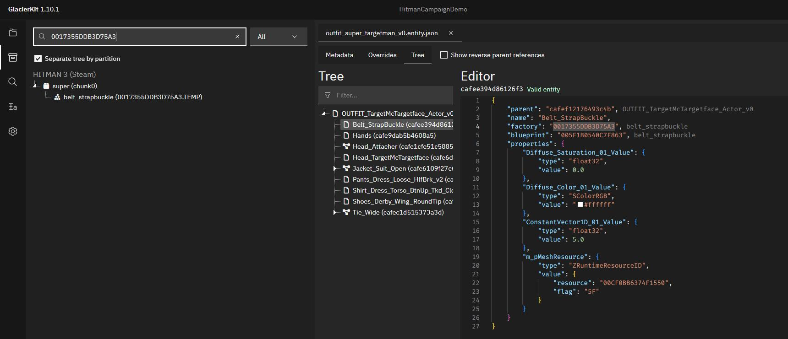  
We can see that the `Belt_StrapBuckle` resource is in the `super` / `chunk0` partition. Consulting our handy [Chunk Data](../../glacier2/chunkdata.md) guide, we can see that every chunk has access to the content in `chunk0` including the `season3` / `chunk2` partition that our new mission is in. So we are free to use this outfit part. Continuing with the rest of the outfit parts, we can see that every outfit part is in chunk0, except for the resource used by the `Head_TargetMcTargetface` node. We will need to swap that out. First let's rename the `Head_TargetMcTargetface` node to `Head_SuperTargetman`.  

Let's find Super Targetman a new head! In the `Game content` tab search for `head_` and set the dropdown to `Templates`, and make sure the `Separate tree by partition` checkbox is checked. Expand the `super (chunk0)` node and scroll down until you see the nodes with the icons of stacks of boxes in a triangle shape, and that end in `.TEMP`. Choose whichever head you'd like. In this example, `head_hippowhisperer` is used.
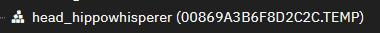  
Click on the head you'd like and click `Open in editor`, and switch to the `Metadata` tab. Copy the `Factory hash` value and switch back to the `outfit_super_targetman_v0.entity.json` file and paste it into the `Head_SuperTargetman` node's `factory` field. Switch back to the `head_hippowhisperer` resource and copy the `Blueprint hash` value and switch back to the `outfit_super_targetman_v0.entity.json` file and paste it into the `Head_SuperTargetman` node's `blueprint` field.  

Next, switch to the `Metadata` tab. In the `Factory hash` text field enter:  
`[assembly:/_pro/characters/templates/hitman_campaign_demo/outfit_super_targetman_actor_v0.entitytemplate].pc_entitytemplate
`  
In the `Blueprint hash` text field enter:  
`[assembly:/_pro/characters/templates/hitman_campaign_demo/outfit_super_targetman_actor_v0.entitytemplate].pc_entityblueprint`  

Press the save button.

## Updating the outfits brick
Rename the `chunk2/Outfits/outfits_bank.entity.json` file to `outfits_modtown.entity.json`, click on it, and switch to the `Metadata` tab. In the `Factory hash` field, enter:  
`[assembly:/_pro/scenes/missions/hitman_campaign_demo/outfits_modtown.brick].pc_entitytype`  
In the `Blueprint hash` field, enter:  
`[assembly:/_pro/scenes/missions/hitman_campaign_demo/outfits_modtown.brick].pc_entityblueprint`  
Switch to the `Tree` tab, and rename the `Target McTargetface` node to `Super Targetman` and click on that node. 

Change the `m_sId` value to the repository entry for the Super Targetman outfit.

Change the `m_sCommonName` and `m_sTitle` values to `Super Targetman`

Rename the `CHARSET_TargetMcTargetface` to `CHARSET_SuperTargetman` and click on that node.

Change the `factory` value to:  
`[assembly:/_pro/characters/templates/hitman_campaign_demo/charset_super_targetman.entitytemplate].pc_entitytemplate`  
Change the `blueprint` value to:  
`[assembly:/_pro/characters/templates/hitman_campaign_demo/charset_super_targetman.entitytemplate].pc_entityblueprint`

Delete the `Prof_Greedy_Unique_CEO` node.

Press the save button.

## Fixing game crashes
If all went well, we should be able to deploy the mod now and see our new mission.

If the game crashes when you start a mission, there may be an issue with the IOI strings. One useful trick to find these issues is to check the `project.json` file. Open it in WebStorm, format the file by going to the `Code` menu and pressing `Reformat Code`. Then select all the lines in the custom paths section, go to the `Edit` menu and press `Sort Lines`. After sorting, make sure to adjust the commas at the end of the lines to make the json valid.  

Double check that all the IOI strings are present and are what you expect, for instance, that there is a blueprint for each entity that needs one, and that there were no copy-paste errors. If you see anything amiss, fix the IOI string in the file that references it.  

For instance, if you don't see the `[assembly:/_pro/characters/templates/hitman_campaign_demo/charset_super_targetman.entitytemplate].pc_entityblueprint` IOI string, then open the `charset_super_targetman.entity.json` file, go to the Metadata tab, and set the `Blueprint hash` to that IOI string.  
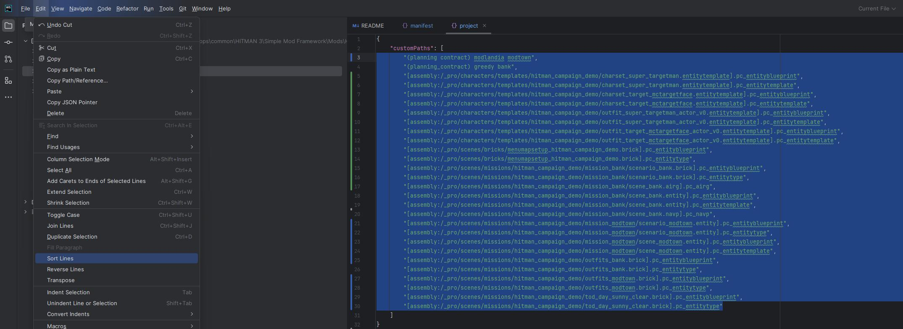  

In this screenshot, we can see that there is a typo for the `scenario_modtown` IOI string. It should be `scenario_modtown.brick`, but it says `scenario_modtown.entity`. In this instance, the fix would be to open the `scenario_modtown.entity.json` file and in the Metadata tab, replace the hash with the correct IOI string.  

Also be sure that any Hex hashes you use match the IOI string that you are expecting.  

Also make sure that you are not referencing anything that is not in an accessible chunk. For instance, if you left the `Prof_Greedy_Unique_CEO` profession in the `Super Targetman` outfit in the `outfits_modtown.entity.json` file, the game will crash because the `[assembly:/_pro/design/actor/profession.template?/prof_greedy_unique_ceo.entitytemplate].pc_entitytype` resource is not accessible in `chunk2`, since it is in `chunk12`. In this instance, the fix would be to delete the `Prof_Greedy_Unique_CEO` node from the `Super Targetman` outfit node.

Also make sure to check each entry in your Unlockables and Repository files to make sure all the IOI strings and hashes are correct.  

Sometimes (usually) if it crashes, there's more than one issue, so don't get discouraged, and just keep going through every file, double-checking all the hashes and paths on the `Metadata` tabs and in entity properties on the `Tree` tab, and making sure the files are in the correct chunk folder.

## Deploying and generating the NAVP and AIRG

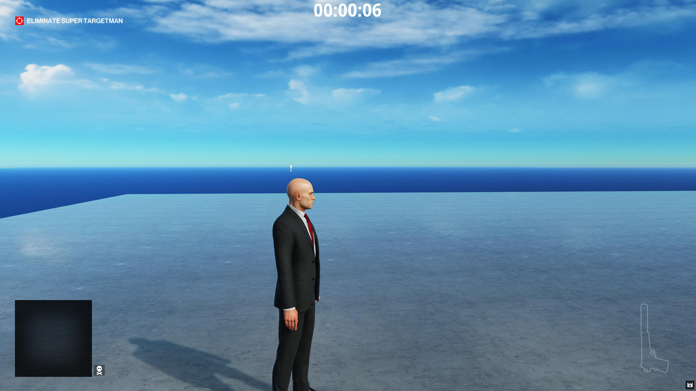
The lighting is nice, there is a sky, and there is a floor we can walk on that reflects the sky properly. But the NPC isn't where we expected him. Let's see if we can fix that by making a NAVP and AIRG.

Open NavKit and click the `Extract from game and build obj` button on the `Extract menu` on the right sidebar.

Once that's done, click the `Build Navp from Obj and Scene` button on the left sidebar.

Once that's done, click the `Build Airg from Navp` button on the `Airg menu` on the right sidebar.
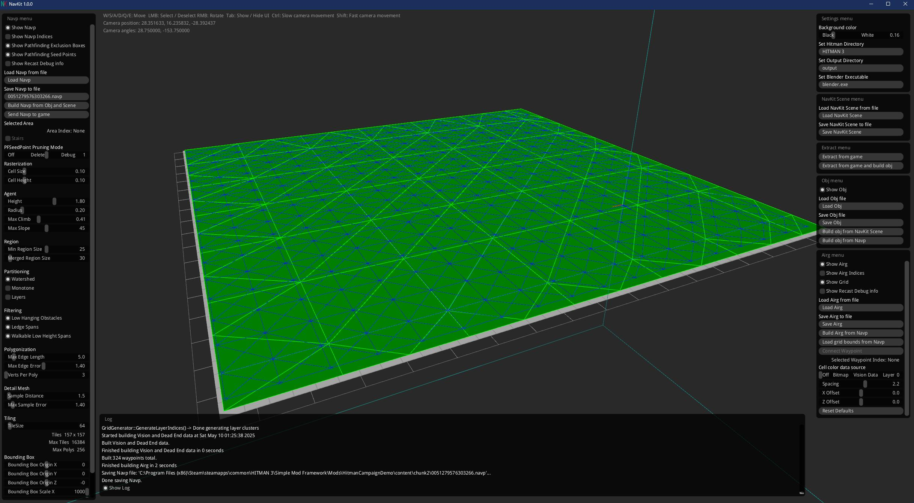
Let's make some new IOI strings for the NAVP and AIRG. For the NAVP, let's use:  
`[assembly:/_pro/scenes/missions/hitman_campaign_demo/mission_modtown/scene_modtown.navp].pc_navp`  
In GlacierKit, go to the `Settings` tab and on the `Custom paths` section, scroll down and press the `Add an entry` button. Paste in that IOI string and press `Continue`.

On the `Text tools` tab, paste that IOI string into the `Hash calculator` field and copy the value in the `Hex` text field.

Back in NavKit, click the `Save Navp` button, and navigate to the `content/chunk2` folder and name it the hex value you copied.

For the AIRG, let's use:  
`[assembly:/_pro/scenes/missions/hitman_campaign_demo/mission_modtown/scene_modtown.airg].pc_airg`  

In GlacierKit, go to the `Settings` tab and on the `Custom paths` section, scroll down and press the `Add an entry` button. Paste in that IOI string and press `Continue`.

On the `Text tools` tab, paste that IOI string into the `Hash calculator` field and copy the value in the `Hex` text field.

Back in NavKit, click the `Save Airg` button, and navigate to the `content/chunk2` folder and name it the hex value you copied.

Now that we have our NAVP and AIRG files, we need to tell the scenario to use them. In GlacierKit, go to the `scenario_modtown.entity.json` file on the `Tree` view, expand the `Scenario_Modtown > AI` node. Right-click on the `Pathfinding` node and click `Create Entity`, name it `Pathfinder_Configuration`, click on the new node and in the contents, replace everything after the `parent` field with:
```json
    "name": "Pathfinder_Configuration",
    "factory": "[modules:/zpathfinderconfiguration.class].pc_entitytype",
    "blueprint": "[modules:/zpathfinderconfiguration.class].pc_entityblueprint",
    "properties": {
        "m_NavpowerResourceID": {
            "type": "ZRuntimeResourceID",
            "value": {
                "resource": "[assembly:/_pro/scenes/missions/hitman_campaign_demo/mission_modtown/scene_modtown.navp].pc_navp",
                "flag": "5F"
            }
        }
    }
}
```
Right-click on the `AI Reasoning Grid` node and click `Create Entity`, name it `AI Reasoning Grid`, click on the new node and in the contents, replace everything after the `parent` field with:
```json
	"name": "AI Reasoning Grid",
	"factory": "[modules:/zreasoninggridconfigentity.class].pc_entitytype",
	"blueprint": "[modules:/zreasoninggridconfigentity.class].pc_entityblueprint",
	"properties": {
		"m_pGrid": {
			"type": "ZRuntimeResourceID",
			"value": {
				"resource": "[assembly:/_pro/scenes/missions/hitman_campaign_demo/mission_modtown/scene_modtown.airg].pc_airg",
				"flag": "5F"
			}
		}
	}
}
```

Deploy the mod, relaunch Hitman and start the mission.
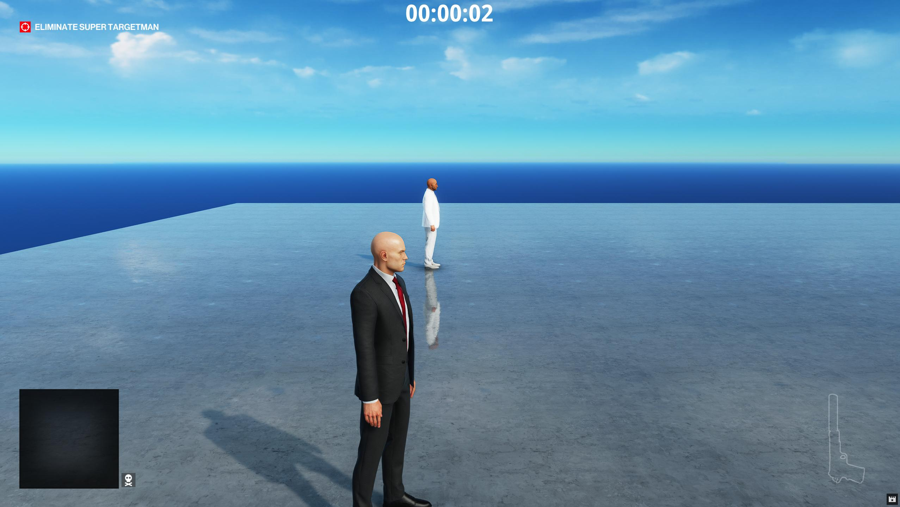
Now our NPC is in the right spot, and reacts properly when distracted or panicking.
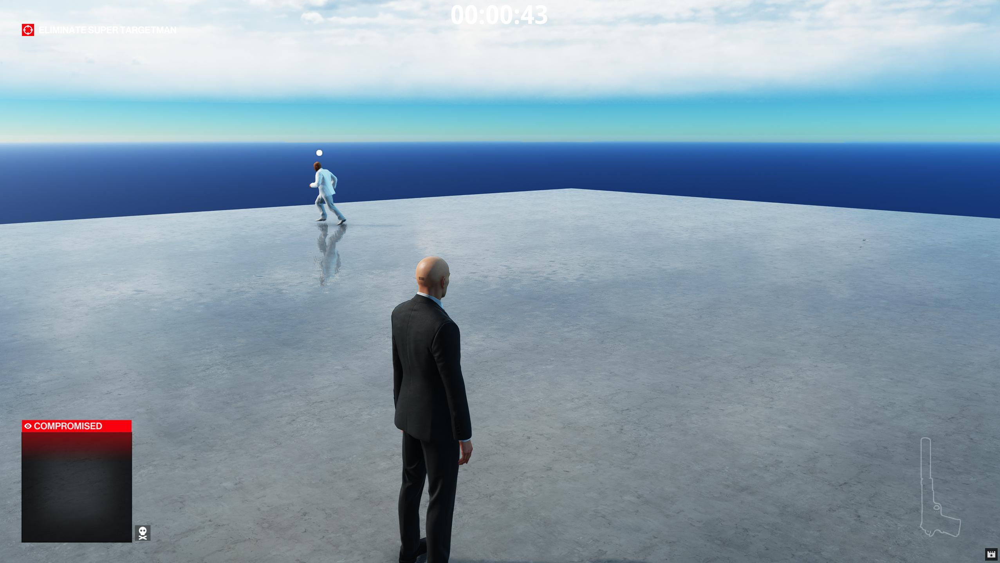
If we take out the target, the exit appears and functions properly.
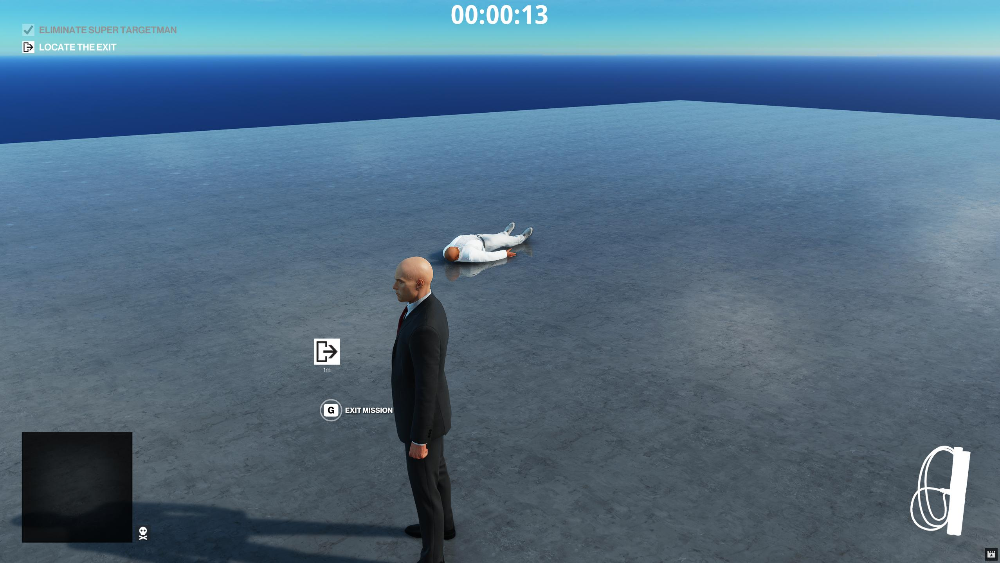

## Finding and adding geometry from in-game
Let's add a building for our NPC. We can build one with a few walls, and a door.

First, to make things a little easier, let's make a new composite entity for this house. Right-click the `000_Outside > Geometry` node and click `Create Entity` and name it `House`, click it, and in its contents, replace everything after the `parent` field with:  
```json
	"name": "House",
	"factory": "[modules:/zcompositeentity.class].pc_entitytype",
	"blueprint": "[modules:/zcompositeentity.class].pc_entityblueprint",
	"properties": {
		"m_mTransform": {
			"type": "SMatrix43",
			"value": {
				"rotation": {
					"x": 0,
					"y": 0,
					"z": 0
				},
				"position": {
					"x": 10,
					"y": 0,
					"z": 0
				}
			}
		},
        "m_eidParent": {
            "type": "SEntityTemplateReference",
            "value": null,
            "postInit": true
        }
	}
}
```
Set the `m_eidParent` value to the entity id of the `000_Outside` entity.

Since we're in chunk2, we can use anything from chunk0, chunk1, or chunk2. Dubai is in chunk0 and conveniently has plenty of examples of walls and doors.  
Let's use these entities:  
`penthouse_wall_interior_6x4_a`  
`penthouse_wall_door_interior_6x2_a`  
`penthouse_wall_corner_edge_interior_6m_a`  
`[assembly:/_pro/environment/templates/architecture/doors/doors_gecko_a.template?/gecko_singledoor_penthouse_staff_bathroom_a.entitytemplate].pc_entitytype`  
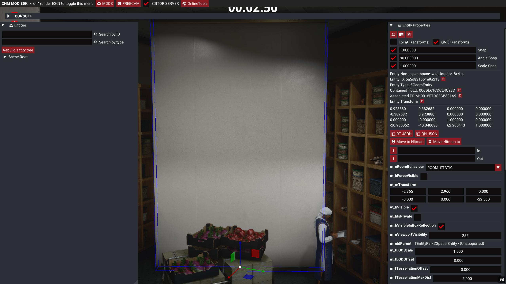
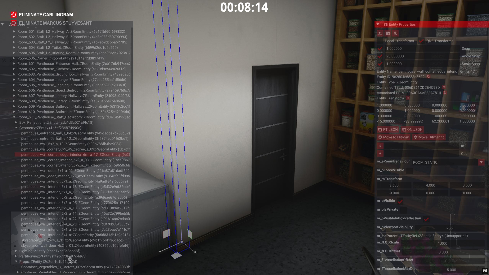

In GlacierKit, if the `Game content` tab, search for `scenario_gecko.brick` and click on it, click on the `Open in Editor` button and in the `Tree` view, search for `penthouse_wall_interior_6x4_a`. Right-click on one of the entities and click `Clipboard > Copy`.  
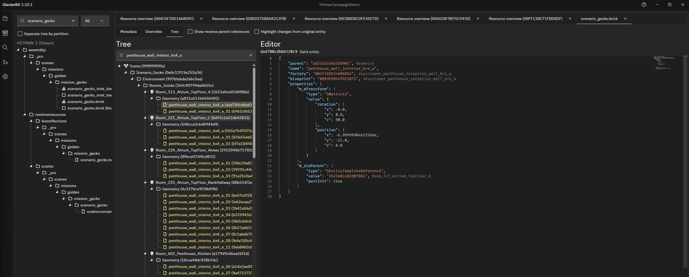
Switch back to the `scenario_modland.entity.json` file and on the tree view, right-click in the `Environment > 000_Outside > Geometry > House` node and click `Clipboard > paste`.

Click on the new node and set the `m_eidParent` value to the entity id of the `House` entity. Set the `position` object to:
```json
"position": {
    "x": 8.0,
    "y": 0.0,
    "z": 0.0
}
```
And the `rotation` object to:
```json
"rotation": {
    "x": 0.0,
    "y": 0.0,
    "z": 0.0
},
```
Right-click this new node, and click `Clipboard > Copy`, and paste five more copies of this node into the `House` node.

Switch back to `scenario_gecko.brick` and search for `penthouse_wall_door_interior_6x2_a`, and similarly copy and paste one of these entities into the `scenario_modland.entity.json` file and set the `m_eidParent` value to the entity id of the `House` entity. Set the `rotation` to all zeros like before and the `position` object to:
```json
"position": {
    "x": 5.0,
    "y": 0.0,
    "z": 0.0
}
```
Click on the new node and set the `m_eidParent` value to the entity id of the `House` node. Right-click this new node, and click `Clipboard > Copy`, and paste in one more copy of this node.

Do the same thing for `penthouse_wall_corner_edge_interior_6m_a`, and paste in one of these. Set the `rotation` to all zeros like before and the `position` object to:
```json
"position": {
    "x": 5.0,
    "y": 6.0,
    "z": 0.0
}
``` 
Right-click this new node and click `Clipboard > Copy`, and paste in 3 copies of this node.

Do the same thing for `gecko_singledoor_penthouse_staff_bathroom_a`. Set the `rotation` to all zeros like before and the `position` object to:
```json
"position": {
    "x": 8.0,
    "y": 6.0,
    "z": 0.0
}
``` 
Click on this new entity and set the `m_bIsLocked` value to `false`.

The positions of these won't be perfect at the moment, but once we get into the mission, we can modify these.

Press the save button, redeploy, relaunch hitman, and start the mission.

We can see that the door is rotated improperly, as are some of the walls. With GlacierKit open to `scenario_modtown.entity.json` we can change the transform of objects in our scenario and have the changes mirrored to GlacierKit, which makes editing the scenario relatively easy. First click the `Rebuild entity tree`.

Next, click on the door and press the `Tab` key to switch the gizmo from `translate` mode to `rotate` mode. Rotate the door so that it fits in the doorframe of the wall.
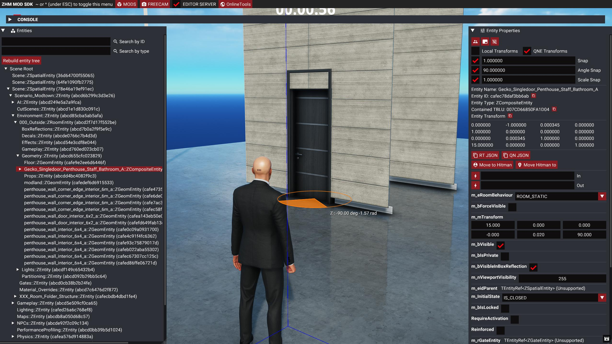

If you move past the walls, we can see that they are actually only one-sided, which is why we make two copies for each wall, so that for each wall we can have one facing each direction.

Click on the wall with the doorframe and rotate that 180 degrees.
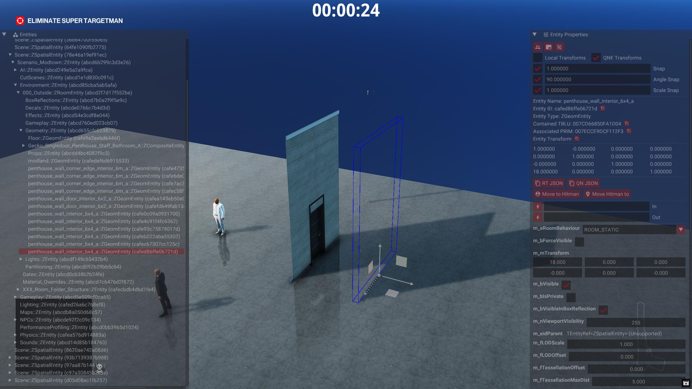

Select another wall and move it and rotate it so that it connects with our first wall. Also make sure to move another copy to that same spot and rotate it 180 degrees away from that.
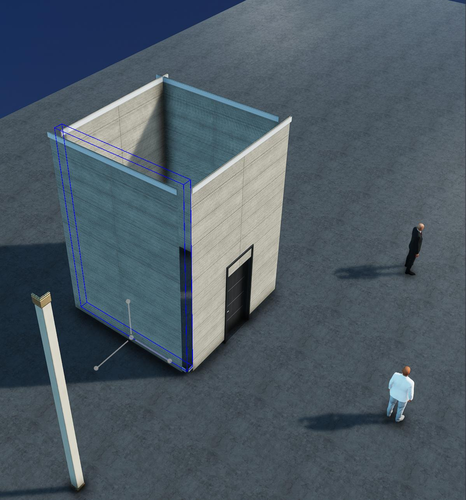

With the corner pieces, move those so that they fit into the outer corners of the house.
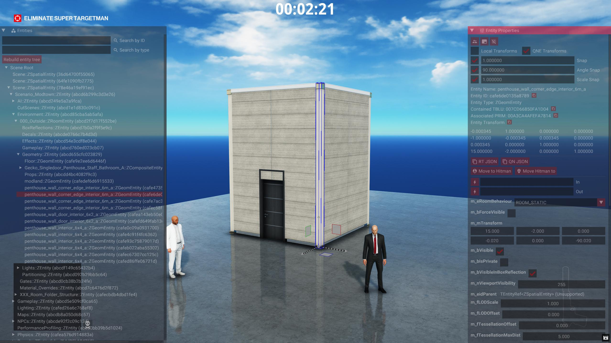

Press the save button in GlacierKit to save the scenario. Close the game, redeploy, relaunch, and start the mission.

## Regenerating the NAVP and AIRG
Now that we've modified the geometry, the old NAVP and AIRG don't accurately represent the scenario. If we were to throw a coin behind the house for instance, Super Targetman would just walk right through the walls.
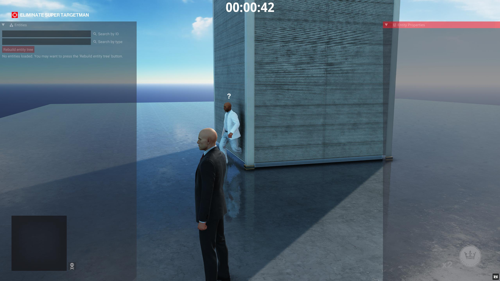

Let's open NavKit up, and follow the same steps as before:  
1. Click the `Extract from game and build obj` button
2. Click the `Build Navp from Obj and Scene` button
3. Save the NAVP file to `content/chunk2/0051279576303266.navp`
4. Click the `Build Airg from Navp` button
5. Save the AIRG file to `content/chunk2/00D89D1CB094AD54.airg`  

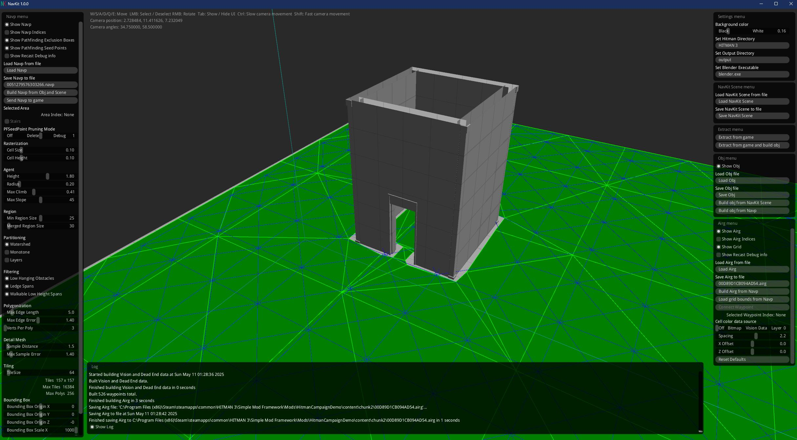  
Redeploy, relaunch, and start the mission, and now Super Targetman will walk around the house if you throw a coin behind the house, or walk through the door if you lure him into the house.
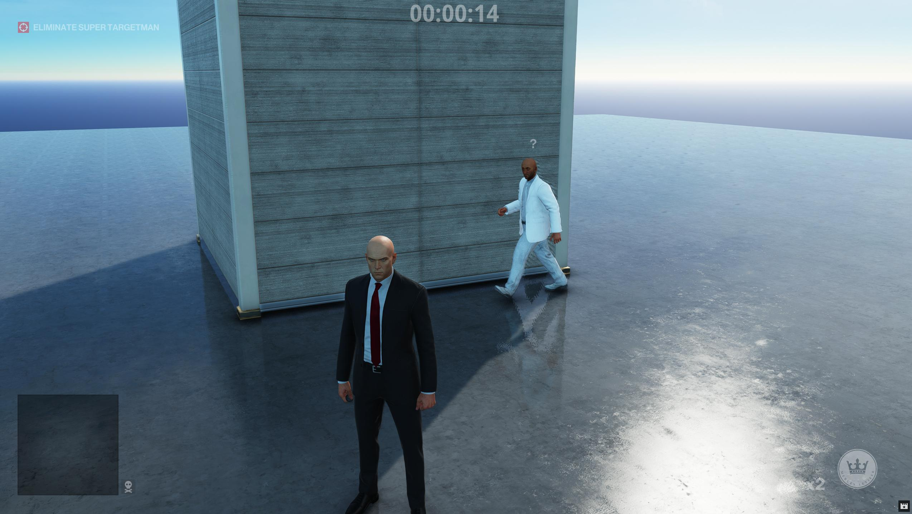

## Next Steps
We've seen how to reuse existing assets to build a scenario, but on the next page, we'll create all new 3D Geometry for our mission.