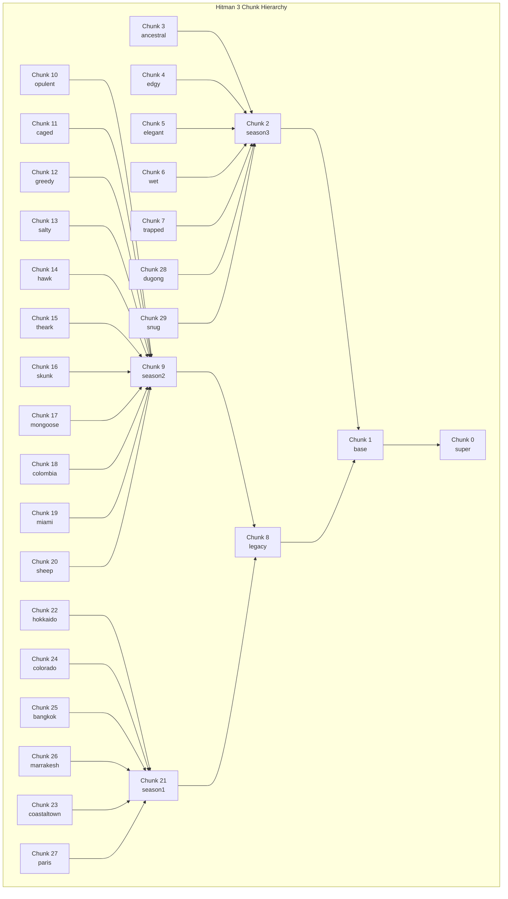

To learn more about how the Glacier 2 resource archives are used, read [these docs](/docs/modding/Hitman/guides/locating_locations.md")

Hitman 3 contains only chunk partitions, these can be found from `chunk0` to `chunk29` inside of the `runtime` folder.

To visualize the relationship between partitions, we can use the `Hitman 3 Chunk Hierarchy flowchart`. After locating the partition on the flowchart, all we need to do is follow the arrows. Using chunk27 (Paris) as an example, we can see the chunks are accessed in the following order:

> chunk27 (Paris) -> chunk21 (Season 1) -> chunk8 (Legacy) -> chunk1 (Base) -> chunk0 (Boot).

Note that while chunk0 can be accessed _from_ anywhere, it is a one-way street; parititons higher in the hierarchy cannot access parititons lower in the hierarchy. The lower the parititon _number_, the higher it is in the parititon _hierarchy_. Therefore, while chunk1 can access chunk0, chunk0 can not access chunk1, because chunk1 (Level 1) is lower in the hierarchy than chunk0 (Level 0). Furthermore, parititons cannot access adjacent parititons. So, as we can see from the flowchart, chunk12 can not access chunk11, but it can access chunk9.

### Hitman 3

| chunk    | codename     | name         | location                    | parent  |
| -------- | ------------ | ------------ | --------------------------- | ------- |
| Chunk 0  | Golden       | Gecko / Boot | Dubai                       | None    |
| Chunk 1  |              | Base         |                             | Super   |
| Chunk 2  |              | Season3      |                             | Base    |
| Chunk 3  | Ancestral    | Bulldog      | Dartmoor                    | Season3 |
| Chunk 4  | Edgy         | Fox          | Berlin                      | Season3 |
| Chunk 5  | Elegant      | Llama        | Mendoza                     | Season3 |
| Chunk 6  | Wet          | Rat          | Chongqing                   | Season3 |
| Chunk 7  | Trapped      | Wolverine    | Romania                     | Season3 |
| Chunk 8  |              | Legacy       |                             | Base    |
| Chunk 9  |              | Season2      |                             | Legacy  |
| Chunk 10 | Opulent      | Stingray     | Haven Island                | Season2 |
| Chunk 11 | Caged        | Falcon       | Prison Sniper Map           | Season2 |
| Chunk 12 | Greedy       | Raccoon      | New York                    | Season2 |
| Chunk 13 | Salty        | Seagull      | Hantu Port Sniper Map       | Season2 |
| Chunk 14 | Austria      | Hawk         | Himmelstein Sniper Map      | Season2 |
| Chunk 15 | The Ark      | Magpie       | Isle of Sgàil               | Season2 |
| Chunk 16 | Suburbia     | Skunk        | Whittleton Creek            | Season2 |
| Chunk 17 | Mumbai       | Mongoose     | Mumbai                      | Season2 |
| Chunk 18 | Colombia     | Hippo        | Santa Fortuna               | Season2 |
| Chunk 19 | Miami        | Flamingo     | Miami                       | Season2 |
| Chunk 20 | New Zealand  | Sheep        | Hawke’s Bay                 | Season2 |
| Chunk 21 |              | Season1      |                             | Legacy  |
| Chunk 22 | Hokkaido     | Snowcrane    | Hokkaido                    | Season1 |
| Chunk 23 | Colorado     | Bull         | Colorado                    | Season1 |
| Chunk 24 | Bangkok      | Tiger        | Bangkok                     | Season1 |
| Chunk 25 | Marrakesh    | Spider       | Marrakesh                   | Season1 |
| Chunk 26 | Coastal Town | Octopus      | Sapienza                    | Season1 |
| Chunk 27 | Paris        | Peacock      | Paris                       | Season1 |
| Chunk 28 | Rocky        | Dugong       | Ambrose Island              | Season3 |
| Chunk 29 | Snug         | Vanilla      | Secret Location (Safehouse) | Season3 |

### Hitman 2

| chunk/dlc | codename     | name                       | location                 |
| --------- | ------------ | -------------------------- | ------------------------ |
| Chunk 0   |              | Polar Bear / Base          | ICA facility             |
| dlc 0     | Paris        | Peacock                    | Paris                    |
| dlc 1     | Coastal Town | Octopus                    | Sapienza                 |
| dlc 2     | Marrakesh    | Spider                     | Marrakesh                |
| dlc 3     |              | Copperhead, Python & Mamba | Sapienza & Marrakesh     |
| dlc 4     | Bangkok      | Tiger                      | Bangkok                  |
| dlc 5     | Colorado     | Bull                       | Colorado                 |
| dlc 6     | Hokkaido     | Snowcrane                  | Hokkaido                 |
| dlc 7     | New Zealand  | Sheep                      | Hawke’s Bay              |
| dlc 8     | Miami        | Flamingo                   | Miami                    |
| dlc 9     | Colombia     | Hippo                      | Santa Fortuna            |
| dlc 10    | Mumbai       | Mongoose                   | Mumbai                   |
| dlc 11    | Suburbia     | Skunk                      | Whittleton Creek         |
| dlc 12    | The Ark      | Magpie                     | Isle of Sgàil            |
| dlc 13    | Austria      | Hawk                       | Himmelstein Sniper Map   |
| dlc 14    | Salty        | Seagull                    | Hantu Port Sniper Map    |
| dlc 15    |              | Anaconda & KingCobra       | Santa Fortuna & Mumbai   |
| dlc 16    | Greedy       | Raccoon                    | New York                 |
| dlc 17    | Caged        | Falcon                     | Prison Sniper Map        |
| dlc 18    |              | Cottonmouth & GartenSnake  | Miami & Whittleton Creek |
| dlc 19    | Opulent      | Stingray                   | Haven Island             |

### Hitman 2016

| chunk/dlc | codename     | name                       | location             |
| --------- | ------------ | -------------------------- | -------------------- |
| Chunk 0   |              | Polar Bear / Base          | ICA facility         |
| dlc 0     | Paris        | Peacock                    | Paris                |
| dlc 1     | Coastal Town | Octopus                    | Sapienza             |
| dlc 2     | Marrakesh    | Spider                     | Marrakesh            |
| dlc 3     |              | Copperhead, Python & Mamba | Sapienza & Marrakesh |
| dlc 4     | Bangkok      | Tiger                      | Bangkok              |
| dlc 5     | Colorado     | Bull                       | Colorado             |
| dlc 6     | Hokkaido     | Snowcrane                  | Hokkaido             |
