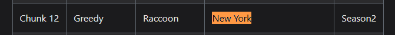
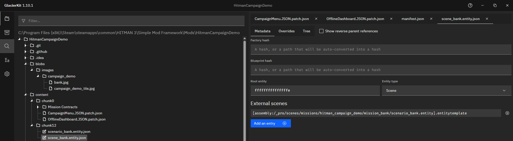

# Creating a Scene and Scenario

For this tutorial, we will go over creating a custom scene file and a custom scenario file based on an existing scenario.

## Understanding Bricks, Scenario Bricks, and Scenes

* Brick
  * A brick contains a group of entities.
  * This typically is a set of similar entities, either geometry objects or NPCs.
* Scenario Brick
  * A brick that contains entities for a location.
  * It is best practice to follow a standardized hierarchical format of entity folders that group similar entities together.
  * For instance, you would put all your NPC entities in a NPCs folder.
* Scene Entity
  * An entity that uses a scenario brick and possibly other bricks, specified in the `externalScenes` list.
  * There could be multiple scenes that all use the same scenario brick.
  * For instance, there could be one scene for the main mission for a location, and a separate scene for an Elusive Target for that same location.

## Downloading the scene and scenario files from the templates

The [Custom-Scenes templates](https://github.com/NotexMods/Custom-Scenes/tree/main/templates) page contains templates for a Scenario Brick, which is copied here for convenience.
* [Scenario brick](resources/empty_scenario_brick.entity.json)  

For each mission, it is best practice to create both a Scene and Scenario `entity.json` file for reusability, though not strictly necessary. We will be following that methodology for this guide.

For the Bank mission, we will need to have Simple Mod Framework (SMF) put these files in the proper chunk for the mission's location. We do that by placing them in a folder name that matches the chunk.

To find the correct chunk for the Bank mission, let's look at the [Chunk Data](../../glacier2/chunkdata.md) page.

Scrolling down to the `Hitman 3` table, we can see that the `New York` location is in `Chunk 12`.

Create a new folder in the `content` folder named `chunk12`.

In GlacierKit, right-click the `content/chunk12` folder and click `New File` and set the name to `scene_bank.entity.json`. Since we gave it a name that ends with `.entity.json`, GlacierKit will initialize the file with the entity template.

Right click [Scenario brick](resources/empty_scenario_brick.entity.json) and press `Save link as...` and save it into your `content/chunk12` folder with a name of `scenario_bank.entity.json`.

## Setting the factory and blueprint hashes for the scene
Now we have our scene and scenario files, but the game doesn't know to tie them to the IOI strings that we created, but we can fix that by setting the Factory hashes and Blueprint hashes for these files.

In GlacierKit, while still on the `Metadata` tab for the `scene_bank.entity.json` file, enter `[assembly:/_pro/scenes/missions/hitman_campaign_demo/mission_bank/scene_bank.entity].entitytemplate` into the `Factory hash` field and press enter. It will automatically be converted to a hashed hexadecimal value that is the game uses for this IOI string. 

Just as important to set as the Factory hash is the Blueprint hash. For that, we can just use the same IOI string, but instead of ending with `.entitytemplate`, change the ending to `.entityblueprint`. For our bank mission it will be:  
`[assembly:/_pro/scenes/missions/hitman_campaign_demo/mission_bank/scene_bank.entity].entityblueprint`

## Setting the scenario for the scene

To set the scenario for the scene we first need to choose the IOI string for the scenario. Typically, it will be the same as the scene's IOI string, but with `scenario` instead of `scene`.

For the bank mission's scene as we specified in the `manifest.json`, we are using:  
`[assembly:/_pro/scenes/missions/hitman_campaign_demo/mission_bank/scene_bank.entity].entitytemplate`  
So our IOI string for the scenario will be:  
`[assembly:/_pro/scenes/missions/hitman_campaign_demo/mission_bank/scenario_bank.brick].entitytype`

We need to add it to the `externalScenes` field of the `content/chunk12/scene_bank.entity.json` file. To do that we can use  GlacierKit.
* Open the mod folder
* Navigate to the `content/chunk12/scene_bank.entity.json` file and click on it
* Go to the Metadata tab on the right panel
* Click the `Add an entry` button under the `External scenes` section
* Enter `[assembly:/_pro/scenes/missions/hitman_campaign_demo/mission_bank/scenario_bank.brick].entitytype` and click the `Continue` button

Now that we have set the `Factory hash` and `Blueprint hash`, and added the scenario to the `External scenes`, we are done with the Scene file. Save the file by pressing the save icon in the tab, or Ctrl+S (if you are on windows). Let's move on to the scenario itself.

## Setting the factory and blueprint hashes for the scenario
The scenario will also need Factory and Blueprint hashes in order for the game to use them.

In GlacierKit, navigate to the `content/chunk12/scenario_bank.entity.json` file and open it.

In the `Factory hash` text field, enter `[assembly:/_pro/scenes/missions/hitman_campaign_demo/mission_bank/scenario_bank.brick].entitytype` and press enter.

In the `Factory blueprint` text field enter `[assembly:/_pro/scenes/missions/hitman_campaign_demo/mission_bank/scenario_bank.brick].entityblueprint` and press enter.
