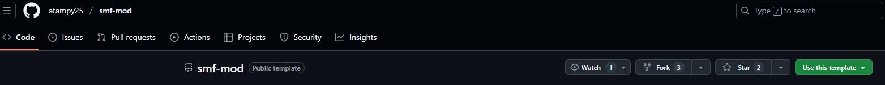
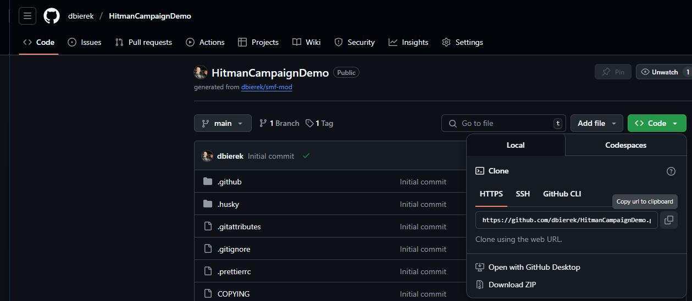

# Creating a Campaign Mod

First we will need to set up a GitHub repository using the Simple Mod Framework smf-mod template.  
Note: Custom campaign mods only work in Offline mode or can be set up to work with [Peacock](https://thepeacockproject.org/).

## Creating the mod repository

For this tutorial, we will go over creating a GitHub repository for a custom campaign mod.  

In this example we will be creating a custom campaign called `Hitman Campaign Demo`.

To start off with, create an account on [github.com](https://github.com) if you don't have one already. Then go to the
[smf mod template](https://github.com/atampy25/smf-mod) and click the `Use this template` button: 
  
Click the `Create a new repository` link. Enter `HitmanCampaignDemo`
(or your desired campaign name). In the description we'll put `A custom Hitman: World of Assassination campaign`. Set it
to Public or Private and click the `Create repository` button.  
You should now have a new repository for your mod owned by your GitHub user account.

## Cloning the mod repository to your computer

To get this mod on your local computer, you will need to clone this repository. To clone the repository:
1. You will first need to have `git` installed, and then run the clone command. For this, you have a few options.
   1. Github Desktop
      1. Download and install GitHub desktop.
         1. Go to the [Download GitHub Desktop](https://desktop.github.com/download/) page.
         2. Click the Download button to download the installer. Run the installer and follow the prompts, granting it access to your GitHub account so you can use it to clone and update your repos.
      2. Open it and click the `Clone a repository from the internet` button.
      3. Choose the `HitmanCampaignDemo` mod from your repositories list.
      4. For the local path, set it to `[HITMAN DIRECTORY]/Simple Mod Framework/Mods/HitmanCampaignDemo` (or whatever the name of your repo is).
      5. Press the `Clone` button
   2. GitHub command line interface:
      1. Download and install the `git` command line executable. 
         1. On windows: Go to the [git Download for Windows](https://git-scm.com/download/win) page and use the installer, or run the `winget` command on that page.
         2. On Mac: Open a terminal and run `git --version`, and it will prompt you to install it if you don't have it already.
         3. On Linux: You probably don't need these instructions but anyway:
            1. Fedora-like: run `sudo dnf install git-all`.
            2. Debian-based: run `$ sudo apt install git-all`.
      2. Go to your mod repo's page on GitHub and click the green `Code` button near the top right of the page, and click the copy icon next to the url:
         
      3. Open a new terminal and `cd` to `[HITMAN DIRECTORY]/Simple Mod Framework/Mods`.
      4. Run `git clone [URL from clipboard]`.

## Next Steps

Now you should have a local copy of your mod, ready to be deployed using `Simple Mod Framework`. It won't do anything yet though, so lets get some things setup in the `manifest.json` file.