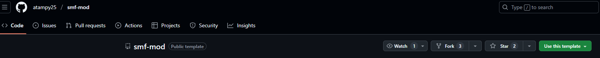

# Creating The Mod Repo

For this tutorial, we will go over creating a Github repository for a custom campaign mod. In this example we will be
creating a custom campaign called `Hitman Campaign Demo`.

To start off with, create an account on [github.com](https://github.com) if you don't have one already. Then go to the
[smf mod template](https://github.com/atampy25/smf-mod) and click the `Use this template` button: 
  
Click the `Create a new repository` link. Enter `HitmanCampaignDemo`
(or your desired campaign name). In the description we'll put `A custom Hitman: World of Assassination campaign`. Set it
to Public or Private and click the `Create repository` button.  
You should now have a new repository for your mod owned by your Github user account.