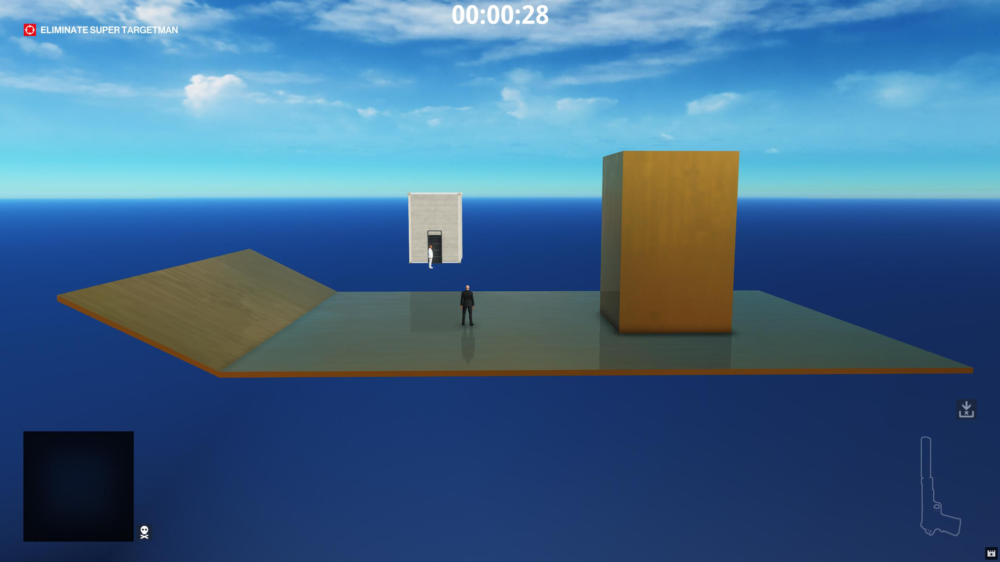

# Creating New Geometry

For this tutorial we will be adding new custom geometry to our Modtown mission.

## Creating new geometry
Reusing in-game assets is useful, but sometimes you need to create your own 3D assets. For this will use blender, with the [Glacier 2 Blender Add-on](../../blender).

> If you'd like an example you can refer to [modland.blend](resources/modland.blend). Note, this reference example is called Modland.

After installing the add-on, open Blender. 


The default scene includes a light and a camera. We won't need those so click on them in the object panel and press delete. Click on the `Collection` node and press the `F2` key and rename it to `Modtown`.

Our geometry so far isn't that interesting; it's just a small cube. Let's make some changes to make it more interesting.

Click the cube and press `S` to enter scale mode, then press `Z` to limit the scale to the Z-axis. Hold `Ctrl` to enable snapping, and then decrease the scale to 0.8. You can also just manually type in the scale there if you'd like instead.

Click the cube and press `S` to enter scale mode, then press `X` to limit the scale to the X-axis. Hold `Ctrl` to enable snapping, and then increase the scale to 10, which you can see on the cube transform properties on the right sidebar.

Click the cube and press `S` to enter scale mode, then press `Y` to limit the scale to the Y-axis. Hold `Ctrl` to enable snapping, and then increase the scale to 10, which you can see on the cube transform properties on the right sidebar.


Let's extrude some of the faces. With the cube selected, switch from `Object Mode` to `Edit Mode` mode from the dropdown menu on the top left of the window. Then switch the select mode to `Face Select`, which is the button with the white square right next to the `Edit Mode` dropdown.


Now select one of the side faces of the cube by clicking on it. Press the `E` key to extrude, and then drag the cursor out somewhat, until it makes a new cuboid to the side of the original one. 

Select multiple faces by holding `Ctrl` and clicking on them, or dragging a box around them, and then extrude some more. Keep going at this until you have created some geometry that you would like for your mission.

If you want to move a face, select it and then press the `G` key, and then either the `X`, `Y`, or `Z` keys to lock the movement to that axis.


You can also select Vertices or Edges by clicking one of those buttons on the top left of the window, next to the `Face Select` button we clicked earlier.


Now that we have geometry we are happy with, we will need to make the geometry collideable. 

## Adding collision to the new geometry
Right-click the `Modtown` collection and click `Duplicate Collection` to create a temporary duplicate collection. Select all the objects in the temporary duplicate collection and on the `Object` menu on the second menu bar from the top, click the `Join Objects` button.  


Select the new collection and on the right panel, select the `Physics` tab, and click the `Add Triangle Mesh Collider` button.  


Drag that new triangle mesh collider object over the original collection and hold the `Shift` and `Alt` keys to remove the parent and keep the transforms, and then release the mouse button.


Drag the `TriangleMeshCollider` object to the original collection to assign the collection as its parent. Right-click the temporary duplicate collection and click `Delete Hierarchy`. Click on the `TriangleMeshCollider` object and in the `Physics` tab of the properties panel on the right sidebar, change the `Collision Layer` to `STATIC_COLLIDABLES_ONLY`.  


In the object panel, select the `Modtown` Collection and switch to the `Collection` properties panel on the right sidebar.  


Change the `Physics Data Type` dropdown to `TRIANGLE_MESH`, and the `Physics Collision Type` to `STATIC`.  


## Texturing the new geometry
On the object panel, select the `Cube` object. On the properties panel, switch to the `Materials` tab and click the yellow button next to the `Base Color` section, and choose `Image Texture`.


Now let's extract a texture to use using GlacierKit. This will help us UV map the texture to the model. Let's use the `concrete_bare_weathered_b_light`. In GlacierKit, on the `Game contents` section search for `concrete_bare_weathered_b_light` and click the `concrete_bare_weathered_b_light.mi` resource. On the resource panel on the right, you can see details about that material. What we want is the diffuse colormap `.TEXT` file, which is the top item in the `References` list.  

Click on that. You will see the texture that we want to use. Click the `Extract image` button and save it somewhere easy to access, for instance, with your `modtown.blend` file.  


In Blender, click the `Open Image` button with the folder icon next to the `Base Color` section and choose the `009D04612645C6E5.jpg` that you extracted.

Now the mesh has the texture, but we can't see it because the `Shading` mode is set to `Solid`. With your mouse over the 3D area and hold the `Z` key and the `Shading` popup menu will appear. Move the mouse over `Material Preview` and let go of the `Z` key.


Now that the shading mode is set to `Material Preview`, we can see the texture on the material, and we can see that the UV mapping doesn't look perfect.


While in `Object Mode`, click on the cube, and then switch to `Edit Mode` using the dropdown on the top left, and then click on the `Face Select` button. Press the `A` key to select all the faces, then click the blue `Z` circle in the 3D view on the top right to get a top view. 

Press the `U` key to bring up the `UV Mapping` popup and click `Project from View`, and the UV mapping will be much better.


Holding down the middle mouse button, drag the mouse around, and you can see that all the faces that are not facing upwards have UV maps that don't look that great. You can click the red `X` circle or green `Y` circle on the top right of the 3D view to switch to a Front, Side, or Back view, then press `Alt + A` to deselect all the faces, then click on a face that has a bad UV mapping, press the `U` key and click `Project from View` again to UV map just this face. Repeat for all the faces that don't look properly UV mapped. 


## Exporting the geometry from Blender
Switch back to `Object Mode` on the top left dropdown so that the Blender add-on doesn't have trouble exporting.

Let's save our scene so we can reload it later if we want.

Now click `File > Export > Glacier RenderPrimitive (prims, materials, textures, geomentities, and collision)`, and put it somewhere you can find easily.  


You'll wind up with a folder of files like this:  


Create a new folder named `content/chunk2/Geometry` and copy these files to that folder:  
`00AA77FDDA276A30.entity.json`  
`0001A27B58E548FD.prim`  
`0001A27B58E548FD.prim.meta.json`  
`0069CC5F40614834.aloc`  

## Updating and editing up the geometry files

Rename the `.entity.json` file to `modtown_geomentity.entity.json`.

Open the `0001A27B58E548FD.prim.meta.json` file in a regular text editor like VS Code, or WebStorm, and in the `hash_reference_data` array, replace the `hash` the value of the object with:  
`[assembly:/_pro/environment/materials/generic/wall/concrete_bare_weathered_b_light.mi].pc_mi`
and save the file.

In GlacierKit, open the new `modtown_geomentity.entity.json` file and set the `Factory hash` to:  
`[assembly:/_pro/environment/geometry/modtown/modtown.prim].pc_entitytype`  
It should already have that hash, but this will add it to the GlacierKit project custom hashes.

In the new `Geometry` folder, create a new file named `modtown.entity.json`. In the metadata tab, set the `Factory hash` field to:  
`[assembly:/_pro/environment/geometry/modtown/modtown.entitytemplate].pc_entitytype`  
and the `Blueprint hash` field to:  
`[assembly:/_pro/environment/geometry/modtown/modtown.entitytemplate].pc_entityblueprint`  

And in the `Tree` view, right-click on the `Scene` node and click `Create Entity` and name it `modtown` and in its contents, replace everything after the `parent` field with:  
```json
	"name": "modtown",
	"factory": "[modules:/zspatialentity.class].pc_entitytype",
	"blueprint": "[modules:/zspatialentity.class].pc_entityblueprint"
}
```
Drag it to be the root entity node, and delete the `Scene` node. Copy the `modtown` entity's id and in the `Metadata` tab set the `Root entity` text field to that id. Set the `Entity type` dropdown to `Template`.

On the `Tree` view, right-click on the `modtown` node and make a new entity named `modtown_geomentity`. In the contents, replace everything after the `parent` node with:
```json
	"name": "modland_geomentity",
	"factory": "[assembly:/_pro/environment/geometry/modtown/modtown.prim].pc_entitytype",
	"blueprint": "[assembly:/templates/geometrytemplatestaticcoll.template?/geomentity01.entitytemplate].pc_entityblueprint",
	"properties": {
		"m_mTransform": {
			"type": "SMatrix43",
			"value": {
				"rotation": {
					"x": 0,
					"y": 0,
					"z": 0
				},
				"position": {
					"x": 0.0,
					"y": 0.0,
					"z": 0.0
				}
			}
		},
		"m_eidParent": {
			"type": "SEntityTemplateReference",
			"value": null,
			"postInit": true
		}
	}
}
```
Copy the root `modtown` node's id and set `modtown_geomentity`'s `m_eidParent > value` to that id. 

Right-click on the `modland_geomentity` node and click `Create New` and name it `metal_copper_b`, and in its contents, replace everything after the `parent` field with:  
```json
	"name": "metal_copper_b",
	"factory": "[assembly:/_pro/environment/materials/generic/metal/metal_copper_b.mi].pc_entitytype",
	"blueprint": "[assembly:/_pro/environment/materials/generic/metal/metal_copper_b.mi].pc_entityblueprint",
	"properties": {
		"m_mTransform": {
			"type": "SMatrix43",
			"value": {
				"rotation": {
					"x": 0,
					"y": 0,
					"z": 0
				},
				"position": {
					"x": 0,
					"y": 0,
					"z": 0
				}
			}
		},
		"Override": {
			"type": "bool",
			"value": true
		},
		"Texture2D_03": {
			"type": "ZRuntimeResourceID",
			"value": {
				"resource": "[assembly:/_pro/environment/textures/custom/metal/metal_brushed_green_a.texture?/specular_a.tex](ascolormap).pc_tex",
				"flag": "5F"
			}
		},
		"ShaderLOD_Distance_op": {
			"type": "IRenderMaterialEntity.EModifierOperation",
			"value": "eReplace"
		},
		"ShaderLOD_Distance": {
			"type": "float32",
			"value": 9999999999
		},
		"ShaderLOD_Speccolor_op": {
			"type": "IRenderMaterialEntity.EModifierOperation",
			"value": "eReplace"
		},
		"ShaderLOD_Speccolor": {
			"type": "SColorRGB",
			"value": "#ff0000"
		},
		"Texture2D_03_enab": {
			"type": "bool",
			"value": true
		},
		"Active": {
			"type": "bool",
			"value": true
		},
		"Clients": {
			"type": "TArray<SEntityTemplateReference>",
			"value": [
              null
			],
			"postInit": true
		},
		"m_eidParent": {
			"type": "SEntityTemplateReference",
			"value": null,
			"postInit": true
		}
	}
}
```

Add the `modland_geomentity` entity id to the `Clients` value array, and to the `m_eidParent` value.

## Adding the new geometry to the scenario

In the `scenario_modtown.entity.json` file, right-click on the `000_Outside > Geometry` node and click `Create Entity`, set the name to `modtown`, click on it and in the contents, replace everything after the `parent` field with:  
```json
	"factory": "[assembly:/_pro/environment/geometry/modtown/modtown.entitytemplate].pc_entitytype",
	"blueprint": "[assembly:/_pro/environment/geometry/modtown/modtown.entitytemplate].pc_entityblueprint",
	"properties": {
		"m_mTransform": {
			"type": "SMatrix43",
			"value": {
				"rotation": {
					"x": 0.0,
					"y": 0.0,
					"z": 0.0
				},
				"position": {
					"x": 0.0,
					"y": 0.0,
					"z": 0.0
				}
			}
		},
		"m_eidParent": {
			"type": "SEntityTemplateReference",
			"value": null
		}
	}
}
```
Set the `m_eidParent` value to the entity id of the `000_Outside` node.

Click the save button, redeploy, relaunch, and start the mission.


We can see our new geometry in the game! Using this example geometry, things don't quite line up with the house and SuperTargetman in this instance, so let's move the house to be on our new geometry. With GlacierKit opened to the `scenario_modtown.entity.json` file enable the ZHMModSDK Editor by pressing the tilde key and click the `Rebuild entity tree` button. Click on the house to select it in the ZHMModSDK Editor Tree as well as in GlacierKit, and you can see that it selected on of the components of the house.


We want to move the whole house, so select the `House` node and with the gizmo in translate mode, drag it with the arrows to move it over our new geometry.


Let's also move the Super Targetman's starting location. Click on him and change his position to be over the new geometry as well.


After taking out the target, we may need to move the exit as well.  


Click the `Exit` node in GlacierKit, and use the Gizmo in ZHMModSDK to move it to a suitable location.  

In GlacierKit, press the save button.

## Regenerating the NAVP and AIRG again
Let's open NavKit, and just as before, build the obj, navp, and airg, and replace the original NAVP and AIRG files in our mod. You don't need to redeploy to do this, as it operates directly on what is in game at the moment of generation.


Redeploy, relaunch, and start the mission.


## Updating the images

Let's take some new screenshots for our location (Modtown), parent location (Modlandia) and mission (Modtown Throwdown) to replace our template images.

In all, we will need 6 new images:
* A background image (fullscreen) for Modtown
* A tile image (tile sized) for the Modtown Throwdown mission
* A tile image (tile sized) for the Main entrance of the Modtown Throwdown mission
* A target image (tile sized) for Super Targetman
* A background image (fullscreen) for Modlandia
* A tile image (tile sized) for the Modlandia

Here are some examples:  

> Modtown background  


> Modtown tile  


> Modtown entrance  


> Modtown Super Targetman  


> Modlandia background  


> Modlandia tile  

## Next Steps
We can use our campaign offline, and it can't work in the official online server, but we can make it work with Peacock by making a plugin. It's not as hard as it sounds. In the next step we'll make the Peacock plugin. 
