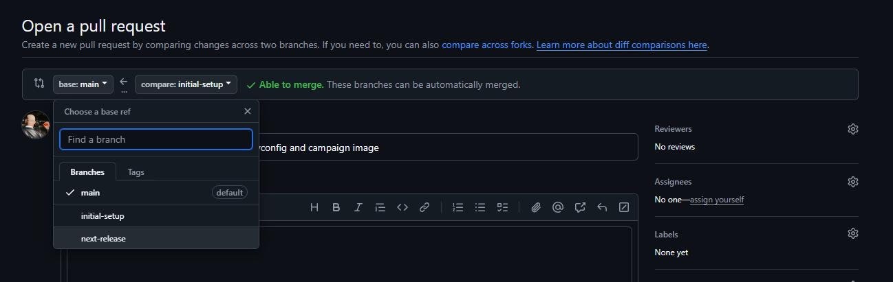

# Committing to GitHub 

For this tutorial, we will go over committing your changes to the GitHub Repo. Let's try out our git commit strategy, manage our branches, and update our `.gitignore` file.

## Creating the `next-release` branch
Let's make a few new branches on our repo. In WebStorm, click the `Terminal` button on the bottom of the left sidebar.


First let's create our `next-release` branch. In the terminal enter:
```bat
git checkout -b next-release
```
This will check out a new branch named `next-release`. We want this branch to just be the same as the `main` branch for now.

Currently, this branch doesn't exist on our GitHub repository, so we need to `push` the changes. Enter:
```batch
git push -u origin head
```
Since we are pushing a new branch to the repo, we are adding `-u origin head`, which tells git to create the branch on the remote repo.

## Creating the `initial-setup` branch

Now let's create a new feature branch. Let's name this one `initial-setup`. In the terminal enter:
```bat
git checkout -b initial-setup
```
This will check out a new branch named `inital-setup`. We want to add our changes and new files to this branch.

## Updating the `.gitignore` file

Click on the `Commit` button on the top of the left sidebar.

We can see that there are a lot of changes under the `Unversioned Files` node in the `.idea` folder. These were created by WebStorm, and we do not need to include them in our repo, so let's tell git to ignore them.

Switch back to the `Project` view by pressing the `Project` button on the top of the left sidebar and open the `.gitignore` file.

Add this line at the end of the file:  
```.gitignore
.idea
```
## Staging files

Switch back to the `Commit` tab.


Now we can see the only files listed are the files we've modified under the `Changes` node, or added under the `Unversioned Files` node. If we were to commit to the repo at this time, the commit would not include our new files, so select both of those new files (colored in red), right-click one of them, and click `Add to VCS` (Version Control System). This will stage the files, so that we are able to commit them.

Now back in the terminal, enter:
```batch
git commit -am "Updated manifest and gitignore, added storyconfig and campaign image"
```
This command makes a commit with two flags, the `-a` flag, which stages all files that are in the VCS, as well as the `-m` flag which includes a message in the commit without an additional prompt.

## Viewing the git log
Now we've made our first commit to this `inital-setup` branch. To see the commit, enter:
```batch
git log
```
It will open an interactive log of your repo. Press the `up` or `down` keys to scroll through the git log, and the `q` key to exit.

## Pushing to the repository on GitHub
Currently, this branch and commit also don't exist on our GitHub repository, so we need to `push` the changes. Enter:
```batch
git push -u origin head
```
This pushes our commit to the `origin`, which here refers to your repository on GitHub.

For subsequent pushes to this branch we can just use `git push` and leave off the `-u origin head`, since the branch will already exist.

## Making a Pull Request
We can manage branch merges manually using the git CLI, or we can use GitHub to merge our changes using `Pull Requests`. Using `Pull Requests` adds a few extra steps, but it also allows you to visually compare and manage your changes more easily, as well as keeping an easy-to-use record of your changes. And when working with multiple contributors, `Pull Requests` allow you to require a review from a repo admin before allowing merging.      

Let's create a pull request for this branch. If we click the link in the terminal it will open the `Comparing changes` / `Open a pull request` page for our branch. Alternatively, we can get to that page by navigating back to our repo's page on the GitHub website, and clicking on the green `Compare & pull request` button in the yellow bar that appeared on the top of our repo's contents.


We don't actually want to merge our `initial-setup` branch into the `main` branch. Instead, we want to merge this branch into the `next-release` branch, so change the `base` branch to `next-release` in the dropdown list.  



Now click the `Create pull request` button.


Here you can add a description if you'd like, or review your changes on the `Files changed` tab.

## Merging a Pull Request into the `next-release` branch

When you are done, change the dropdown on the `Merge pull request` button on the `Conversation` tab to `Squash and Merge`.

For the commit message use `feat: Initial setup` and continue with the merge.

## Creating a new release

You may want to have multiple Pull Requests in one release, but for this example, let's make a release now just to try out the process.

Back on the home page of your mod repository, the green `Compare & pull request` button in the yellow bar that appeared on the top of our repo's contents. Create a Pull Request from the `next-release` branch with a base of the `main` branch.

This time though, instead of using the `Squash & Merge` button, just use the normal `Merge` button. For the message, you can just leave it as the default, or set the message to something else.

When the merge is done, a GitHub Actions workflow will begin, and since one of the commits includes a semantic versioning keyword (`feat: `), it will make a new release. For more information about this process, check the `README.md` file in your mod.

## Next Steps

Now that we have committed our changes and made a new release, let's create the MenuMapSetup and use it in the main menu. 