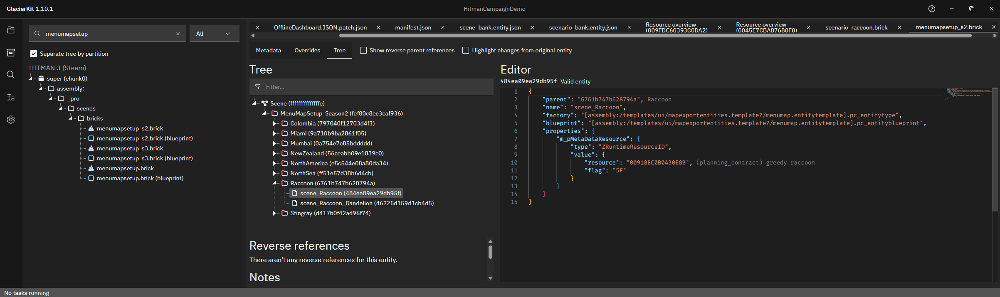
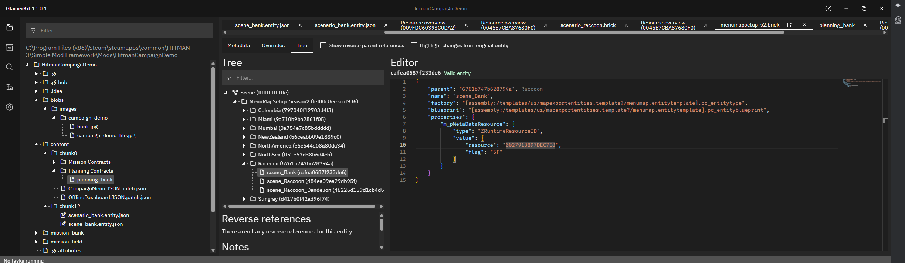

# Menu Map Setup

For this tutorial, we will go over patching the MenuMapSetup files. MenuMapSetup files define the planning contract for the scene.

Since our custom scene is going to take place in New York, which was release in Season 2, we will need to modify the `[assembly:/_pro/scenes/bricks/menumapsetup_s2.brick].pc_entitytype` file. 

## Patching the Season 2 MenuMapSetup file

In GlacierKit go to the `Game content` tab and search for `menumapsetup`. Select the `menumapsetup_s2.brick` file and click the `Open in editor` button. On the `Tree` tab, expand the `MenuMapSetup_Season2` and `Raccoon` nodes, you will see the `scene_Raccoon` node. Select it to see how it is defined. Note the id `484ea09ea29db95f`.  

```json
{
	"parent": "6761b747b628794a",
	"name": "scene_Raccoon",
	"factory": "[assembly:/templates/ui/mapexportentities.template?/menumap.entitytemplate].pc_entitytype",
	"blueprint": "[assembly:/templates/ui/mapexportentities.template?/menumap.entitytemplate].pc_entityblueprint",
	"properties": {
		"m_pMetaDataResource": {
			"type": "ZRuntimeResourceID",
			"value": {
				"resource": "00918EC0B0A30E8B",
				"flag": "5F"
			}
		}
	}
}
```
Right-click the `scene_Raccoon` node and click `Clipboard` > `Copy`. Then right-click the `Raccoon` node and click `Clipboard` > `Paste`. You will see a new node has been created under the `Raccoon` node that also has the name `scene_Raccoon`. Select the one that does not have the same id as the original one.

Set the name to `scene_Bank`. The important thing in this file is the `resource` field of the `m_pMetaDataResource` property. As shown by GlacierKit, for the `scene_Raccoon` file, the value is the hexadecimal representation of the hashed value of the IOI string `(planning_contract) greedy raccoon`. We will need to set this to the hashed value of our new planning contract.

Let's use the IOI string `(planning_contract) greedy bank`. So we don't forget this IOI string, let's add it to the custom hashes list for our project.

In GlacierKit, click on the `Settings` button on the left sidebar. Scroll to the bottom of the `Custom paths` section and click the `Add an entry` button. Enter `(planning_contract) greedy bank` and press the `Continue` button.

In the `content/chunk0` folder, create a new folder called `Planning Contracts`, and in that folder create a new folder called `bank`

## Getting the hash for an IOI string
GlacierKit has a handy tool to get the hashed value of an IOI string, in hexadecimal (Hex) and decimal format. Switch to the `Text tools` tab on the left sidebar.

In the `Hash calculator` text field enter `(planning_contract) greedy bank`.

In the `Hex` field it will now have your hashed IOI string in hexadecimal format: `0027913897DEC7E8`. Click the copy icon next to it.

## Using the hashed value
Going back to the `menumapsetup_s2.brick` file, in the `resource` field, delete the existing text and paste in your hashed value.

The `scene_Bank` node should now look like this:

```json
{
	"parent": "6761b747b628794a",
	"name": "scene_Bank",
	"factory": "[assembly:/templates/ui/mapexportentities.template?/menumap.entitytemplate].pc_entitytype",
	"blueprint": "[assembly:/templates/ui/mapexportentities.template?/menumap.entitytemplate].pc_entityblueprint",
	"properties": {
		"m_pMetaDataResource": {
			"type": "ZRuntimeResourceID",
			"value": {
				"resource": "0027913897DEC7E8",
				"flag": "5F"
			}
		}
	}
}
```

Click the save icon on the `menumapsetup_s2.brick` file to open the `Save file` dialog. Navigate to the `content/chunk0` folder. Enter the name `menumapsetup_s2` and press the `Save` button.

In GlacierKit, on the `Files` tab you should now see a file named `menumapsetup_s2.entity.patch.json` in your `content/chunk0` folder. You may need to change to another tab and back to the `Files` tab to see the `Files` tab update.

## Next Steps
Now that the Menu Map Setup file has been updated, let's create the actual Planning file for our scene. For the next step we will need the `0027913897DEC7E8` value that we set in the `resource` field, so let's copy that value now. 