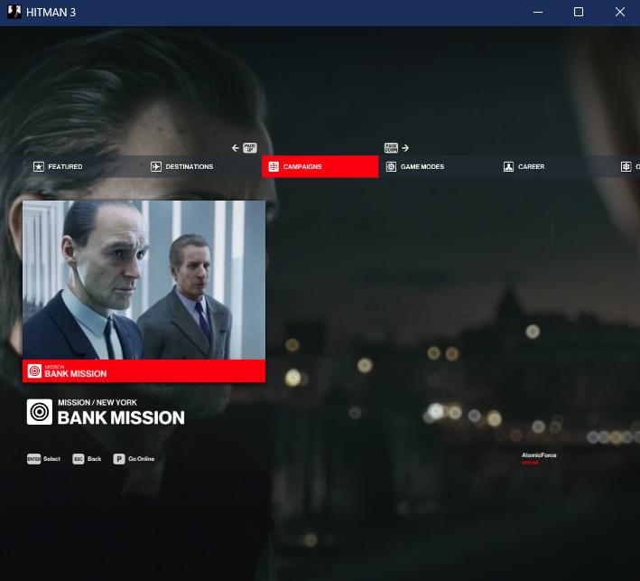
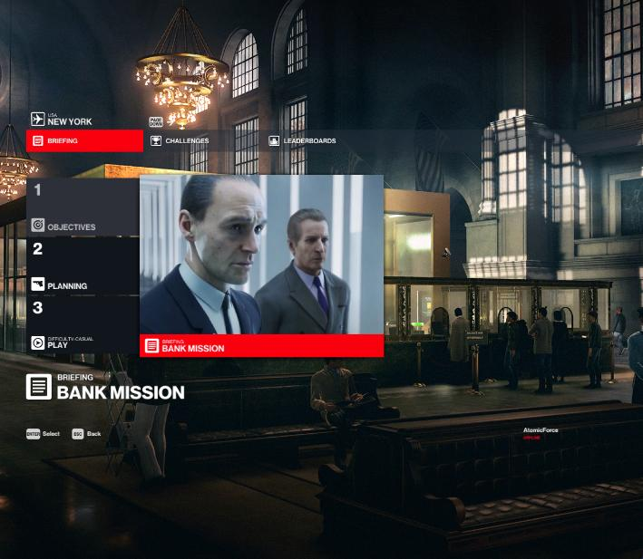
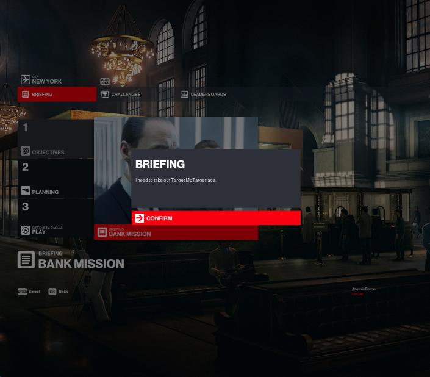
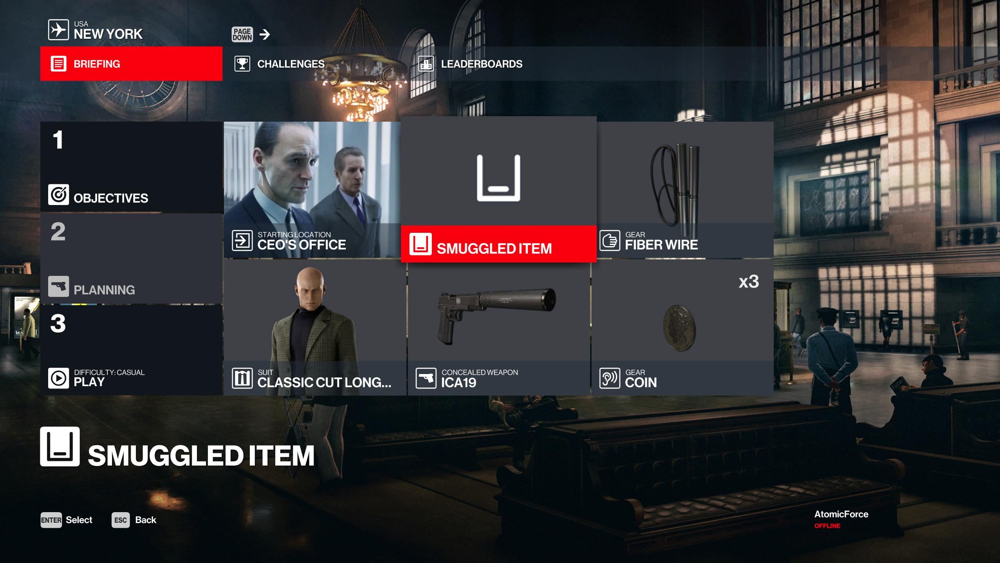
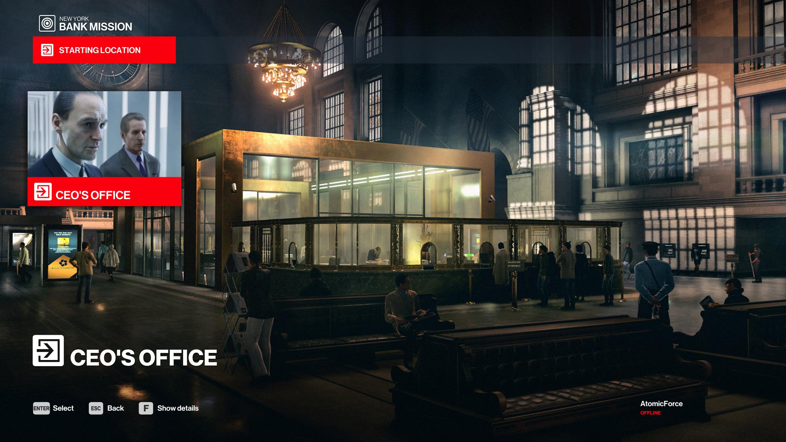

# Mission Contract

For this tutorial, we will go over creating a custom mission contract.

## Creating the `mission_bank.contract.json` file

In the `content/chunk0/` folder, create a new folder named `Mission Contracts`. In that folder create a new file named `mission_bank.contract.json` and set its contents to:

```json
{
	"Data": {
		"EnableSaving": true,
		"Objectives": [],
		"GameDifficulties": [
			{ "Difficulty": "easy", "Bricks": [] },
			{ "Difficulty": "normal", "Bricks": [] },
			{ "Difficulty": "hard", "Bricks": [] }
		],
		"Bricks": [],
		"DevOnlyBricks": [],
		"Entrances": ["[INSERT NEW UUID FOR THE ENTRANCE]"],
		"GameChangers": [],
		"GameChangerReferences": []
	},
	"Metadata": {
		"Id": "[INSERT UUID FOR THE MISSION]",
		"IsPublished": true,
		"Title": "UI_BANK_TITLE",
		"Description": "UI_BANK_DESC",
		"CodeName_Hint": "New York",
		"ScenePath": "assembly:/_pro/scenes/missions/hitman_campaign_demo/mission_bank/scene_bank.entity",
		"TileImage": "images/campaign_demo/bank.jpg",
		"Location": "LOCATION_GREEDY_RACCOON",
		"LastUpdate": "2025-05-02T19:44:00.000Z",
		"CreationTimestamp": "2025-05-02T19:44:00.000Z",
		"CreatorUserId": "[INSERT GENERATED CREATOR USER ID]",
		"Type": "mission",
		"Release": "3.0.0",
		"Entitlements": ["H2_LEGACY_EXPANSION"]
	},
	"UserData": {},
	"SMF": { "destinations": { "addToDestinations": true, "peacockIntegration": true, "narrativeContext": "Mission" } }
}
```

## Explanation:

* In the `Entrances` field enter a new UUID for the new entrance, for instance:
`"Entrances": ["8e2bdc62-905d-43c1-8d91-3dceb8506a77"],`
* In the `Id` field enter the same UUID for this mission that you created for the `CampaignMenu.JSON.patch.json` file.
* In this example, we are creating a custom mission for the New York location, so the `Location` field is set to `LOCATION_GREEDY_RACCOON`, the `CodeName_Hint` field is set to `New York`, and the `Entitlements` field list is set to `H2_LEGACY_EXPANSION`.

## Create the mission tile image
In the `blobs/images/campaign_demo` folder, create a new image file for named `bank.jpg` with a resolution of 693 by 517.

> Here is an example you can use for the `bank.jpg` file 

## Deploying mod
Let's deploy the mod again and see the difference.
Now when you click on the Hitman Campaign Demo tile, you will see the new mission.  


If you click on that mission, you will see the mission menu on the Objectives tab.


If you click on the briefing tile, you will see our custom briefing.


If you click the Planning tab, you will see that it shows our new starting location.


If you click the new location, it will show our new starting location as the only option.


If you go back and press the Play button, the game will crash, as we haven't actually created this scene.

## Next Steps
Now that we have the menus set up for our new mission, lets make a new scene file and a new scenario file for it.