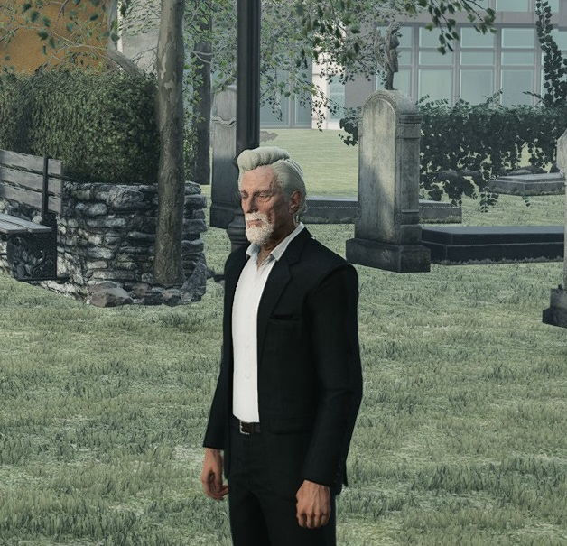
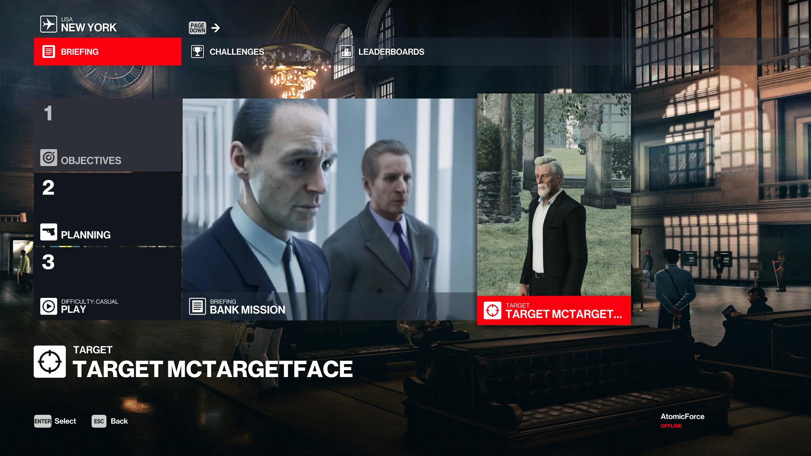
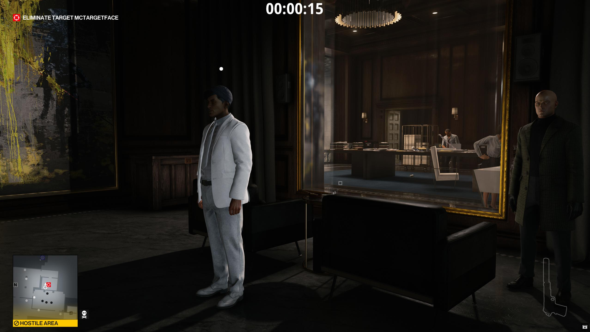
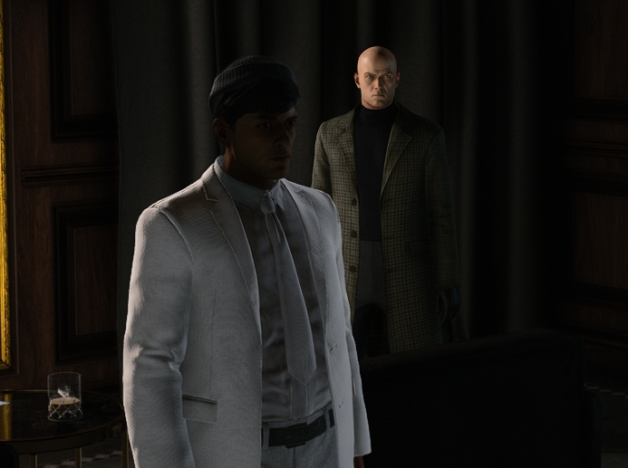
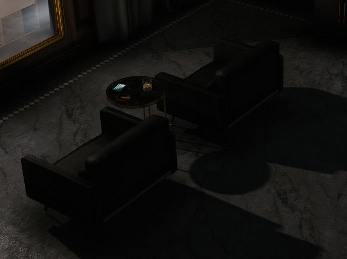
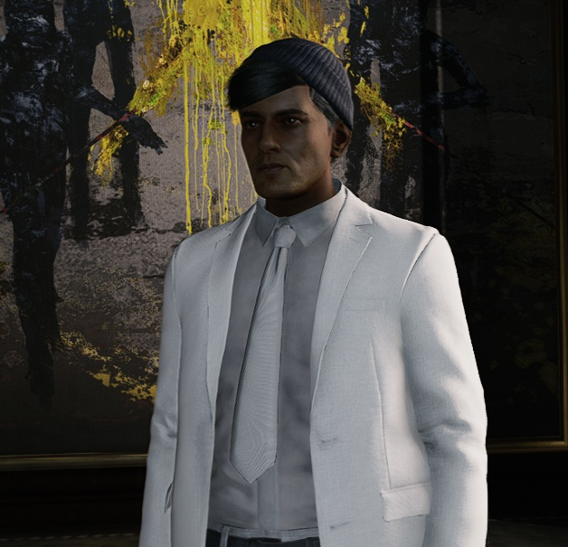

# Creating a new NPC
For this tutorial, we will go over how to create a new NPC that will be used as a target.

Building off our Bank mission, let's make a new target named `Target McTargetface`. First we'll need to update the `manifest.json` file to add some localisation strings.

## Updating the Manifest file 
Our new NPC needs to have a name and description added to the manifest file so that the menus will be able to display them, and we need to add a new entry to the `packagedefinition`.

Open up the `manifest.json` file and add the following lines under the `localisation > english` section:
```json
    "NPC_TARGET_MCTARGETFACE_NAME": "Target McTargetface",
    "NPC_TARGET_MCTARGETFACE_DESC": "Target McTargetface is the new CEO of the Milton-Fitzpatrick Bank."
```
In full, it should now look like this:
```json
  "localisation": {
    "english": {
      "UI_HITMAN_CAMPAIGN_DEMO": "Hitman Campaign Demo",
      "UI_STORY": "Story",
      "UI_BANK_DESC": "I need to take out Target McTargetface.",
      "UI_BANK_TITLE": "Bank mission",
      "UI_STARTING_LOCATION_BANK_CEO_OFFICE_DEFAULT_NAME": "CEO's Office",
      "UI_STARTING_LOCATION_BANK_CEO_OFFICE_DESC": "47 has made his way to the CEO's office.",
      "NPC_TARGET_MCTARGETFACE_NAME": "Target McTargetface",
      "NPC_TARGET_MCTARGETFACE_DESC": "Target McTargetface is the new CEO of the Milton-Fitzpatrick Bank."
  },
```

Press the save button.

## Adding Repository entries for the NPC and Outfit 
In GlacierKit, open the `HitmanCampaignDemo.repository.json` file.

Let's create our outfit repository entry. Click the `New item` button and set the `Editor` text to be:
```json
{
  "CommonName": "Outfit Target McTargetface",
  "Description": "Outfit Target McTargetface",
  "Name": "Outfit Target McTargetface",
  "Category": "",
  "HeroDisguiseAvailable": false,
  "Image": "",
  "ImageTransparent": "",
  "IsHitmanSuit": false,
  "TokenID": ""
}
```

Now let's create our NPC repository entry. Click the `New item` button and set the `Editor` text to be:
```json
{
	"CharacterSetIndex": 0.0,
	"Description": "Target McTargetface",
	"Description_LOC": "actor_description",
	"Image": "images/campaign_demo/bank/target_mc_targetface.jpg",
	"Name": "Target McTargetface",
	"Outfit": "[NEW TARGET'S OUTFIT UUID]",
	"OutfitVariationIndex": 0.0,
	"Tile": "images/campaign_demo/bank/target_mc_targetface.jpg"
}
```

We can see that we will need a new image file. In our `images/campaign_demo/bank` folder let's create a new file named `target_mc_targetface.jpg` and make it a template picture for the target.


Copy the id of the new outfit repository entry from under the `Editor` header text and paste it into the `Outfit` field of the new NPC entry.

We will also need this repository entry's id, so select the UUID under the `Editor` header text and copy it.

Click the save button.

## Updating the Mission contract
Open the `content/chunk0/Mission Contracts/mission_bank.contract.json` file. Under the `Objectives` array, add the following object:
```json
{
    "Id": "[NEW GENERATED UUID]",
    "Category": "primary",
    "ObjectiveType": "setpiece",
    "DisplayAsKillObjective": true,
    "ForceShowOnLoadingScreen": true,
    "IsHidden": false,
    "BriefingName": "$($repository [NEW NPC'S UUID]).Name",
    "Image": "images/campaign_demo/bank/target_mc_targetface.jpg",
    "HUDTemplate": { "display": "Eliminate Target McTargetface" },
    "BriefingText": "Eliminate Target McTargetface",
    "SuccessEvent": {
        "EventName": "Kill",
        "EventValues": { "RepositoryId": "[NEW NPC'S UUID]" }
    }
}
```
Replace the `[NEW GENERATED UUID]` value with your copied UUID from the repository entry.

Let's also generate a new UUID for the new mission contract objective using GlacierKit. Go to the `Text tools` section and click the copy button next to the `Random UUID` text field, and paste it into the `Id` field.

Click the save button.

Our new NPC will need a new outfit, and we will need to make a new outfits brick for our NPC's outfit.

## Adding a new Outfit
In GlacierKit, right-click our `content/chunk12` folder and click `New folder` and name it `Outfits`.

Right-click that new `Outfits` folder and click `New File` and name it `outfit_target_mctargetface_v0.entity.json`. Click on that new file.

Switch to the `Metadata` tab and change the `Entity type` dropdown to `Template`.
Let's set the `Factory hash` to:
`[assembly:/_pro/characters/templates/hitman_campaign_demo/outfit_target_mctargetface_actor_v0.entitytemplate].pc_entitytemplate`
and set the `Factory blueprint` to:
`[assembly:/_pro/characters/templates/hitman_campaign_demo/outfit_target_mctargetface_actor_v0.entitytemplate].pc_entityblueprint`

Switch to the `Tree` view.

Let's copy an outfit from the New York outfits and modify it. For this example, we'll use the Mateo NPC outfit.

Go to the `Game content` tab and search for `outfit_` and check the `Separete tree by partition` checkbox. Scroll down to the `greedy > assembly > _pro > characters > templates > raccoon > char_raccoon_unique.template?` folder and expand it. Click on the `outfit_raccoon_unique_headofsecurity_m_actor_v0.entitytemplate` node and click the `Open in editor` button. Switch to the `Tree` view.

Right-click on the `OUTFIT_Raccoon_Unique_HeadOfSecurity_M_Actor_v0` node and click `Clipboard > Copy`.

Switch back to the `outfit_target_mctargetface_v0.entity.json` file. Right-click on the `Scene` and click `Clipboard > Paste`.

Now it is a child node of the `Scene` node, but we actually want it at the root. Drag the `OUTFIT_Raccoon_Unique_Lieutenant_M_Actor_v0` node to the root of the tree. It will now be on the same level as the `Scene` node.

We also need to set this node to be the root entity. Copy the entity id from under the `Editor` panel header text.

Switch to the `Metadata` tab. Replace the value into the `Root entity` text field with the id you copied.

Switch back to the `Tree` tab and delete the `Scene` node.

Let's delete Mateo's badge. Expand the `OUTFIT_Raccoon_Unique_Lieutenant_M_Actor_v0` node. Right-click the `Spine2_Attacher_01` node and click `Delete.

Let's also delete Mateo's walkie-talkie. Right-click the `Pelvis_Attacher` node and click `Delete.

Click on the `OUTFIT_Raccoon_Unique_Lieutenant_M_Actor_v0` node and change the name field to `OUTFIT_TargetMcTargetface_Actor_v0`.

Click through the different outfit piece entities, you will notice several outfit parts have a `SColorRGB` fields with a color square. Let's change some of them. In this example I chose to make all the customizable colors white.

Let's also switch out his head. Click on the `Head_HeadOfSecurity` node and change the name to `Head_TargetMcTargetface`.

Switch to the `Game content` tab and search for `head_`. Expand the `greedy` node and click on `head_itlazy` and click on the `Open in editor` button. On the `Metadata` tab, copy the `Factory hash`. Switch back to the `outfit_target_mctargetface_v0.entity.json` file. On the `Head_HeadOfSecurity` node, replace the `factory` field.

Switch back to the `head_itlazy` file and copy the `Blueprint hash`. Switch back to the `outfit_target_mctargetface_v0.entity.json` file. On the `Head_HeadOfSecurity` node, replace the `blueprint` field.

Click the save button.

We now have a custom outfit for our new NPC. It has Mateo's suit, but it's all white, it has the lazy IT guy's head, he doesn't have a badge, and he doesn't have a radio. We can modify the outfit more later but for now this will do.

Let's create a Character set for this outfit.

## Adding a Character set
Right-click that new `Outfits` folder and click `New File` and name it `charset_target_mctargetface.entity.json`. Click on that new file.

Switch to the `Metadata` tab and change the `Entity type` dropdown to `Template`.
Let's set the `Factory hash` to:
`[assembly:/_pro/characters/templates/hitman_campaign_demo/charset_target_mctargetface.entitytemplate].pc_entitytemplate`
and set the `Factory blueprint` to:
`[assembly:/_pro/characters/templates/hitman_campaign_demo/charset_target_mctargetface.entitytemplate].pc_entityblueprint`

Switch to the `Tree` view.

Let's copy the charset for Fabien and modify it.

Go to the `Game content` tab and search for `charset_` and check the `Separete tree by partition` checkbox. Scroll down to the `greedy > assembly > _pro > characters > templates > raccoon > char_raccoon_unique.template?` folder and expand it. Click on the `charset_raccoon_unique_headofsecurity_m.entitytemplate].pc_entitytype` node and click the `Open in editor` button. Switch to the `Tree` view.

Right-click on the `CHARSET_Raccoon_Unique_HeadOfSecurity_M` node and click `Clipboard > Copy`.

Switch back to the `charset_target_mctargetface.entity.json` file. Right-click on the `Scene` and click `Clipboard > Paste`.

Now it is a child node of the `Scene` node, but we actually want it at the root. Drag the `CHARSET_Raccoon_Unique_HeadOfSecurity_M` node to the root of the tree. It will now be on the same level as the `Scene` node.

We also need to set this node to be the root entity. Copy the entity id from under the `Editor` panel header text.

Switch to the `Metadata` tab. Replace the value into the `Root entity` text field with the id you copied.

Switch back to the `Tree` tab and delete the `Scene` node.

Expand the `CHARSET_Raccoon_Unique_HeadOfSecurity_M` node.

Click on the `CHARSET_Raccoon_Unique_HeadOfSecurity_M` node and change the name field to `CHARSET_TargetMcTargetface`.

Click on the `Actor > 0` node and change the `m_Outfit > value > resource` field to `[assembly:/_pro/characters/templates/hitman_campaign_demo/outfit_target_mctargetface_actor_v0.entitytemplate].pc_entitytemplate`.

Click the save button.

We now have a custom charset for our new NPC with the Actor v0 outfit pointing to our new custom outfit.

We need to add an outfits brick that uses this charset.

## Adding a new Outfits brick
Right-click that new `Outfits` folder and click `New File` and name it `outfits_bank.entity.json`. Click on that new file.

Switch to the `Metadata` tab and change the Entity type from `Scene` to `Brick`.

Let's set the `Factory hash` to:  
`[assembly:/_pro/scenes/missions/hitman_campaign_demo/outfits_bank.brick].pc_entitytype`  
and set the `Factory blueprint` to:  
`[assembly:/_pro/scenes/missions/hitman_campaign_demo/outfits_bank.brick].pc_entitytype`

In the `External scenes` section click the `Add an entry` button and enter `[assembly:/_pro/scenes/bricks/globaldata.brick].pc_entitytype`, and press `Continue`.

Switch to the `Tree` tab.

Right-click on the `Scene` node and click `Create Entity` and name it `Target McTargetface`. Replace everything beneath the `parent` field with:
```json
 "name": "Target McTargetface",
  "factory": "[modules:/zglobaloutfitkit.class].pc_entitytype",
  "blueprint": "[modules:/zglobaloutfitkit.class].pc_entityblueprint",
  "properties": {
    "m_sId": {
      "type": "ZGuid",
      "value": "[TARGET OUTFIT UUID]"
    },
    "m_pParentOutfit": {
      "type": "SEntityTemplateReference",
      "value": {
        "ref": "6736fcbbd3e73209",
        "externalScene": "[assembly:/_pro/scenes/bricks/globaldata.brick].pc_entitytype"
      }
    },
    "m_eActorCCClass": {
      "type": "EActorCCPreset",
      "value": "ACCP_CivilianeMale"
    },
    "m_eActorType": {
      "type": "EActorType",
      "value": "eAT_Civilian"
    },
    "m_sCommonName": {
      "type": "ZString",
      "value": "Target McTargetface"
    },
    "m_sTitle": {
      "type": "ZString",
      "value": "Target McTargetface"
    },
    "m_DamageMultipliers": {
      "type": "SBodyPartDamageMultipliers",
      "value": {
        "m_fHeadDamageMultiplier": 3.0,
        "m_fFaceDamageMultiplier": 3.0,
        "m_fArmDamageMultiplier": 1.0,
        "m_fLArmDamageScalar": 0.0,
        "m_fRArmDamageScalar": 0.0,
        "m_fHandDamageMultiplier": 0.5,
        "m_fLHandDamageScalar": 0.0,
        "m_fRHandDamageScalar": 0.0,
        "m_fLegDamageMultiplier": 0.6000000238418579,
        "m_fLLegDamageScalar": 0.0,
        "m_fRLegDamageScalar": 0.0,
        "m_fTorsoDamageMultiplier": 1.0,
        "m_bApplyLeftRightScalars": false
      }
    },
    "m_rDescriptionTextResource": {
      "type": "ZRuntimeResourceID",
      "value": {
        "resource": "[assembly:/localization/hitman6/conversations/ui/pro/online/repository/outfits_npcs_raccoon.sweetmenutext?/outfits_raccoon_target_lieutenant_m_description_33caaba6-7e28-4e9c-ad35-8e1d9a3f58f0.sweetline].pc_sweetline",
        "flag": "5F"
      }
    },
    "m_rNameTextResource": {
      "type": "ZRuntimeResourceID",
      "value": {
        "resource": "[assembly:/localization/hitman6/conversations/ui/pro/online/repository/outfits_npcs_raccoon.sweetmenutext?/outfits_raccoon_target_lieutenant_m_name_33caaba6-7e28-4e9c-ad35-8e1d9a3f58f0.sweetline].pc_sweetline",
        "flag": "5F"
      }
    },
    "m_eSoundFootwearType": {
      "type": "EHM5SoundFootwearType",
      "value": "EFWT_LEATHER"
    },
    "m_rDefaultVoiceVariations": {
      "type": "TArray<EActorVoiceVariation>",
      "value": [
        "eAVV_CIVMALE07"
      ]
    },
    "m_aCharSets": {
      "type": "TArray<SEntityTemplateReference>",
      "value": [
      ],
      "postInit": true
    }
  }
}
```

Replace `[TARGET NPC'S UUID]` with your new target's UUID.

Right-click the `Target McTargetface` node in the `Tree` view and click `Create Entity` and name it `CHARSET_TargetMcTargetface`.

Replace the `factory` and `blueprint` lines with this:
```json
	"factory": "[assembly:/_pro/characters/templates/hitman_campaign_demo/charset_target_mctargetface.entitytemplate].pc_entitytemplate",
	"blueprint": "[assembly:/_pro/characters/templates/hitman_campaign_demo/charset_target_mctargetface.entitytemplate].pc_entityblueprint"
```

Copy the id of the new `CHARSET_TargetMcTargetface` entity and in the `Target McTargetface` entity, paste it into the `m_aCharSet` value array. It should look something like this:
```json
    "m_aCharSets": {
      "type": "TArray<SEntityTemplateReference>",
      "value": [
        "[ID OF THE CHARSET_TargetMcTargetface ENTITY]"
      ],
      "postInit": true
    }
```

Click the save button.

Now that we have an outfits brick that points to our custom charset, which points to our custom outfit, let's add this outfit brick to our scenario.

## Adding the outfits brick
Open the `scenario_bank.entity.json` file and go to the `Metadata` tab.

In the `External scenes` section, click the `Add an entry` button.

Enter:  
`[assembly:/_pro/scenes/missions/hitman_campaign_demo/outfits_bank.brick].pc_entitytype`  
and press the `Continue` button.

Press the save button. While we're on this file, let's create an NPC that uses our new charset and outfit.

## Creating a new NPC entity
Open the `scenario_bank.entity.json` file and right-click on the `Scene > Scenario_Bank > NPCs` node and click `Create Entity` and set the name to `CHAR_TargetMcTargetface`.

Replace everything beneath the `parent` field with:
```json
	"name": "CHAR_TargetMcTargetface",
	"factory": "[assembly:/templates/gameplay/ai2/actors.template?/npcactor.entitytemplate].pc_entitytype",
	"blueprint": "[assembly:/templates/gameplay/ai2/actors.template?/npcactor.entitytemplate].pc_entityblueprint",
	"properties": {
		"m_mTransform": {
			"type": "SMatrix43",
			"value": {
                "rotation": {
                    "x": -0.0,
                    "y": 0,
                    "z": -0.0
                },
                "position": {
                    "x": -22.26884,
                    "y": 55.282745,
                    "z": 25.000002
                }
			}
		},
		"RepositoryId": {
			"type": "ZGuid",
			"value": "[GENERATED NPC UUID]"
		},
		"m_OutfitRepositoryID": {
			"type": "ZGuid",
			"value": "[GENERATED NPC OUTFIT ID]"
		},
		"m_nOutfitVariation": {
			"type": "int32",
			"value": 0
		},
		"m_sActorName": {
			"type": "ZString",
			"value": "Target McTargetface"
		},
		"m_eRequiredVoiceVariation": {
			"type": "EActorVoiceVariation",
			"value": "eAVV_CIVMALE01"
		},
		"m_InventoryItemKeys": {
			"type": "TArray<SEntityTemplateReference>",
			"value": []
		},
		"m_aEnforcedOutfits": {
			"type": "TArray<SEntityTemplateReference>",
			"value": [],
			"postInit": true
		},
		"m_eidParent": {
			"type": "SEntityTemplateReference",
			"value": "fffffffffffffffe",
			"postInit": true
		}
	},
	"subsets": {
		"AudioEmitters": [
			"fffffffffffffffe"
		],
		"Replicable": [
			"fffffffffffffffe"
		]
	}
}
```

This will create our new target NPC and place him roughly in the center of the CEO's Office. Since the `m_aEnforcedOutfits` array is empty, he will not be an enforcer for Agent 47. We could make the NPC an enforcer for Agent 47 in his own suit, but it might be better to just give our new CEO the CEO profession. This way, any zones that the CEO enforces will also be enforced by our NPC. 

Switch to the `outfits_bank.entity.json` file. Right-click on the `Target McTargetface` node and click `Create Entity` and set the name to `Prof_Greedy_Unique_CEO`. Replace everything in the entity contents after the `parent` field with:
```json
	"name": "Prof_Greedy_Unique_CEO",
	"factory": "[assembly:/_pro/design/actor/profession.template?/prof_greedy_unique_ceo.entitytemplate].pc_entitytype",
	"blueprint": "[assembly:/_pro/design/actor/profession.template?/prof_greedy_unique_ceo.entitytemplate].pc_entityblueprint",
	"properties": {
		"m_aHolders": {
			"type": "TArray<SEntityTemplateReference>",
			"value": [
			],
			"postInit": true
		}
	}
}
```

In the `m_aHolders` value array, add the id of the `Target McTargetface` entity from under the `Editor` header text. It should look something like this:
```json
{
	"parent": "cafe459970a0deb3",
	"name": "Prof_Greedy_Unique_CEO",
	"factory": "[assembly:/_pro/design/actor/profession.template?/prof_greedy_unique_ceo.entitytemplate].pc_entitytype",
	"blueprint": "[assembly:/_pro/design/actor/profession.template?/prof_greedy_unique_ceo.entitytemplate].pc_entityblueprint",
	"properties": {
		"m_aHolders": {
			"type": "TArray<SEntityTemplateReference>",
			"value": ["cafe459970a0deb3"],
			"postInit": true
		}
	}
}
```

Let's redeploy, relaunch, and start the mission and see what happens.


> Our target is visible on the menu
> 

> Our target has a new outfit and is an enforcer for the CEO's office

## Updating the menu pictures
Now that we have the mission fully setup, let's replace our template screenshots with some more bespoke ones.  


> Updated bank `tile.jpg`


> Updated `bank_entrance_ceo.jpg`


> Updated `campaign_deom_tile.jpg`


> Updated `target_mc_targetface.jpg`

## Next Steps
Now let's make a whole new mission from scratch.