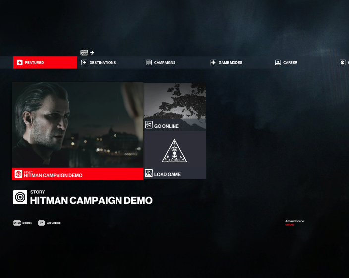

# Offline Dashboard

For this tutorial, we will go over patching the offline dashboard JSON file to add a custom campaign.

## Creating the `OfflineDashboard.JSON.patch` file

In the `content/chunk0` folder, create a file named `OfflineDashboard.JSON.patch` and set the contents to:

```json
{
	"file": "00230A8E3EEAE4DF",
	"patch": [
		{
			"op": "replace",
			"path": "/children/$mergearrays/0/$if/$else/data/header",
			"value": "$loc UI_STORY"
		},
		{
			"op": "replace",
			"path": "/children/$mergearrays/0/$if/$else/data/title",
			"value": "$loc UI_HITMAN_CAMPAIGN_DEMO"
		},
		{
			"op": "replace",
			"path": "/children/$mergearrays/0/$if/$else/data/icon",
			"value": "mission"
		},
		{
			"op": "replace",
			"path": "/children/$mergearrays/0/$if/$else/data/image",
			"value": "$res images/campaign_demo/campaign_demo_tile.jpg"
		},
		{
			"op": "add",
			"path": "/children/$mergearrays/0/$if/$else/actions/accept/0",
			"value": {
				"call": {
					"onmenuframe": true,
					"method": "showBackground",
					"args": false
				}
			}
		},
		{
			"op": "add",
			"path": "/children/$mergearrays/0/$if/$else/actions/accept/-",
			"value": {
				"set-selected": {
					"target": "$formatstring story_category_UI_MENU_PAGE_SIDE_MISSIONS_TITLE"
				}
			}
		},
		{
			"op": "add",
			"path": "/children/$mergearrays/0/$if/$else/actions/accept/-",
			"value": {
				"trigger-input": {
					"action": "accept"
				}
			}
		},
		{
			"op": "add",
			"path": "/children/$mergearrays/0/$if/$else/actions/accept/-",
			"value": {
				"set-selected": {
					"target": "$formatstring story_category_UI_HITMAN_CAMPAIGN_DEMO"
				}
			}
		},
		{
			"op": "add",
			"path": "/children/$mergearrays/0/$if/$else/actions/accept/-",
			"value": {
				"call": {
					"onmenuframe": true,
					"method": "showBackground",
					"args": true
				}
			}
		},
		{
			"op": "add",
			"path": "/children/$mergearrays/0/$if/$else/actions/accept/-",
			"value": {
				"trigger-input": {
					"action": "accept"
				}
			}
		},
		{
			"op": "replace",
			"path": "/children/$mergearrays/0/$if/$else/actions/select/replace-children/children/0/data/header",
			"value": "$loc UI_STORY"
		},
		{
			"op": "replace",
			"path": "/children/$mergearrays/0/$if/$else/actions/select/replace-children/children/0/data/title",
			"value": "$loc UI_HITMAN_CAMPAIGN_DEMO"
		},
		{
			"op": "replace",
			"path": "/children/$mergearrays/0/$if/$else/actions/select/replace-children/children/0/data/typeicon",
			"value": "mission"
		},
		{
			"op": "replace",
			"path": "/children/$mergearrays/0/$if/$else/actions/deselect/replace-children/children",
			"value": {}
		}
	]
}
```

Let's deploy our mod and see what happens.

## Deploying Custom Campaign Demo
* Open Simple Mod Framework and go to the mod list tab.
* You should See `Hitman Campaign Demo` in the list of available mods.
* Click the enable button for `Hitman Campaign Demo`.
* Click the `Apply` button.
* Launch Hitman
* Switch to Offline mode
    * Go to the `Options` tab.
    * Go to the `Privacy` tab.
    * Press the `Opt-out` button
    * Decline the `Privacy Policy`
* You should see a `Hitman Campaign Demo` tile.
* If you try to click it, it will take you to the wrong campaign, since we haven't created a mission contract yet.

## Next Steps
Now that we have a campaign with a tile button, let's create a mission contract so the campaign menu will work.