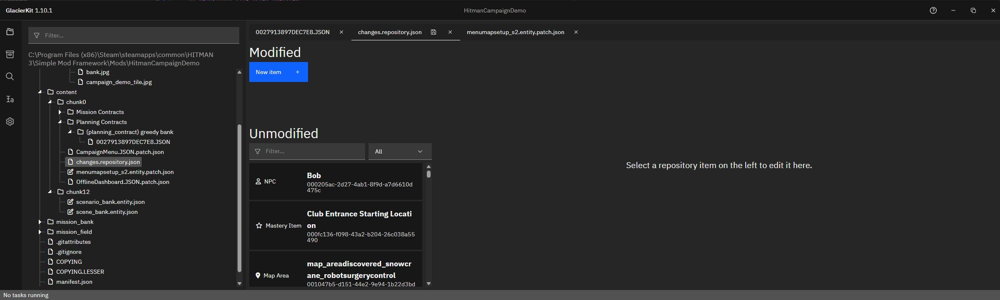
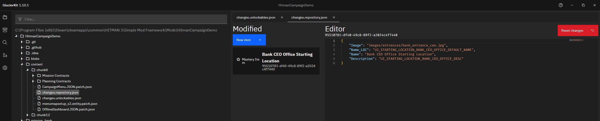

# Repository File

For this tutorial, we will go over creating a repository file.

## Repository File brief overview

The repository stores metadata about various things in Hitman: World of Assassination, from starting locations to NPCs, to weapons.

For our purposes we will just be adding a new starting location for now. 

## Creating a repository file
In GlacierKit, right-click on the `content/chunk0` folder and create a new file named `hitman_campaign_demo.repository.json`. (The exact filename doesn't really matter, as long as it ends with `.repository.json` but for this tutorial we'll use `hitman_campaign_demo.repository.json`).

## Modifying the repository file
In GlacierKit, click on the `hitman_campaign_demo.repository.json` file. You will see the repository editor:  

Click on the `New item` button.

```json
{
    "Image": "images/entrances/bank_entrance_ceo.jpg",
    "Name_LOC": "UI_STARTING_LOCATION_BANK_CEO_OFFICE_DEFAULT_NAME",
    "Name": "Bank CEO Office Starting Location",
    "Description": "UI_STARTING_LOCATION_BANK_CEO_OFFICE_DESC"
}
```
You should now see your custom starting location's repository entry.  


Note the new starting location's repository entry's new UUID, just above the Editor text area. We will need that for the next step, so highlight and copy it now.

Click the save icon.

## Create the starting location image
In the `blobs/images/` folder, create a new folder named `entrances`. In that folder create a new image named `bank_entrance_ceo.jpg`.

> Here is an example you can use for the `bank_entrance_ceo.jpg` file

## Next Steps
Now that we have a repostitory entry for our new starting location, we need to set it as unlocked to be able to use it.