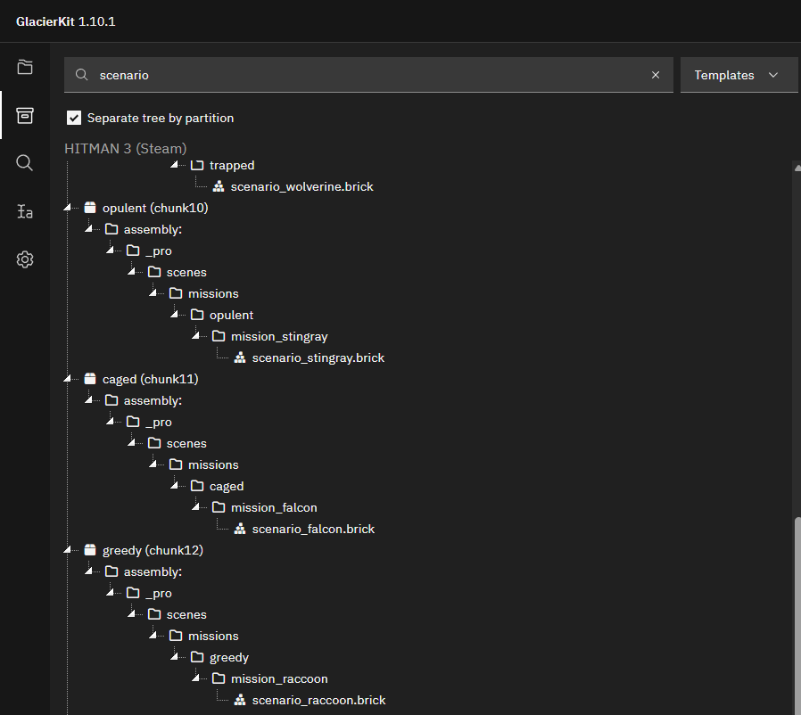
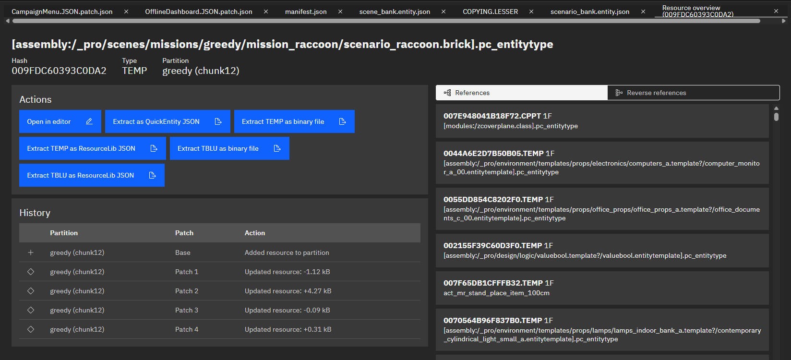
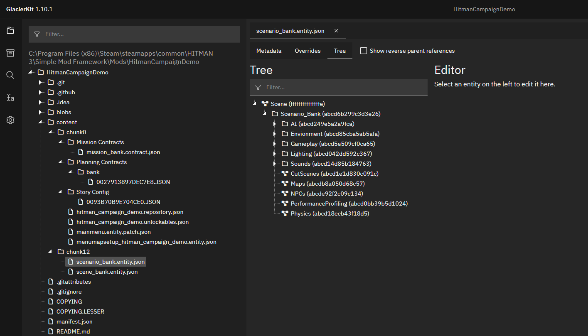

# Modifying Existing Mission

## Adding the `scenario_raccoon` brick to the bank scenario
Now that the Factory hash and Blueprint hash are set, lets include the Milton-Fitzpatrick bank scenario in our bank mission, so the game has something to load for our mission. But how do we find the scenario used by the `Golden Handshake` mission? We can use GlacierKit to find it, though it can be a little tricky depending on which mission you are looking for, as the file structure design for missions evolved over time during the development of Hitman: World of Assassination, and wasn't standardized until Hitman 2, and even then, there are still some exceptions.

In general though, in GlacierKit you can go to the `Game Content` tab, switch the dropdown to `Template` and type scenario in the search field, and press enter.

If you scroll down to the `greedy` section that we found it for the New York chunk, you can see that there is only one scenario, `scenario_raccoon.brick`. Click on it to open it in the file viewer.

Since it starts on the `Metadata` tab, you can see the IOI string at the top, as well as other metadata, like the file history, and references. For our purposes at the moment, we just need the IOI string, `[assembly:/_pro/scenes/missions/greedy/mission_raccoon/scenario_raccoon.brick].pc_entitytype`. Select it and copy it.

Switch back to the `scenario_bank.entity.json` file. In the `External scenes` section of the `Metadata` tab click the `Add an entry` button. Paste the `[assembly:/_pro/scenes/missions/greedy/mission_raccoon/scenario_raccoon.brick].pc_entitytype` value and press the `Continue` button.

Press the save button.

Let's deploy the mod and see what happens.

## Adding new entities to the mission
If you switch to the `Tree` tab and expand the `Scenario_Empty` node, you will see the scenario template structure.

This is where you can add any new entities for your mission.

## Removing entities from the original scenario