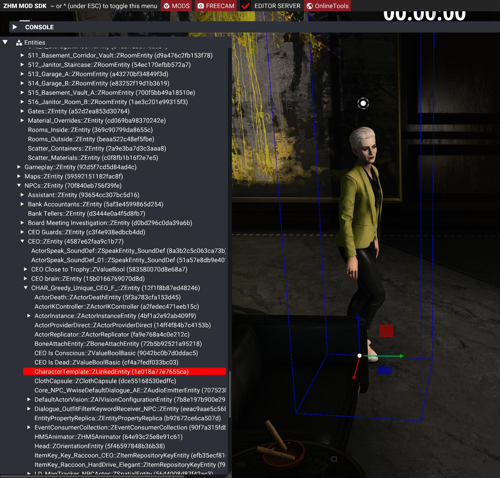
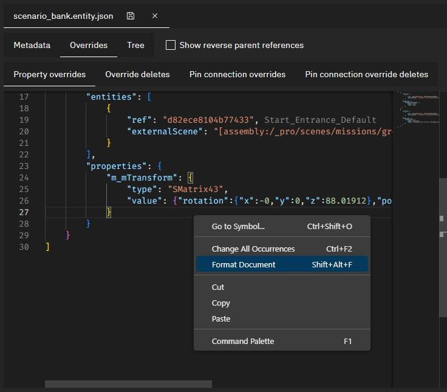
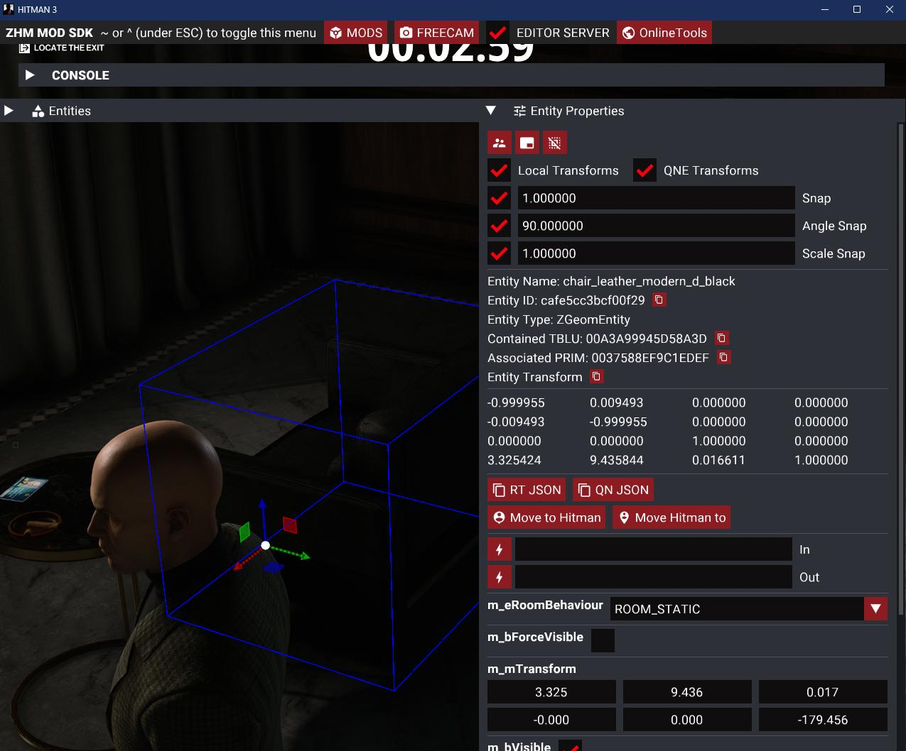

# Modifying Existing Mission

## Adding the `scenario_raccoon` brick to the bank scenario
Now that the Factory hash and Blueprint hash are set, lets include the Milton-Fitzpatrick bank scenario in our bank mission, so the game has something to load for our mission. But how do we find the scenario used by the `Golden Handshake` mission? We can use GlacierKit to find it, though it can be a little tricky depending on which mission you are looking for, as the file structure design for missions evolved over time during the development of Hitman: World of Assassination, and wasn't standardized until Hitman 2, and even then, there are still some exceptions.

In general though, in GlacierKit you can go to the `Game Content` tab, switch the dropdown to `Templates` and type `scenario` in the search field, and press enter. Check the box for `Separate tree by partition` to make it easier to find the scenario in the chunk we want.


If you scroll down to the `greedy` section that we found is for the New York chunk, you can see that there is only one scenario, `scenario_raccoon.brick`. Click on it to open it in the file viewer.  

> _Note:_ Some earlier destinations, for instance, Paris and Sapienza, use `location.brick` instead of `scenario_[CODENAME].brick`.


Since it starts on the `Metadata` tab, you can see the IOI string at the top, as well as other metadata, like the file history, and references. For our purposes at the moment, we just need the IOI string:  
`[assembly:/_pro/scenes/missions/greedy/mission_raccoon/scenario_raccoon.brick].pc_entitytype`  
Select it and copy it.

Switch back to the `scenario_bank.entity.json` file. In the `External scenes` section of the `Metadata` tab click the `Add an entry` button. Paste the:  
`[assembly:/_pro/scenes/missions/greedy/mission_raccoon/scenario_raccoon.brick].pc_entitytype`  
value and press the `Continue` button.

## Setting a property override

We have a new starting location, and we want that to be the default spawn, so we need to set the original starting location to not be the default spawn. For that we can use a property override.

Switch to the `Overrides` tab.

In the `Property overrides` section, set the contents to:
```json
[
  {
    "entities": [
      {
        "ref": "d82ece8104b77433",
        "externalScene": "[assembly:/_pro/scenes/missions/greedy/mission_raccoon/scenario_raccoon.brick].pc_entitytype"
      }
    ],
    "properties": {
      "m_bDefaultHeroSpawn": {
        "type": "bool",
        "value": false
      }
    }
  }
]
```
You'll see that in the `Property overrides` content section, the `ref` (reference) id now has text next to it that says `Start_Entrance_Default`. That indicates that the entity with that id in `scenario_raccoon` has that name. 

Switch to the `Tree` tab.  

You will see a node named `Scenario_Empty`. Click on that and rename it to `Scenario_Bank`.

## Adding new entities to the mission
Expand the `Scenario_Bank` node and you will see the scenario template structure.


This is where you can add any new entities for your mission.

Let's add our starting location.

Expand the `Gameplay` node.

Right-click on the `Starting Locations` node and click `Create Entity` and name it `CEO Office`.

Right-click on the `CEO Office` node and click `Create Entity` and name it `HeroSpawn_Location_Default`.

Click on the `HeroSpawn_Location_Default` entity. Replace the two lines that start with `"factory"` and `"blueprint"` with:
```json
	"factory": "[assembly:/_pro/design/levelflow.template?/herospawn.entitytemplate].pc_entitytype",
	"blueprint": "[assembly:/_pro/design/levelflow.template?/herospawn.entitytemplate].pc_entityblueprint",
	"properties": {
		"m_mTransform": {
			"type": "SMatrix43",
			"value": {
				"rotation": {
					"x": 0,
					"y": 0,
					"z": 0
				},
				"position": {
					"x": 0,
					"y": 0,
					"z": 0
				}
			}
		},
		"m_sId": {
			"type": "ZGuid",
			"value": "[INSERT STARTING LOCATION UUID]"
		},
		"m_bDefaultHeroSpawn": {
			"type": "bool",
			"value": true
		},
		"m_eidParent": {
			"type": "SEntityTemplateReference",
			"value": "fffffffffffffffe",
			"postInit": true
		}
	}
```
Replace `[INSERT STARTING LOCATION UUID]` with your starting location's UUID.

Click the save button.

## Deploying the mod and starting the mission

Let's deploy the mod and start our mission and see what happens.


The mission started, and Agent 47 was placed at coordinates (0, 0, 0).

This isn't the CEO's office, so let's find the coordinates to use for that.

For this we will need ZHMModSDK.

## Installing ZHMModSDK
[ZHMModSDK](https://github.com/OrfeasZ/ZHMModSDK). Follow the instructions on the readme to install this to the Hitman directory.
Briefly:
> 1. Download the latest version of the mod loader and the mods by going here, and downloading ZHMModSDK-Release.zip. This zip file contains the mod loader and a few sample mods.

> 2. Extract the contents of the ZHMModSDK-Release.zip archive to drive:\Path\To\HITMAN3\Retail, where drive:\Path\To\HITMAN3 is the path to your Hitman 3 installation directory. This will be at C:\Program Files\EpicGames\HITMAN3 or C:\Program Files (x86)\Steam\steamapps\common\HITMAN 3 by default. Make sure that you extract the files in the Retail folder and not the root HITMAN3 folder.

Relaunch the game and when prompted, select the mods you'd like.

## Finding the starting location coordinates
Start the mission again. You'll notice that a guard spots you pretty quickly, which will make it tough to find our coordinates.

We can pause the game by using ZHMModSDK.

Press the tilde key:
> `

to bring the ZHMModSDK menu to the foreground.

Click the `FREECAM` button at the top of the screen. On the popup menu, check the box for `Pause game in freecam`. 


That will let us buy some time to find the starting location coordinates we want by enabling the freecam.

Close the freecam settings by click the `X` button on the popup menu.

Press the tilde key again to put the ZHMModSDK menu in to background.

Press the `K` key to enable the freecam.

You can press the `F11` key to toggle showing the ZHMModSDK menu if you'd like.

Let's fly to the CEO's Office. 


Let's start 47 right by the chair. Aim at the ground next to the chair and press `Ctrl+F9` to teleport 47 to that spot.


Show the ZHMModSDK menu by pressing `F11` if it's hidden and reactivate it by pressing the tilde key:
> `

To select Agent 47 after teleporting in a paused freecam, we will need to toggle the freecam off and on again.

Click on Agent 47 to select his entity and show his entity's properties:


On his properties click the `QN JSON` button to copy his transform to the clipboard.

## Updating the starting location transform
Back in GlacierKit, in the `scenario_bank.entity.json` file, on the `HeroSpawn_Location_Default` node, select the whole `m_mTransform`'s `value` object:
  

`Paste` the clipboard contents in (`Ctrl+V` if you are using Windows). It will replace that value with the value you copied from the game:  


Press the save button.

> _Note:_ Occasionally, GlacierKit and the Editor in ZHMModSDK will get out of sync. If you notice that you press the save button in GlacierKit, and it does not save, or if you see a message about the app being unstable in the message bar at the bottom of GlacierKit, close and relaunch GlacierKit.  

Let's redeploy and relaunch the game and start our mission.  


We now start in the CEO's Office.

## Removing entities from the original scenario

While we're at it, let's also remove the existing CEO, Athena Savalas.  

In GlacierKit, go to the `Metadata` tab, and switch to the `Override deletes` tab. Set the contents to:

```json
[
  {
    "ref": "",
    "externalScene": "[assembly:/_pro/scenes/missions/greedy/mission_raccoon/scenario_raccoon.brick].pc_entitytype"
  }
]
```
Back in Hitman, we next need to build the entity tree. Click the `Rebuild entity tree` button. Once it is done, click on her to select her entity.  



When you click on an NPC, it selects the `CharacterTemplate::ZLinkedEntity` Node on the `Entities` panel, but what we need to be able to delete an NPC is the id of the `CHAR_*:ZEntity` node, which is this node's parent node.

Select the `CHAR_Greedy_Unique_CEO_F_::ZEntity` node, and then click the copy icon next to the `Entity ID` button on the `Entity Properties` panel.  

Back in GlacierKit, paste the entity id you copied into the `ref` field of the object you added to the `Override deletes`.

Press the save button.

If we redeploy, relaunch, and restart the mission, we can see that Athena Savalas is no longer there.  


## Moving existing entities

Let's redecorate the CEO's office a little bit.

Click the `Rebuild entity tree` button. Click on the crate in the corner of the room. It will have only selected a part of the crate, so on the entity tree, select the parent node, which is the `SetPiece_Container_Body_Chest_Wooden_B_03` entity.  


Use the Gizmo to move it to the other corner of the room, by dragging the green arrow. To have more screen room to see what you are doing, you can minimize the `Entities` panel and `Entity Properties` panel by clicking the arrow icons on the top left of the panels.


In GlacierKit, let's set a new override property for the crate and set the transform to the transform from the game. On the `scenario_bank.entity.json` file, go to the `Overrides` tab. On the `Property overrides` tab, add the following JSON snippet in the array after the `Start_Entrance_Default` override, adding a comma between them:
```json
{
  "entities": [
    {
      "ref": "",
      "externalScene": "[assembly:/_pro/scenes/missions/greedy/mission_raccoon/scenario_raccoon.brick].pc_entitytype"
    }
  ],
  "properties": {
    "m_mTransform": {
      "type": "SMatrix43",
      "value": {}
    }
  }
}
```

In ZHMModSDK Expand the `Entity Properties` panel again, and click on the copy button next to the `Entity ID`. Paste it into the `ref` field of the new entry in the property override. Click the `QN JSON` button to copy the transform.


Paste it into the `value` field of the new entry, replacing the `{}` that is there. The transform is not formatted, so right-click within the text area and click `Format Document`.


The `Property Overrides` section should now something look like this in full:
```json
[
  {
    "entities": [
      {
        "ref": "d82ece8104b77433",
        "externalScene": "[assembly:/_pro/scenes/missions/greedy/mission_raccoon/scenario_raccoon.brick].pc_entitytype"
      }
    ],
    "properties": {
      "m_bDefaultHeroSpawn": {
        "type": "bool",
        "value": false
      }
    }
  },
  {
    "entities": [
      {
        "ref": "72f6be8f4564de23",
        "externalScene": "[assembly:/_pro/scenes/missions/greedy/mission_raccoon/scenario_raccoon.brick].pc_entitytype"
      }
    ],
    "properties": {
      "m_mTransform": {
        "type": "SMatrix43",
        "value": {
          "rotation": {
            "x": -0,
            "y": 0,
            "z": 88.01912
          },
          "position": {
            "x": -27.27426,
            "y": 57.66893,
            "z": 25
          },
          "scale": {
            "x": 1,
            "y": 1,
            "z": 1
          }
        }
      }
    }
  }
]
```

Press the save button.

If you redeploy, relaunch, and restart the mission, you should now see the crate has moved to the other side of the room.


## Adding a new prop
Let's add a second chair while we're at it.

In ZHMModSDK, click the `Rebuild Entity Tree` button again.

Since we're copying an entity from the original scenario, let's switch back to the `[assembly:/_pro/scenes/missions/greedy/mission_raccoon/scenario_raccoon.brick].pc_entitytype` file in GlacierKit.

Click the `Open in editor` button. Switch to the `Tree` tab. Here you can see the scenario structure for the Golden Handshake mission. Now that we have ZHMModSDK's Editor mod running and GlacierKit opened to a brick that is loaded in the game, the Game Connection socket is open between GlacierKit and the Editor. You may want to set Hitman to windowed mode by pressing `Alt + Enter` to more easily see it side-by-side with GlacierKit, or move it to a second monitor if you have one. 

Click on the couch in Hitman and the `chair_leather_modern_d_black` node will be selected in GlacierKit.


In GlacierKit, right-click the `chair_leather_modern_d_black` node and click `Clipboard > Copy`. Switch back to the `scenario_bank.entity.json` file.

On the `Tree` tab, expand the nodes `Scene > Scenario_Bank > Environment`. Right-click on the `Environment` node and click `Create Entity` and name it `Props`. Right-click on the `Props` node and click `Clipboard > Paste`.

The `m_eidParent` node has a null `value`, so the entity won't actually be placed properly. Let's fix that.

Replace the `m_eidParent` object with this json object.
```json
{
    "type": "SEntityTemplateReference",
    "value": {
        "ref": "",
        "externalScene": "[assembly:/_pro/scenes/missions/greedy/mission_raccoon/scenario_raccoon.brick].pc_entitytype"
    }
}
```

Since the parent is in another brick, we need to set the `externalScene` value as shown above.

We need to set the `ref` value to what the original couch's `m_eidParent` value was. Switch back to the `scenario_raccoon.brick` file and to the chair entity. Copy the entity id in the `m_eidParent` value. Switch back to the `scenario_bank.entity.json` file and to the chair entity, and paste it into the ref field.

Right now the new couch has the exact same location as the original, so let's move the new couch as well.

In Hitman, click the couch and drag it somewhere with the gizmo.

On the `Entity Properties` panel, we can see the value for the `m_mTransform` value. We want to copy the transform, but currently the `Local Transforms` checkbox is not checked, so the transform shown is the global transform. Since this entity has a parent node that also has a position, we need to use the local transform, so that it gives the transform relative to that parent node. Check the `Local Transforms` checkbox, and click the `QN JSON` button to copy the local transform for the couch.



In GlacierKit, on the `scenario_bank.entity.json` file's `Tree` tab, on the new couch node, delete the `transform`'s `value` object and paste in the copied transform value.

Press the save button.

When you redeploy, relaunch, and restart the mission, you will see two chairs.  


## Next Steps
Now that we have changed the level geometry, let's generate a new navigation mesh and a new AI Reasoning Grid.