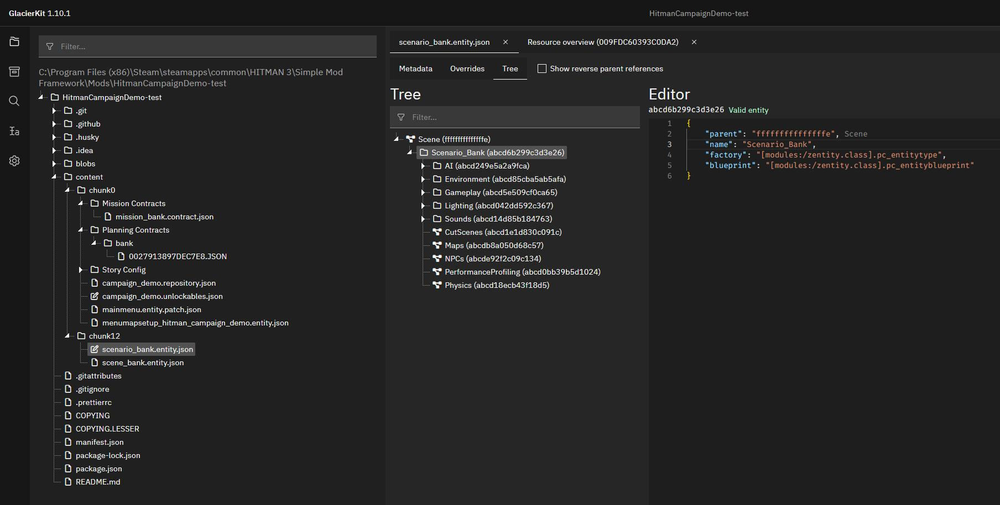

# Modifying Existing Mission

## Adding the `scenario_raccoon` brick to the bank scenario
Now that the Factory hash and Blueprint hash are set, lets include the Milton-Fitzpatrick bank scenario in our bank mission, so the game has something to load for our mission. But how do we find the scenario used by the `Golden Handshake` mission? We can use GlacierKit to find it, though it can be a little tricky depending on which mission you are looking for, as the file structure design for missions evolved over time during the development of Hitman: World of Assassination, and wasn't standardized until Hitman 2, and even then, there are still some exceptions.

In general though, in GlacierKit you can go to the `Game Content` tab, switch the dropdown to `Template` and type scenario in the search field, and press enter.


If you scroll down to the `greedy` section that we found it for the New York chunk, you can see that there is only one scenario, `scenario_raccoon.brick`. Click on it to open it in the file viewer.


Since it starts on the `Metadata` tab, you can see the IOI string at the top, as well as other metadata, like the file history, and references. For our purposes at the moment, we just need the IOI string, `[assembly:/_pro/scenes/missions/greedy/mission_raccoon/scenario_raccoon.brick].pc_entitytype`. Select it and copy it.

Switch back to the `scenario_bank.entity.json` file. In the `External scenes` section of the `Metadata` tab click the `Add an entry` button. Paste the `[assembly:/_pro/scenes/missions/greedy/mission_raccoon/scenario_raccoon.brick].pc_entitytype` value and press the `Continue` button.

Switch to the `Overrides` tab.

In the `Property overrides` section, set the contents to:
```json
[
  {
    "entities": [
      {
        "ref": "d82ece8104b77433",
        "externalScene": "[assembly:/_pro/scenes/missions/greedy/mission_raccoon/scenario_raccoon.brick].pc_entitytype"
      }
    ],
    "properties": {
      "m_bDefaultHeroSpawn": {
        "type": "bool",
        "value": false
      }
    }
  }
]
```
Switch to the `Tree` tab.  

You will see a node called `Scenario_Empty`. Click on that and rename it to `Scenario_Bank`.

## Adding new entities to the mission
Expand the `Scenario_Bank` node and you will see the scenario template structure.


This is where you can add any new entities for your mission.

Let's add our starting location.

Expand the `Gameplay` node.

Right-click on the `Starting Locations` node and click `Create entity` and name it `CEO Office`.

Righ-click on the `CEO Office` node and click `Create entity` and name it `HeroSpawn_Location_Default`.

Click on the `HeroSpawn_Location_Default` entity. Replace the two lines that start with `"factory"` and `"blueprint"` with:
```json
	"factory": "[assembly:/_pro/design/levelflow.template?/herospawn.entitytemplate].pc_entitytype",
	"blueprint": "[assembly:/_pro/design/levelflow.template?/herospawn.entitytemplate].pc_entityblueprint",
	"properties": {
		"m_mTransform": {
			"type": "SMatrix43",
			"value": {
				"rotation": {
					"x": 0,
					"y": 0,
					"z": 0
				},
				"position": {
					"x": 0,
					"y": 0,
					"z": 0
				}
			}
		},
		"m_sId": {
			"type": "ZGuid",
			"value": "[INSERT STARTING LOCATION UUID]"
		},
		"m_bDefaultHeroSpawn": {
			"type": "bool",
			"value": true
		},
		"m_eidParent": {
			"type": "SEntityTemplateReference",
			"value": "fffffffffffffffe",
			"postInit": true
		}
	}
```
Replace `[INSERT STARTING LOCATION UUID]` with your starting location's UUID.

Click the save button.

## Deploying the mod and starting the mission

Let's deploy the mod and start our mission and see what happens.


The mission started, and Agent 47 was placed at coordinates (0, 0, 0).

This isn't the CEO's office, so let's find the coordinates to use for that.

For this we will need ZHMModSDK.

## Installing ZHMModSDK
[ZHMModSDK](https://github.com/OrfeasZ/ZHMModSDK). Follow the instructions on the readme to install this to the Hitman directory.
Briefly:
> 1. Download the latest version of the mod loader and the mods by going here, and downloading ZHMModSDK-Release.zip. This zip file contains the mod loader and a few sample mods.

> 2. Extract the contents of the ZHMModSDK-Release.zip archive to drive:\Path\To\HITMAN3\Retail, where drive:\Path\To\HITMAN3 is the path to your Hitman 3 installation directory. This will be at C:\Program Files\EpicGames\HITMAN3 or C:\Program Files (x86)\Steam\steamapps\common\HITMAN 3 by default. Make sure that you extract the files in the Retail folder and not the root HITMAN3 folder.

Relaunch the game and when prompted, select the mods you'd like.

## Finding the starting location coordinates
Start the mission again. You'll notice that a guard spots you pretty quickly, which will make it tough to find our coordinates.

Click the `FREECAM` button at the top of the screen. On the popup menu, check the box for `Pause game in freecam`. 


That will let us buy some time to find the starting location coordinates we want by enabling the freecam.

Close the freecam settings by click the `X` button on the popup menu.

Press the `K` key to enable the freecam.

Press the tilde key:
> `  

to put the ZHMModSDK menu in the background. You can press the `F11` key to toggle showing the ZHMModSDK menu if you'd like. 

Let's fly to the CEO's Office. 


Let's start 47 right by the chair. Aim at the ground next to the chair and press `Ctrl+F9` to teleport 47 to that spot.


Show the ZHMModSDK menu by pressing `F11` if it's hidden and reactivate it by pressing the tilde key:
> `

To select Agent 47 after teleporting in a paused freecam, we will need to toggle the freecam off and on again.

Click on Agent 47 to select his entity and show his entity's properties:


On his properties click the `QN JSON` button to copy his transform to the clipboard.

## Updating the starting location transform
Back in GlacierKit, in the `scenario_bank.entity.json` file, on the `HeroSpawn_Location_Default` node, select the whole `m_mTransform`'s `value` object:

Press the `Paste` button, or `Ctrl+V` if you are using Windows. It will replace that value with the value you copied from the game:


Press save.

Let's redeploy and relaunch the game and start our mission.


We are now starting in the CEO's Office.

[//]: # (## Removing entities from the original scenario)

[//]: # (While we're at it, let's also remove the existing CEO, Athena Savalas. Click on her to select her entity.)

[//]: # (![ceo_selected.jpg]&#40;resources/ceo_selected.jpg&#41;)

[//]: # (Click the copy icon next to her `Entity ID`.)

[//]: # ()
[//]: # (Go to the `Metadata` tab, and switch to the `Override deletes` tab. Set the contents to:)

[//]: # (```json)

[//]: # ([)

[//]: # (  {)

[//]: # (    "entities": [)

[//]: # (      {)

[//]: # (        "ref": "01e018a77e7655ca",)

[//]: # (        "externalScene": "[assembly:/_pro/scenes/missions/greedy/mission_raccoon/scenario_raccoon.brick].pc_entitytype")

[//]: # (      })

[//]: # (    ])

[//]: # (  })

[//]: # (])

[//]: # (```)


[//]: # ()
[//]: # (To remove entities from the original scenario, let's switch back to the `[assembly:/_pro/scenes/missions/greedy/mission_raccoon/scenario_raccoon.brick].pc_entitytype` file in GlacierKit.)

[//]: # ()
[//]: # (Switch to the `Tree` tab. Here you can see the scenario structure for the Golden Handshake mission. Let's try deleting an NPC.)

