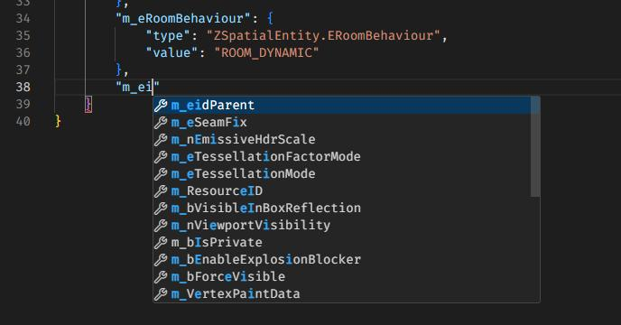
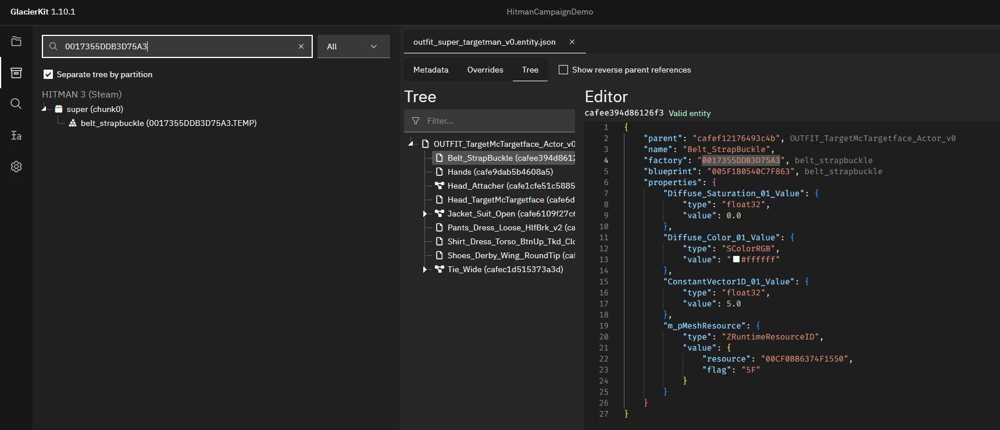
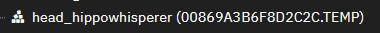

# Creating a New Mission

For this tutorial, we will go over creating a new custom mission and location.  
The mission will take place in:
* The country of `Modlandia`
* The city of `Modtown`  

And the name of the mission will be `Modtown Throwdown`.

For this new mission let's make it relatively simple, just a grassy field with a few small buildings and a few NPCs. Since we've already covered creating a mission in detail before, this time around will be a little more abbreviated, though there's still a lot to cover, so this page will be a bit of a doozy!

> Remember to make small, incremental changes, and to save, deploy, launch the mission, and commit your changes if they are successful. Keep in mind that sometimes the mod will crash on deployment or mission launching if there is a resource that is being referenced but has not been created yet. If you have created all the required resources, double check all the factory and blueprint hashes, and be wary of whether it includes the square brackets (`[` and `]`) and subsequent extension, and whether that extension includes the `pc_` or not. Also make sure everything is in the correct chunk folder. 

## Adding a new Location and Parent Location
Since we are making a new mission from scratch, not based on any existing mission, let's also make a new Location and Parent Location for it, so that it will show up in the Destinations tab. This mainly involves updating the manifest and unlockables, and adding some new images.

## Updating the Manifest
Let's open the `manifest.json` file and add a few new entries to the `localisation > english` object:
```json
      "UI_LOCATION_PARENT_MODLANDIA_COUNTRY": "Modlandia",
      "UI_LOCATION_MODTOWN_COUNTRY": "Modlandia",
      "UI_LOCATION_PARENT_MODLANDIA_CITY": "Modtown",
      "UI_LOCATION_MODTOWN_CITY": "Modtown",
      "UI_LOCATION_MODTOWN_TITLE": "Modtown Throwdown"
      "UI_MODTOWN_DESC": "I need to take out Super Targetman.",
      "UI_MODTOWN_TITLE": "Modtown Throwdown mission",
      "UI_STARTING_LOCATION_MODTOWN_OUTSIDE_DEFAULT_NAME": "Outside",
      "UI_STARTING_LOCATION_MODTOWN_OUTSIDE_DESC": "47 has made his way outside in Modtown.",
      "UI_MODTOWN_DESC": "I need to take out Super Targetman.",
      "UI_MODTOWN_TITLE": "Modtown Throwdown",
      "NPC_SUPER_TARGETMAN_NAME": "Super Targetman",
      "NPC_SUPER_TARGETMAN_DESC": "Super Targetman is the villian of Modlandia.",
```

Let's create a new packagedefinition entry:
```json
    {
      "type": "entity",
      "partition": "season3",
      "path": "[assembly:/_pro/scenes/missions/hitman_campaign_demo/mission_modtown/scene_modtown.entity].entitytemplate"
    }
```

Note that we set the partition to `season3`. This is because we won't need anything from any chunks other than `chunk0`, `chunk1`, and `chunk2`. For a refresher on chunks, see [Chunk Data](../../glacier2/chunkdata.md).

## Updating the repository file
In GlacierKit, open the `hitman_campaign_demo.repository.json` file and click on the `New item` button.

In the new item, replace the contents with:
```json
{
    "Image": "images/entrances/modtown/modtown_entrance_outside.jpg",
    "Name_LOC": "UI_STARTING_LOCATION_MODTOWN_OUTSIDE_DEFAULT_NAME",
    "Name": "Outside Starting Location",
    "Description": "UI_STARTING_LOCATION_MODTOWN_OUTSIDE_DESC"
}
```

Click on the `New item` button again. In the new item, replace the contents with:
```json
{
	"CommonName": "Outfit Super Targetman",
	"Description": "Outfit Super Targetman",
	"Name": "Outfit Super Targetman",
	"Category": "",
	"HeroDisguiseAvailable": false,
	"Image": "",
	"ImageTransparent": "",
	"IsHitmanSuit": false,
	"TokenID": ""
}
```
Copy the new outfit's repository entry UUID from under the `Editor` header text.

Click on the `New item` button again. In the new item, replace the contents with:
```json
{
	"CharacterSetIndex": 0.0,
	"Description": "Super Targetman",
	"Description_LOC": "actor_description",
	"Image": "images/campaign_demo/modtown/super_targetman.jpg",
	"Name": "Super Targetman",
	"Outfit": "[NEW OUTFIT REPOSITORY ENTRY UUID]",
	"OutfitVariationIndex": 0.0,
	"Tile": "images/campaign_demo/modtown/super_targetman.jpg"
}
```
Replace `[NEW OUTFIT REPOSITORY ENTRY UUID]` with the UUID you copied from the new outfit repository entry.

## Updating the Unlockables
In GlacierKit, open the `hitman_campaign_demo.unlockables.json` file and click the `New item` button. In the new Item, replace the contents with:
```json
{
	"Id": "LOCATION_PARENT_MODLANDIA",
	"Guid": "[NEW GENERATED UUID]",
	"Type": "location",
	"Subtype": "location",
	"ImageId": null,
	"RMTPrice": -1,
	"GamePrice": -1,
	"IsPurchasable": false,
	"IsPublished": true,
	"IsDroppable": false,
	"Capabilities": [],
	"Qualities": {},
	"Properties": {
		"Icon": "images/locations/modlandia/tile.jpg",
		"LockedIcon": "images/locations/modlandia/tile.jpg",
		"DlcImage": "images/livetile/dlc/tile_hitman3.jpg",
		"DlcName": "GAME_STORE_METADATA_S3_GAME_TITLE",
		"IsLocked": false,
		"UpcomingContent": false,
		"UpcomingKey": "UI_MENU_LIVETILE_CONTENT_UPCOMING_HEADLINE",
		"Background": "images/locations/modlandia/background.jpg",
		"Order": 0,
		"LimitedLoadout": false,
		"NormalLoadoutUnlock": "",
		"ProgressionKey": "LOCATION_MODLANDIA",
		"Season": 1,
		"RequiredResources": [
			"[assembly:/_pro/scenes/missions/hitman_campaign_demo/mission_modtown/scene_modtown.entity].entitytemplate"
		],
		"Entitlements": [
			"H1_LEGACY_STANDARD"
		]
	},
	"Rarity": null
}
```
Replace `[NEW GENERATED UUID]` with a newly generated UUID using GlacierKit.

We will also need to add new two new images: `images/locations/LOCATION_MODLANDIA/tile.jpg`, which should have a resolution of 693 x 517, and `images/locations/LOCATION_MODLANDIA/background.jpg`, which should be big enough to fit fullscreen (something like 1920 x 1080).

Now that we have our new parent location, let's add the sublocation.

In GlacierKit, on the `hitman_campaign_demo.unlockables.json` file, click the `New item` button. In the new Item, replace the contents with:
```json
{
  "Id": "LOCATION_MODTOWN",
  "Guid": "[NEW GENERATED UUID]",
  "Type": "location",
  "Subtype": "sublocation",
  "ImageId": null,
  "RMTPrice": -1,
  "GamePrice": -1,
  "IsPurchasable": false,
  "IsPublished": true,
  "IsDroppable": false,
  "Capabilities": [],
  "Qualities": {},
  "Properties": {
    "ParentLocation": "LOCATION_PARENT_MODLANDIA",
    "Icon": "images/campaign_demo/modtown/tile.jpg",
    "LockedIcon": "images/campaign_demo/modtown/tile.jpg",
    "DlcImage": "images/livetile/dlc/tile_hitman3.jpg",
    "DlcName": "GAME_STORE_METADATA_S3_GAME_TITLE",
    "IsLocked": false,
    "UpcomingContent": false,
    "UpcomingKey": "UI_MENU_LIVETILE_CONTENT_UPCOMING_HEADLINE",
    "Background": "images/campaign_demo/modtown/background.jpg",
    "Order": 0,
    "LimitedLoadout": false,
    "ProgressionKey": "LOCATION_MODTOWN",
    "CreateContractId": "[ANOTHER NEW GENERATED UUID]",
    "HideProgression": false,
    "RequiredResources": ["[assembly:/_pro/scenes/missions/hitman_campaign_demo/modtown/scene_modtown.entity].entitytemplate"],
    "Entitlements": ["H1_LEGACY_EXPANSION"]
  },
  "Rarity": null
}
```
Replace `[NEW GENERATED UUID]` with a newly generated UUID using GlacierKit.

Replace `[ANOTHER NEW GENERATED UUID]` with a different newly generated UUID using GlacierKit.

We will also need two more new images here: `images/locations/LOCATION_MODLANDIA/tile.jpg`, which should have a resolution of 693 x 517, and `images/locations/LOCATION_MODLANDIA/background.jpg`, which should be big enough to fit fullscreen (something like 1920 x 1080).

Let's also create a new unlockable for the starting location. Click the `New item`. On the new item, set the contents to:
```json
{
  "Id": "STARTING_LOCATION_OUTSIDE",
  "Type": "access",
  "Subtype": "startinglocation",
  "RMTPrice": -1,
  "GamePrice": -1,
  "IsPurchasable": false,
  "IsPublished": true,
  "IsDroppable": false,
  "Capabilities": [],
  "Qualities": {},
  "Properties": {
    "Location": "LOCATION_MODTOWN",
    "RepositoryId": "[NEW STARTING LOCATION REPOSITORY ENTRY UUID]",
    "Equip": [],
    "UnlockOrder": 3
  }
}
```

The next steps are similar to what we did for the bank mission, so let's just quickly go through them.

## Update the Story Config
Open the `storyconfig.JSON.patch.json` file. Add a new object in the `StoryData` array:
```json
{
    "Type": "Mission",
    "Id": "[NEW GENERATED UUID]",
    "_comment": "The Modtown Throwdown mission for the Hitman Campaign Demo"
}
```
Replace `[NEW GENERATED UUID]` with a new UUID generated with GlacierKit.

Click the save button.

## Update the Menu Map Setup file
In GlacierKit, open the `menumapsetup_hitman_campaign_demo.entity.json` file. On the `Tree` tab, expand the `Scene > MenuMapSetup_HitmanCampaignDemo` node. Right-click on the `MenuMapSetup_HitmanCampaignDemo` node and click `Create Entity`. Replace everything under the `parent` field with:
```json
	"name": "Scene_Modtown",
	"factory": "[assembly:/templates/ui/mapexportentities.template?/menumap.entitytemplate].pc_entitytype",
	"blueprint": "[assembly:/templates/ui/mapexportentities.template?/menumap.entitytemplate].pc_entityblueprint",
	"properties": {
		"m_pMetaDataResource": {
			"type": "ZRuntimeResourceID",
			"value": {
				"resource": "",
				"flag": "5F"
			}
		}
	}
}
```

The `m_pMetaDataResource > value > resource` field is where we will set the planning contract's IOI string for our new mission. Let's use `(planning contract) modlandia modtown`. Add this to the `Custom paths` in the GlacierKit Settings.   

In the `Text tools`, convert `(planning contract) modlandia modtown` to a Hex hash: `001421449C722898`, and enter that in the resource field of the `Scene_Modtown` entity.

Press the save button.

## Creating a new Planning Contract file
In the `content/chunk0/Planning Contracts` folder, create a new folder named `modtown`. Right-click on the new `modtown` folder and click `New file` and set the filename to our new planning contract's hex hash with `.JSON` at the end: `001421449C722898.JSON`.

Open that file and set the contents to:
```json
{
    "scene": "assembly:/_pro/scenes/missions/hitman_campaign_demo/mission_modtown/scene_modtown.entity",
    "actors": [],
    "entrances": [
        {
            "id": "[NEW STARTING LOCATION's REPOSITORY ENTRY'S UUID]",
            "isDefaultSpawn": true,
            "isPreferredSpawn": true,
            "WorldTransform": "0, 0, 0, 0, 0, 0, 0, 0, 1, 0, 0, 0"
        }
	],
	"Exits": [
      {
        "id": "[NEW GENERATED EXIT UUID]",
        "WorldTransform": "0, 0, 0, 0, 0, 0, 0, 0, 1, 0, 0, 0",
        "RequireKey": false
      }
	],
	"AgencyPickups": [
	]
}
```
Replace `[NEW STARTING LOCATION's REPOSITORY ENTRY'S UUID]` with your new starting location's repository entry's UUID.

Replace `[NEW GENERATED EXIT UUID]` with a new UUID generated using GlacierKit.

Press the save button.

## Creating a new Mission Contract file
Right-click on the `content/chunk0/Mission Contracts` folder, click `New file`, and set the filename to `mission_modtown.contract.json`. Open that file and set the contents to:
```json
{
    "Data": {
        "EnableSaving": true,
        "Objectives": [
            {
                "Id": "[NEW GENERATED UUID]",
                "Category": "primary",
                "ObjectiveType": "setpiece",
                "DisplayAsKillObjective": true,
                "ForceShowOnLoadingScreen": true,
                "IsHidden": false,
                "BriefingName": "$($repository [TARGET'S UUID]).Name",
                "Image": "images/campaign_demo/modtown/super_targetman.jpg",
                "HUDTemplate": {
                    "display": "Eliminate Super Targetman"
                },
                "BriefingText": "Eliminate Super Targetman",
                "SuccessEvent": {
                    "EventName": "Kill",
                    "EventValues": {
                        "RepositoryId": "[TARGET'S UUID]"
                    }
                }
            }
        ],
        "GameDifficulties": [
            {
                "Difficulty": "easy",
                "Bricks": []
            },
            {
                "Difficulty": "normal",
                "Bricks": []
            },
            {
                "Difficulty": "hard",
                "Bricks": []
            }
        ],
        "Bricks": [],
        "DevOnlyBricks": [],
        "Entrances": [
            "[ENTRANCE UUID]"
        ],
        "GameChangers": [],
        "GameChangerReferences": []
    },
    "Metadata": {
        "Id": "[ANOTHER NEW GENERATED UUID]",
        "IsPublished": true,
        "Title": "UI_MODTOWN_TITLE",
        "Description": "UI_MODTOWN_DESC",
        "CodeName_Hint": "Modtown",
        "ScenePath": "assembly:/_pro/scenes/missions/hitman_campaign_demo/mission_modtown/scene_modtown.entity",
        "TileImage": "images/campaign_demo/modtown/tile.jpg",
        "Location": "LOCATION_MODTOWN",
        "LastUpdate": "2025-05-02T19:44:00.000Z",
        "CreationTimestamp": "2025-05-02T19:44:00.000Z",
        "CreatorUserId": "a38f1dce-a7af-4a3c-a47a-5a94db8c0ed9",
        "Type": "mission",
        "Release": "3.0.0",
        "Entitlements": [
            "H2_LEGACY_EXPANSION"
        ]
    },
    "UserData": {},
    "SMF": {
        "destinations": {
            "addToDestinations": true,
            "peacockIntegration": true,
            "narrativeContext": "Mission"
        }
    }
}
```
Replace `[NEW GENERATED UUID]` and `[ANOTHER NEW GENERATED UUID]` with newly generated UUIDs using GlacierKit.

Replace `[TARGET'S UUID]` with the new target's repository entry UUID.  

Replace `[ENTRANCE UUID]` with the new starting location's repository entry UUID.  

Click the save button.

## Creating a scene and scenario
In the `content` folder, create a new folder named `modtown`. In that folder create a new folder named `chunk2`.

In GlacierKit, right-click on the new `chunk2` folder, and click `Create file` and name it `scene_modtown.entity.json` and click on it.

In the `Metadata` tab, in the `Factory hash` field, enter:  
`[assembly:/_pro/scenes/missions/hitman_campaign_demo/mission_modtown/scene_modtown.entity].pc_entitytemplate`  
In the `Blueprint hash`, enter:
`[assembly:/_pro/scenes/missions/hitman_campaign_demo/mission_modtown/scene_modtown.entity].pc_entityblueprint`  
In the `External Scenes` section, click the `Add an entry` button, enter:  
`[assembly:/_pro/scenes/missions/hitman_campaign_demo/mission_modtown/scenario_modtown.brick].pc_entitytype`  
and press the `Continue` button.

Press the save button.

Download the [empty_scenario_brick.entity.json](resources/empty_scenario_brick.entity.json) template again and save it as `content/chunk2/scenario_modtown.entity.json` and click it.
In the `Metadata` tab, in the `Factory hash` field, enter:  
`[assembly:/_pro/scenes/missions/hitman_campaign_demo/mission_modtown/scenario_modtown.entity].pc_entitytype`  
In the `Blueprint hash`, enter:
`[assembly:/_pro/scenes/missions/hitman_campaign_demo/mission_modtown/scenario_modtown.entity].pc_entityblueprint`  
In the `External scenes` section, click `Add an entry`, enter:  
`[assembly:/_pro/scenes/missions/hitman_campaign_demo/outfits_modtown.brick].pc_entitytype`  
and press `Continue`.

We will also need a few more external scenes to make the mission load properly. Add all of these as well:  
`[assembly:/_pro/scenes/bricks/gameessentialsbase.brick].pc_entitytype`  
`[assembly:/_pro/scenes/bricks/globaldata.brick].pc_entitytype`  
`[assembly:/_pro/scenes/bricks/ui_hitman_s2.brick].pc_entitytype`  
`[assembly:/_pro/scenes/bricks/ui_hitman_s3.brick].pc_entitytype`  

Switch to the `Tree` tab and rename the `Scenario_Empty` node to `Scenario_Modtown`. Expand the `Scenario_Modtown > Gameplay` node and right-click on the `Starting locations` node and click `Create Entity` and name it `Outside` and click on the `Outside` node. Replace everything in the contents after the `parent` field with:
```json
  "name": "Outside",
  "factory": "[assembly:/_pro/design/levelflow.template?/herospawn.entitytemplate].pc_entitytype",
  "blueprint": "[assembly:/_pro/design/levelflow.template?/herospawn.entitytemplate].pc_entityblueprint",
  "properties": {
    "m_mTransform": {
      "type": "SMatrix43",
      "value": {
        "rotation": {
          "x": 0,
          "y": 0,
          "z": 0
        },
        "position": {
          "x": 0,
          "y": 0,
          "z": 0
        }
      }
    },
    "m_sId": {
      "type": "ZGuid",
      "value": "[OUTSIDE STARTING LOCATION UUID]"
    },
    "m_bDefaultHeroSpawn": {
      "type": "bool",
      "value": true
    },
    "m_bPreferredHeroSpawn": {
      "type": "bool",
      "value": true
    },
    "m_eidParent": {
      "type": "SEntityTemplateReference",
      "value": "fffffffffffffffe",
      "postInit": true
    }
  }
}
```
Replace `[OUTSIDE STARTING LOCATION UUID]` with the new outside starting location's repository entry UUID. 

Right-click on the `Gameplay > Hero` node and click `Create Entity` and set the name to `Agent47_Default`, and click on the new entity node, and in the contents, replace everything after the `parent` field with:
```json
	"name": "Agent47_Default",
	"factory": "[assembly:/_pro/characters/templates/hero/agent47/agent47.template?/agent47_default.entitytemplate].pc_entitytype",
	"blueprint": "[assembly:/_pro/characters/templates/hero/agent47/agent47.template?/agent47_default.entitytemplate].pc_entityblueprint",
	"properties": {
		"m_mTransform": {
			"type": "SMatrix43",
			"value": {
				"rotation": {
					"x": 0,
					"y": 0,
					"z": 0
				},
				"position": {
					"x": 0,
					"y": 0,
					"z": 0
				}
			}
		},
		"m_eidParent": {
			"type": "SEntityTemplateReference",
			"value": "fffffffffffffffe",
			"postInit": true
		}
	}
}
```

Expand the `Environment` node. We have an empty `000_Outside` node, but let's replace it with a more filled out one. First let's delete that node by right-clicking it and pressing `Delete`. The `XXX_Room_Folder_Structure` node has some useful categories, so let's copy it. Right-click that node and press `Clipboard > Copy`. Then right-click the `Environment` node and press `Clipboard > Paste`.

Next let's make our new `000_Outside` node a `zroomentity`. Click the `000_Outside` node and in the contents, replace everything after the `parent` field with:
```json
  "name": "000_Outside",
  "factory": "[modules:/zroomentity.class].pc_entitytype",
  "blueprint": "[modules:/zroomentity.class].pc_entityblueprint",
  "properties": {
    "m_vRoomMin": {
      "type": "SVector3",
      "value": {
        "x": -1000,
        "y": -1000,
        "z": -1000
      }
    },
    "m_vRoomMax": {
      "type": "SVector3",
      "value": {
        "x": 1000,
        "y": 1000,
        "z": 1000
      }
    },
    "m_mTransform": {
      "type": "SMatrix43",
      "value": {
        "rotation": {
          "x": 0,
          "y": 0,
          "z": 0
        },
        "position": {
          "x": 0,
          "y": 0,
          "z": 0
        }
      }
    },
    "m_bIsPrivate": {
      "type": "bool",
      "value": false
    },
    "m_bOutside": {
      "type": "bool",
      "value": true
    },
    "m_bCSMRoom": {
      "type": "bool",
      "value": true
    }
  },
  "subsets": {
    "Rooms": [
      "fffffffffffffffe"
    ]
  }
}
```
Right-click the `Geometry` node and click `Create Entity` and name it `Floor`. Click it and in the contents, replace everything after the `parent` field with:
```json
{
	"name": "Floor",
	"factory": "0065E6850BB157E2",
	"blueprint": "00B6E9D9DA6DE143",
	"properties": {
		"m_mTransform": {
			"type": "SMatrix43",
			"value": {
				"rotation": {
					"x": 0,
					"y": 0,
					"z": 0
				},
				"position": {
					"x": 0.0,
					"y": 10.0,
					"z": 10.0
				}
			}
		},
		"m_PrimitiveScale": {
			"type": "SVector3",
			"value": {
				"x": 20,
				"y": 20,
				"z": 1
			}
		},
		"m_bVisible": {
			"type": "bool",
			"value": true
		},
		"m_eRoomBehaviour": {
			"type": "ZSpatialEntity.ERoomBehaviour",
			"value": "ROOM_DYNAMIC"
		}
	}
}
```
Next, click on the `000_Outside` entity and copy the entity id underneath the `Editor` header text. Then click on the `Floor` node and at the bottom of the properties object, add a new object by adding a comma, then a `"`, and then start typing `m_eidParent`. The autocomplete will pop up. Select `m_eidParent` and press enter, and it will fill out the rest of the object. Replace the `null` value with the entity id you copied. Then it should look something like this:
```json
        ...
		"m_eRoomBehaviour": {
			"type": "ZSpatialEntity.ERoomBehaviour",
			"value": "ROOM_DYNAMIC"
		},
		"m_eidParent": {
			"type": "SEntityTemplateReference",
			"value": "abcd2f7d17f552be"
		}
	}
}
```


Next, right-click on the `Gameplay > Exit locations` node and click `Create Entity` and set the name to `Exit`. Click on the new `Exit` node and in the contents, replace everything after the `parent` field with:
```json

	"name": "Exit_MainEntrance",
	"factory": "[assembly:/_pro/design/levelflow.template?/exit_pushbutton.entitytemplate].pc_entitytype",
	"blueprint": "[assembly:/_pro/design/levelflow.template?/exit_pushbutton.entitytemplate].pc_entityblueprint",
	"properties": {
		"m_mTransform": {
			"type": "SMatrix43",
			"value": {
				"rotation": {
					"x": 0.0,
					"y": 0.0,
					"z": 0.0
				},
				"position": {
					"x": 5.0,
					"y": 5.0,
					"z": 0.0
				}
			}
		},
		"m_sId": {
			"type": "ZGuid",
			"value": "[NEW EXIT'S UUID]"
		},
		"Manual_Exit_Trigger_Needed": {
			"type": "bool",
			"value": true
		},
		"name_metricvalue": {
			"type": "ZString",
			"value": "Exit_Modtown_ExitName"
		},
		"Show3dExitSpatial": {
			"type": "bool",
			"value": true
		},
		"m_mTransforminteraction": {
			"type": "SMatrix43",
			"value": {
				"rotation": {
					"x": -0.0,
					"y": 0.0,
					"z": -0.0
				},
				"position": {
					"x": 0.07000000029802322,
					"y": -0.8199999928474426,
					"z": -0.3400000035762787
				}
			}
		},
		"m_mTransformprompt": {
			"type": "SMatrix43",
			"value": {
				"rotation": {
					"x": -0.0,
					"y": 0.0,
					"z": -0.0
				},
				"position": {
					"x": 0.0,
					"y": 0.0,
					"z": 1.2699999809265137
				}
			}
		},
		"m_mTransformexiticon": {
			"type": "SMatrix43",
			"value": {
				"rotation": {
					"x": -0.0,
					"y": 0.0,
					"z": -0.0
				},
				"position": {
					"x": 0.0,
					"y": 0.0,
					"z": 1.6200000047683716
				}
			}
		},
		"m_eidParent": {
			"type": "SEntityTemplateReference",
			"value": "fffffffffffffffe"
		}
	},
	"events": {
	}
}
```

Now right-click the `Scenario_Modtown > NPCs` node and click `Create Entity` and set the name to `Super Targetman`. Click on the new `Super Targetman` node and in the contents, replace everything after the `parent` field with:
```json
	"name": "Super Targetman",
	"factory": "[assembly:/templates/gameplay/ai2/actors.template?/npcactor.entitytemplate].pc_entitytype",
	"blueprint": "[assembly:/templates/gameplay/ai2/actors.template?/npcactor.entitytemplate].pc_entityblueprint",
	"properties": {
		"m_mTransform": {
			"type": "SMatrix43",
			"value": {
				"rotation": {
					"x": 0.0,
					"y": 0.0,
					"z": 0.0
				},
				"position": {
					"x": 0.0,
					"y": 5.0,
					"z": 0.0
				}
			}
		},
		"RepositoryId": {
			"type": "ZGuid",
			"value": "[SUPER TARGETMAN'S REPOSITORY ENTRY UUID]"
		},
		"m_OutfitRepositoryID": {
			"type": "ZGuid",
			"value": "[SUPER TARGETMAN'S OUTFIT'S REPOSITORY ENTRY UUID]"
		},
		"m_nOutfitVariation": {
			"type": "int32",
			"value": 0
		},
		"m_sActorName": {
			"type": "ZString",
			"value": "Super Targetman"
		},
		"m_nOutfitCharset": {
			"type": "int32",
			"value": 0
		},
		"m_eRequiredVoiceVariation": {
			"type": "EActorVoiceVariation",
			"value": "eAVV_CIVMALE08"
		},
		"m_aEnforcedOutfits": {
			"type": "TArray<SEntityTemplateReference>",
			"value": [
			]
		},
		"m_eidParent": {
			"type": "SEntityTemplateReference",
			"value": "fffffffffffffffe",
			"postInit": true
		}
	},
	"subsets": {
		"AudioEmitters": [
			"fffffffffffffffe"
		],
		"Replicable": [
			"fffffffffffffffe"
		]
	}
}
```

Replace `[SUPER TARGETMAN'S REPOSITORY ENTRY UUID]` and `[SUPER TARGETMAN'S OUTFIT'S REPOSITORY ENTRY UUID]` with the repository entries for Super Targetman and his outfit respectively.

Right-click on the `Gameplay` node and click `Create entity` and name it `Map`, and click on that new node, and in the contents, replace everything after the `parent` field with:
```json
	"name": "Modtown",
	"factory": "[assembly:/templates/ui/mapmarkup.template?/menumap.entitytemplate].pc_entitytype",
	"blueprint": "[assembly:/templates/ui/mapmarkup.template?/menumap.entitytemplate].pc_entityblueprint",
	"properties": {
		"m_pMetaDataResource": {
			"type": "ZRuntimeResourceID",
			"value": {
				"resource": "001421449C722898",
				"flag": "5F"
			}
		}
	}
}
```
Where `001421449C722898` is the hash of our planning contract for this mission.

Press the save button.

## Updating the Charset
For simplicity, let's copy our entire outfit folder from `content/chunk12/Outfits` to `content/chunk2`. This cannot be done from GlacierKit, so in GlacierKit right-click on the `chunk12` folder and click `Show in Explorer`. Copy the outfit folder, then go to the `content/chunk2` folder and paste it.

In GlacierKit, the new folder should have appeared. Let's modify the files to fit our new mission and NPCs. Before we get started, so we don't get our two `Outfits` folders confused, let's collapse the `chunk12/Outfits` folder by click the arrow next to it.

First rename the `chunk2/Outfits/charset_target_mctargetface.entity.json` file to `charset_super_targetman.entity.json`, then click on that file.

Rename the `CHARSET_TargetMcTargetface` to `CHARSET_SuperTargetman`. Expand the `CHARSET_SuperTargetman > Actor > 0` node and click on the `0` node. Replace the `properties > m_Outfit > value > resource` value with:  
`[assembly:/_pro/characters/templates/hitman_campaign_demo/outfit_super_targetman_actor_v0.entitytemplate].pc_entitytemplate`.  

Next expand the `HeroA` node and click on `Var0`. Replace the `properties > m_Outfit > value > resource` value with:  
`[assembly:/_pro/characters/templates/hitman_campaign_demo/outfit_super_targetman_actor_v0.entitytemplate].pc_entitytemplate`.  

Next expand the `Nude` node and click on `Var0`. Replace the `properties > m_Outfit > value > resource` value with:  
`[assembly:/_pro/characters/templates/hitman_campaign_demo/outfit_super_targetman_actor_v0.entitytemplate].pc_entitytemplate`.

Next, switch to the `Metadata` tab. In the `Factory hash` text field enter:  
`[assembly:/_pro/characters/templates/hitman_campaign_demo/charset_super_targetman.entitytemplate].pc_entitytemplate`  
In the `Blueprint hash` text field enter:  
`[assembly:/_pro/characters/templates/hitman_campaign_demo/charset_super_targetman.entitytemplate].pc_entitytemplate`  
Press the save button.

## Updating the Outfit
Next, rename the `chunk2/Outfits/outfit_target_mctargetface_v0.entity.json` file to `outfit_super_targetman_v0.entity.json` and click on it. Rename the `OUTFIT_TargetMcTargetface_Actor_v0` node to `OUTFIT_SuperTargetman_Actor_v0` and expand it.

Since our outfit for the other mission took place on the New York brick, we might not have access to some of the outfit parts. For each part, we can check using GlacierKit. Click on the `Belt_StrapBuckle` node, copy the factory hash `0017355DDB3D75A3`, switch to the `Game content` tab and search for that hash. Check the `Separate tree by partition` checkbox.  
  
We can see that the `Belt_StrapBuckle` resource is in the `super` / `chunk0` partition. Consulting our handy [Chunk Data](../../glacier2/chunkdata.md) guide, we can see that every chunk has access to the content in `chunk0` including the `season3` / `chunk2` partition that our new mission is in. So we are free to use this outfit part. Continuing with the rest of the outfit parts, we can see that every outfit part is in chunk0, except for the resource used by the `Head_TargetMcTargetface` node. We will need to swap that out. First let's rename the `Head_TargetMcTargetface` node to `Head_SuperTargetman`.  

Let's find Super Targetman a new head! In the `Game content` tab search for `head_` and set the dropdown to `Templates`, and make sure the `Separate tree by partition` checkbox is checked. Expand the `super (chunk0)` node and scroll down until you see the nodes with the icons of stacks of boxes in a triangle shape, and that end in `.TEMP`. Choose whichever head you'd like. In this example, `head_hippowhisperer` is used.
  
Click on the head you'd like and click `Open in editor`, and switch to the `Metadata` tab. Copy the `Factory hash` value and switch back to the `outfit_super_targetman_v0.entity.json` file and paste it into the `Head_SuperTargetman` node's `factory` field. Switch back to the `head_hippowhisperer` resource and copy the `Blueprint hash` value and switch back to the `outfit_super_targetman_v0.entity.json` file and paste it into the `Head_SuperTargetman` node's `blueprint` field.  

Press the save button.

## Updating the outfits brick
Rename the `chunk2/Outfits/outfits_bank.entity.json` file to `outfits_modtown.entity.json`, click on it, and switch to the `Metadata` tab. In the `Factory hash` field, enter:  
`[assembly:/_pro/scenes/missions/hitman_campaign_demo/outfits_modtown.brick].pc_entitytype`  
In the `Blueprint hash` field, enter:  
`[assembly:/_pro/scenes/missions/hitman_campaign_demo/outfits_modtown.brick].pc_entityblueprint`  
Switch to the `Tree` tab, and rename the `Target McTargetface` node to `Super Targetman` and click on that node. 

Change the `m_sId` value to the repository entry for the Super Targetman outfit.

Change the `m_sCommonName` and `m_sTitle` values to `Super Targetman`

Rename the `CHARSET_TargetMcTargetface` to `CHARSET_SuperTargetman` and click on that node.

Change the `factory` value to:  
`[assembly:/_pro/characters/templates/hitman_campaign_demo/charset_super_targetman.entitytemplate].pc_entitytemplate`  
Change the `blueprint` value to:  
`[assembly:/_pro/characters/templates/hitman_campaign_demo/charset_super_targetman.entitytemplate].pc_entityblueprint`

Delete the `Prof_Greedy_Unique_CEO` node.

Press the save button.

## Deploying
If all went well, we should be able to deploy the mod now and see our new mission.