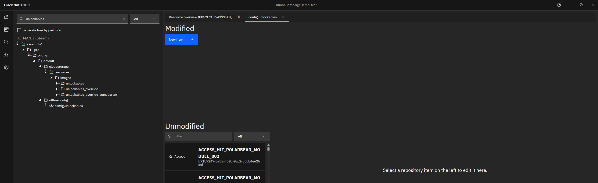
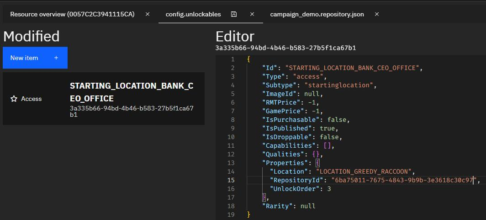

# Unlockables File

For this tutorial, we will go over creating an unlockables file.

## Brief overview of the Unlockables File
The Unlockables file contains metadata about, well, you guessed it, things that can be unlocked. This includes things like starting locations, outfits, and locations.

## Creating and modifying an Unlockables File
In GlacierKit, on the `Game content` tab, search for unlockables. Open the `assembly:/_pro/online/default/offlineconfig/config.unlockables` file, and click the `Open in editor` button. You will see the Unlockables entries.


## Adding a new entry for the starting location 
Click the `New Item` button and click on the new item. In the editor for your new entry, set the contents to:

```json
{
    "Id": "STARTING_LOCATION_BANK_CEO_OFFICE",
    "Type": "access",
    "Subtype": "startinglocation",
    "ImageId": null,
    "RMTPrice": -1,
    "GamePrice": -1,
    "IsPurchasable": false,
    "IsPublished": true,
    "IsDroppable": false,
    "Capabilities": [],
    "Qualities": {},
    "Properties": {
      "Location": "LOCATION_GREEDY_RACCOON",
      "RepositoryId": "[UUID OF STARTING LOCATION]",
      "UnlockOrder": 3
    },
    "Rarity": null
}
```

Note, the `STARTING_LOCATION_BANK_CEO_OFFICE` text matches what we set in the manifest for `UI_STARTING_LOCATION_BANK_CEO_OFFICE_DEFAULT_NAME` and `UI_STARTING_LOCATION_BANK_CEO_OFFICE_DESC`. This is how the game knows to use those strings for this location, so they will need to match.

Set the `RepositoryId` to the value copied from the repositories file in the previous step.  



Click the save button. Navigate to the `content/chunk0` folder and set the name to something like `campaign_demo`. Similarly to the repository file we created in the previous section, the only important part of the name is `.unlockables.json`, so you can name it whatever you'd like, but for this tutorial we'll refer to it as `campaign_demo.unlockables.json`.


## Next Steps
Now that we have the Unlockables File set, let's create a planning contract for our scene. 