# Using NavKit
For this tutorial, we will go over how to use [NavKit](https://github.com/glacier-modding/NavKit/).

## What is NavKit for?
You can make a map using just the ZHMModSDK and GlacierKit, so why do you need a third tool?

The reason NavKit was created was because NPCs cannot directly use level geometry for pathfinding. They need to have the walkable areas of the map defined explicitly. In Hitman: World of Assassination, the way these are defined is through two files, a navigation mesh (NAVP file), and an AI Reasoning Grid (AIRG) file.

NavKit is used to take a level's geometry and generate these two files for the level so that NPCs will be able to walk along the surface of the level normally.

Now that we know why we need NavKit when making custom levels, let's install it.

## Installing NavKit
To install NavKit, click the link above, download the latest release `.zip` file, and extract it somewhere on your computer.

You will need to make sure you have ZHMModSDK installed (described in the [previous step](scene_modified.md)).

You will need to install [Blender](https://www.blender.org/download/), as NavKit uses it to build a 3D mesh of the extracted scene with the level's geometry. 

In the current version of NavKit you will also need to do one more step, which is to copy the custom `Editor.dll` file from the extracted directory to your `Hitman 3/Retail/mods` folder, overwriting the existing `Editor.dll` file, or you could create a backup of your current copy if you'd like. If you want to uninstall NavKit later, you can always grab another copy of the original `Editor.dll` file from the latest ZHMModSDK release.

You will also need to install the latest Visual C++ Redistributable from https://learn.microsoft.com/en-us/cpp/windows/latest-supported-vc-redist?view=msvc-140. Make sure you get the X64 version.

That's it, now you should be able to launch the `NavKit.exe` file and see the NavKit user interface.

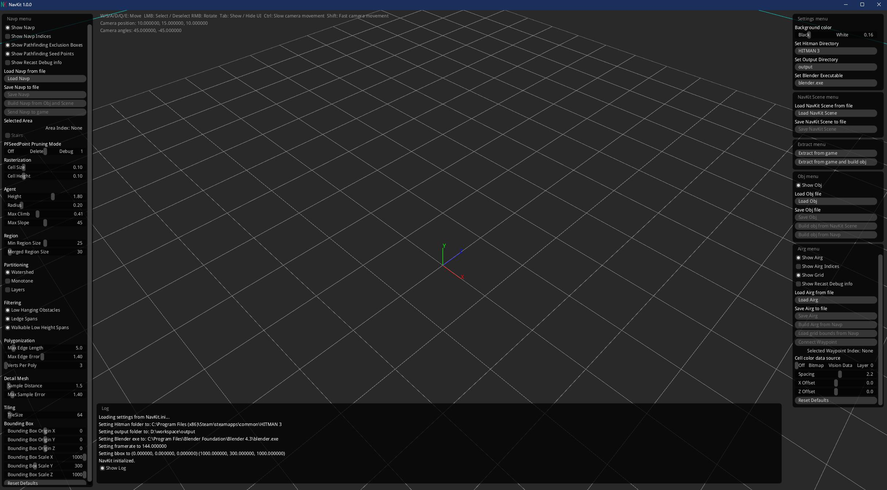

## Using NavKit
It may look a little daunting, as there are a lot of options, but most of the time you won't need to adjust the settings.

The first thing you may notice is the cell grid and the coordinate axes. Note that here Y is up and Z is forward, unlike in Hitman, which is Z-up and Y-forward. This is due to the tool NavKit uses (Recast) under the hood for a lot of the generation features. Don't worry, it will automatically convert between the coordinate systems as needed.

With NavKit you can load, save, and visualize NAVP and AIRG files. You can also do the same with OBJ files, which are 3D model files.

The main way to use NavKit is to follow these 4 steps:
1. Extract a scene from the game to a `.nav.json` file.
2. Take a `.nav.json` file and use it to build a `.obj` file.
3. Take the `.obj` file and use it to build a `.navp`. file.
4. Take the `.navp` file and use it to build a `.airg` file.

Once you have the NAVP and AIRG files, you can tell your custom mission to use them and the NPCs will follow your custom level geometry.

## Brief overview of navigation mesh (NAVP) files
A navigation mesh is a simplified 3D mesh of a map's walkable space. The mesh is divided into flat polygons, called areas, and the areas are connected by their edges. In Hitman: World of Assassination, the navigation mesh is saved in the form of a NavPower (NAVP) file.
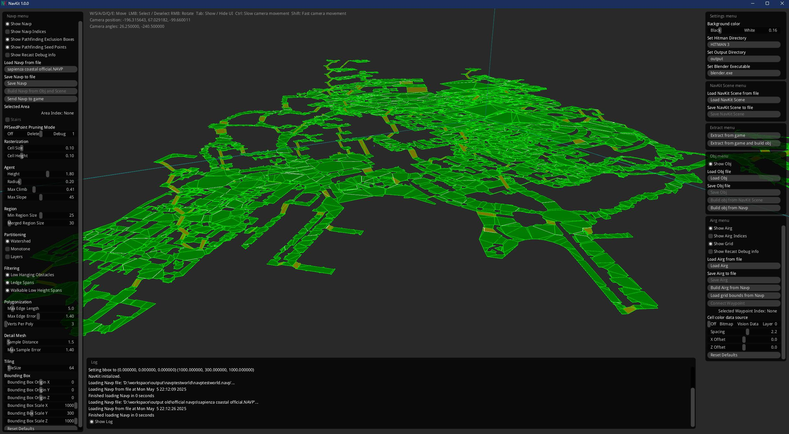
> The official Sapienza NAVP, as visualized in NavKit.  

When an NPC needs to find a path from one point of the map to another, the game:
1. Plots the start and end points on the navigation mesh
2. Checks if it can get from the start point to the end walking only along connected areas
3. Plots a course that minimizes the distance needed 

The NAVP file is a great tool, but the pathfinding calculations can get a little expensive when many NPCs need to pathfind on large maps. That's where the AI Reasoning Grid comes in.

## Brief overview of AI Reasoning Grid (AIRG) files
The AI Reasoning Grid is an even more simplified version of a map's walkable space. The "grid" consists of waypoints and connections between them. The waypoints are generated and placed only in valid areas of the NAVP file, and two waypoints are only connected if there is nothing between them, or if only a small obstacle is between them. In Hitman: World of Assassination, the AI Reasoning Grid is saved in the form of an AIRG file.

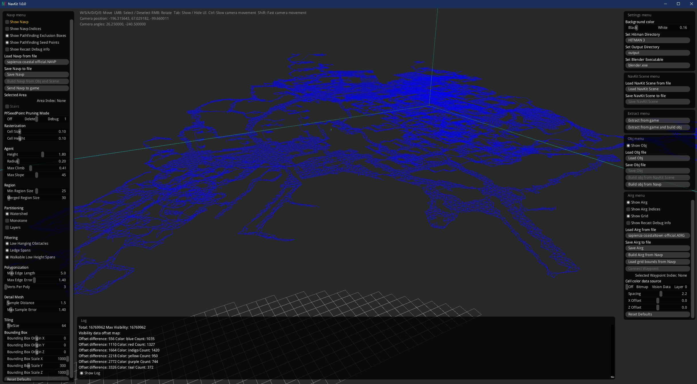
>The official Sapienza AIRG, as visualized in NavKit.

## Putting the NAVP and AIRG files together

Before the game ever checks the navigation mesh, it first checks the simplified AI Reasoning Grid, since the "valid path" check is a much lighter computation. If there is a valid path along connected waypoints from the start point to the end point, only then does it check the navigation mesh.

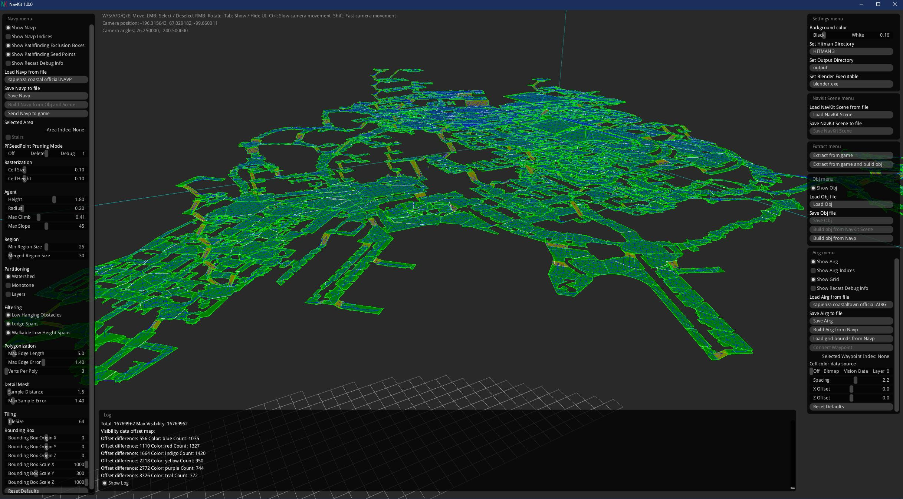
>The official Sapienza NAVP, and the official Sapienza AIRG, as visualized in NavKit.

## Custom level geometry with the original navp and airg
Now that we know how NAVP and AIRG files work, we can start to see a problem with our custom mission. We have modified the level geometry, but we are still using the original NAVP and AIRG. This means that the NPCs don't understand what should and should not be walkable space where our changes are, and NPCs will start to walk through obstacles, or avoid blank spaces.

With our custom mission running, let's get a guard in the room and lure them across the room to see how they interact with our new chair.

Go in to free cam mode on ZHMModSDK and select a guard.

Click the `Move to Hitman` button.

Move 47 out of the guard's vision by selecting him and dragging him away using the gizmo.

Throw a coin to lure the guard.

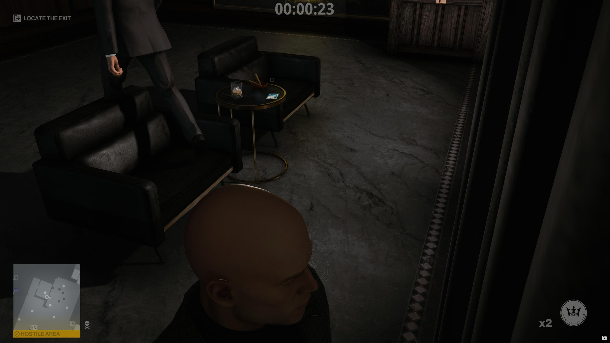

That's not very polite!

Let's take a look at the original New York navp and see why this is happening.

First we need to extract the original NAVP and AIRG.

## Loading a NAVP file and AIRG from the game files
Go to GlacierKit and on the `Game content` tab, search for `navp`. Scroll down until you see `greedy/mission_raccoon/scene_raccoon_basic.navp`. Click it and then click the `Extract file` button and save it to your computer, keeping track of where you saved it to.

Now search for `airg`. Scroll down until you see `greedy/mission_raccoon/scene_raccoon_basic_scene.airg`. Likewise, click it and then click the `Extract file` button and save it to your computer.

Now switch to NavKit, and press the `Load Navp` button on the `Navp menu`, which is the left sidebar.

Select the `.navp` file you saved and press the `Open` button to load it.

Now press the `Load Airg` button on the `Airg menu` at the bottom of the right sidebar.

Select the `.airg` file you saved and press the `Open` button to load it. It may take a minute to load the `.airg` file.

Once they are both done loading, you should see both the NAVP and AIRG displayed in NavKit.
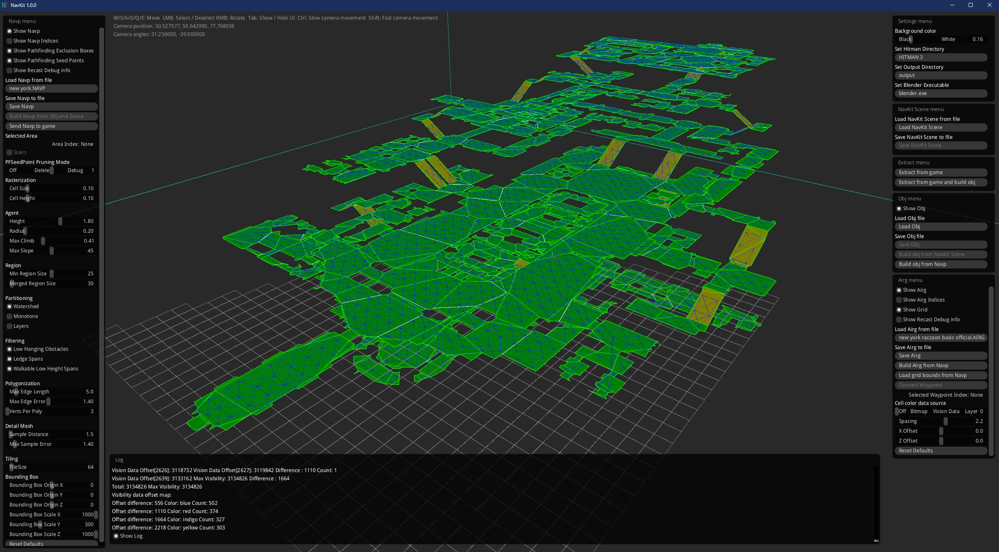

It can be a little tricky to get your bearings when looking at just the NAVP and AIRG, but you should be able to tell where the CEO's office is. Let's fly there and see what it looks like.

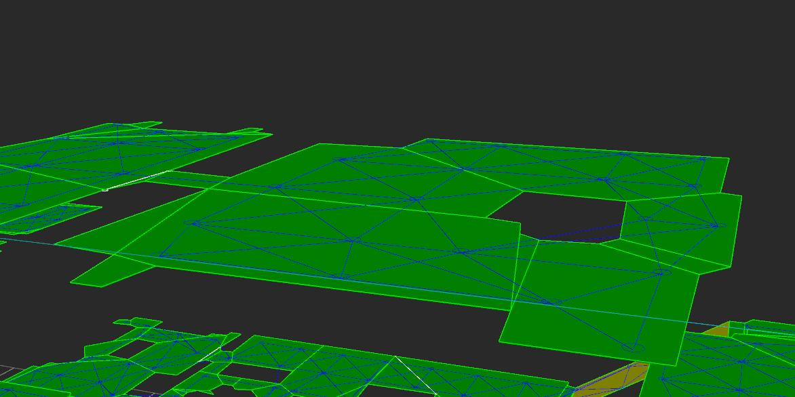

As you can see, there is only a cutout for a single chair, and there is a cutout for the crate's original position. This is why the guard walked over the chair instead of around it.

Let's generate a new NAVP file and a new AIRG file and set our custom mission to use them to fix this issue.

## Extracting a Scene
The first step to generating a new NAVP file and a new AIRG file is the extract a scene.

For this we will need to set a couple of settings.

1. Set your `Hitman 3` directory by pressing the `Set Hitman Directory` button on the top right.
2. Set the `Output` directory to a directory of your choice by pressing the `Set Output Directory. It should be on a drive that has a decent amount of space. I recommend a drive with at least 1 GB of free space, since there will need to be a lot of ALOC (collision) files extracted, and the OBJ files can get pretty large as well.
3. Set the `blender.exe` path by pressing the `Set Blender Executable`.

Now that the settings are configured. Make sure Hitman is running and your custom mission is loaded.

Press the `Extract from game` button on the `Extract menu` on the right sidebar.

This will take a minute or two. Once it is done, you should see some red boxes appear in NavKit. These are `Pathfinding Boxes` with an `Exclude` type. They tell NPCs to avoid that region, even if it is within a valid NAVP area.
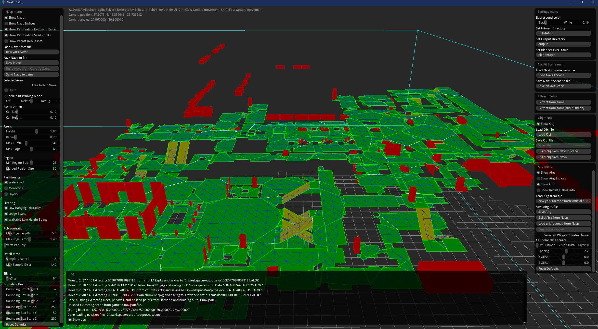

Now that you have the scene extracted, let's save it so we can load it later if we want.

To save the extracted scene, click the `Save NavKit Scene` on the `NavKit Scene menu` on the right sidebar.

You can save the file anywhere, but I like to keep all my outputs in the output folder. To stay organized, let's create a new folder in the `output` folder for our campaign named `Hitman Campaign Demo`. Create another new folder in that folder named `Bank`. Then name the file `bank.nav.json` and click the `Save` button.

## Building an OBJ (3D mesh) of the scene
Now that we have the scene extracted, you can close Hitman if you want.

Click the `Build obj from NavKit Scene` button on the `Obj menu` of the right sidebar.

This will take a minute or two, and when it's done, you will see a 3d representation of your custom mission comprised of the collision files for all the entities in the level. These are lower fidelity models of the 3D models of the level geometry that are used to calculate collisions efficiently.

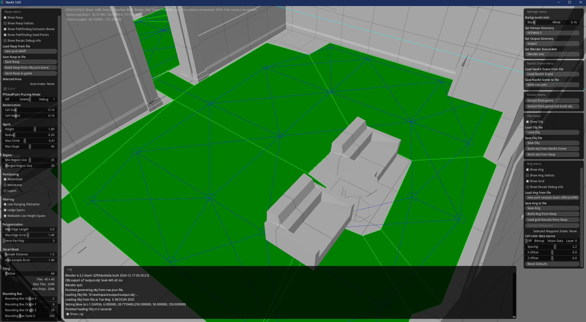

As you can see, the new chair is there, and the crate has been moved to the new location.

Let's save this OBJ file so we can load it again later if we want.

Save it as `bank.obj` in your new `Bank` folder.

Now let's build the NAVP.

## Building a NAVP from an OBJ and NavKit scene file
Now that we have the `NavKit Scene` file and the `OBJ` file loaded for our custom mission, click the `Build Navp from Obj and Scene` button on the `Navp menu`, which is the left sidebar.

After a minute, the new navp should be loaded.
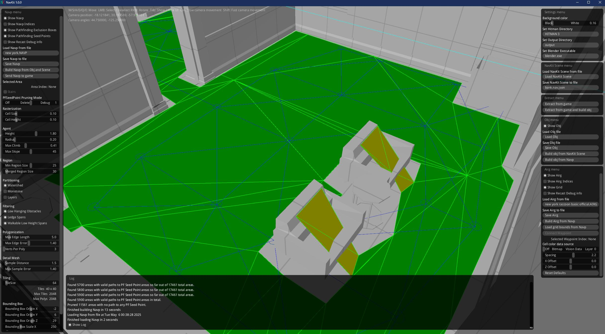

You can see that the new navp has been generated and there are now cutouts for both the chairs. In this case, it also generated some sloped ares on the chairs, but since they are not connected to anything, they shouldn't cause any issues. If you'd like you can lower the `Max Climb` or `Max Slope` values using the sliders on the `Navp menu`, the left sidebar, and regenerate the Navp.

Once you are satisfied with the NAVP, click the `Save Navp` and save it to your `Bank` folder as `bank.navp`.

The AIRG waypoints and connections still go through the new chair, so let's build the AIRG.

## Building an AIRG from a NAVP file
Now that we have the NAVP loaded, click the `Build Airg from Navp` button on the `Airg menu` on the bottom of the right sidebar.

This may take a few minutes. When it's done, you should see that the airg waypoints and connections no longer go through the new chair.

Click the `Save Airg` button and in your new `Bank` folder, save the file as `bank.airg`.

Now we have a new NAVP file and a new AIRG file for our custom scene that uses the new level geometry properly. Let's make the custom scene use these files.

## Using the NAVP file in your custom scene
In GlacierKit, go to the `scenario_raccoon.brick` file and click the `Open in editor` button, and in the `Tree` view, search for `navp`. You will see a node named `PathfinderConfiguration`. If you click that node, you will see that the `resource` field is set to:
`[assembly:/_pro/scenes/missions/greedy/mission_raccoon/scene_raccoon_basic.navp].pc_navp`

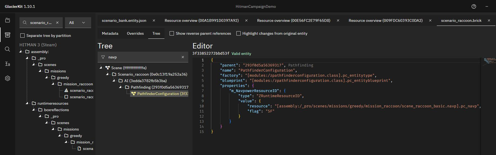

Let's use a property override to change the `resource` field. We will need to choose a new IOI string for our NAVP. The naming convention for NAVP files is generally to name it the same string as the scene, but ending in `.navp].pc_navp`, so we'll do the same. Since the IOI string for our scene is:
`[assembly:/_pro/scenes/missions/hitman_campaign_demo/mission_bank/scene_bank.entity].pc_entitytemplate`
let's use:
`[assembly:/_pro/scenes/missions/hitman_campaign_demo/mission_bank/scene_bank.navp].pc_navp`

Let's add this to our project's `Custom paths` so we don't lose it. In GlacierKit, go to the `Settings` tab, scroll down to `Custom paths` and click the `Add an entry` button. Paste in:  
`[assembly:/_pro/scenes/missions/hitman_campaign_demo/mission_bank/scene_bank.navp].pc_navp`  
and click the `Continue` button. 

For the property override, we will need the entity id of this `PathfinderConfiguration` node. It is shown above the node's text area in the right panel, under the word `Editor`: `3f33852272bbd53f`.

Back in our `scenario_bank.entity.json` file, on the `Overrides` tab, go to the `Property overrides` tab. Add this object at the end of the list:

```json
    {
  "entities": [
    {
      "ref": "3f33852272bbd53f",
      "externalScene": "[assembly:/_pro/scenes/missions/greedy/mission_raccoon/scenario_raccoon.brick].pc_entitytype"
    }
  ],
  "properties": {
    "m_NavpowerResourceID": {
      "type": "ZRuntimeResourceID",
      "value": {
        "resource": "[assembly:/_pro/scenes/missions/hitman_campaign_demo/mission_bank/scene_bank.navp].pc_navp",
        "flag": "5F"
      }
    }
  }
}
```

Press the save button.

This will override the NAVP that the scenario uses with our custom NAVP, but we don't actually have it in the mod folder yet.

The name of the file that we will need in our mod folder will actually need to use the hashed IOI string, in hexadecimal format. Let's copy our NAVP's IOI String and use GlacierKit to convert it for us.

In GlacierKit, go to the `Text tools` tab on the left sidebar and enter `[assembly:/_pro/scenes/missions/hitman_campaign_demo/mission_bank/scene_bank.navp].pc_navp` into the `Hash calculator`. Click the copy icon next to the `Hex` field, to copy the value `00DCA47815BC371B`.

Let's save another copy of our NAVP file, this time to the actual mod. In NavKit, click the `Save Navp` button and navigate to `[HITMAN DIRECTORY]/Simple Mod Framework/Mods/HitmanCampaignDemo/content/chunk12/`, and use our hashed value `00DCA47815BC371B` for the name.

Now the game will be able to find and load our NAVP file.

## Using the AIRG file in your custom scene
Let's do the same thing for the AIRG file.

In GlacierKit, go to the `scenario_raccoon.brick` file and click the `Open in editor` button, and in the `Tree` view, search for `airg`. You will see a node named `AI Reasoning Grid`. If you click that node, you will see that the `resource` field is set to:
`[assembly:/_pro/scenes/missions/greedy/mission_raccoon/scene_raccoon_basic_scene.airg].pc_airg`

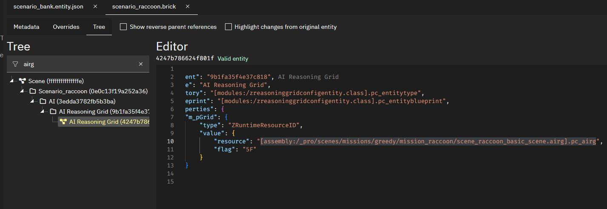

Let's use a property override to change the `resource` field. We will need to choose a new IOI string for our AIRG. The naming convention for AIRG files is generally to name it the same string as the scene, but ending in `.airg].pc_airg`, so we'll do the same. Since the IOI string for our scene is:
`[assembly:/_pro/scenes/missions/hitman_campaign_demo/mission_bank/scene_bank.entity].pc_entitytemplate`
let's use:
`[assembly:/_pro/scenes/missions/hitman_campaign_demo/mission_bank/scene_bank.airg].pc_airg`

Let's add this to our project's `Custom paths` so we don't lose it. In GlacierKit, go to the `Settings` tab, scroll down to `Custom paths` and click the `Add an entry` button. Paste in:  
`[assembly:/_pro/scenes/missions/hitman_campaign_demo/mission_bank/scene_bank.airg].pc_airg`  
and click the `Continue` button.

For the property override, we will need the entity id of this `AI Reasoning Grid` node. It is shown above the node's text area in the right panel, under the word `Editor`: `4247b786624f801f`.

Back in our `scenario_bank.entity.json` file, on the `Overrides` tab, go to the `Property overrides` tab. Add this object at the end of the list:

```json
    {
  "entities": [
    {
      "ref": "4247b786624f801f",
      "externalScene": "[assembly:/_pro/scenes/missions/greedy/mission_raccoon/scenario_raccoon.brick].pc_entitytype"
    }
  ],
  "properties": {
    "m_pGrid": {
      "type": "ZRuntimeResourceID",
      "value": {
        "resource": "[assembly:/_pro/scenes/missions/hitman_campaign_demo/mission_bank/scene_bank.airg].pc_airg",
        "flag": "5F"
      }
    }
  }
}
```

Press the save button.

This will override the AIRG that the scenario uses with our custom AIRG, but we don't actually have it in the mod folder yet.

As before, the name of the file that we will need in our mod folder will actually need to use the hashed IOI string, in hexadecimal format. Let's copy our AIRG's IOI String and use GlacierKit to convert it for us.

In GlacierKit, go to the `Text tools` tab on the left sidebar and enter `[assembly:/_pro/scenes/missions/hitman_campaign_demo/mission_bank/scene_bank.airg].pc_airg` into the `Hash calculator`. Click the copy icon next to the `Hex` field, to copy the value `0065C805E39F128A`.

Let's save another copy of our AIRG file, this time to the actual mod. In NavKit, click the `Save Airg` button and navigate to `[HITMAN DIRECTORY]/Simple Mod Framework/Mods/HitmanCampaignDemo/content/chunk12/`, and use our hashed value `0065C805E39F128A` for the name.

Now the game will be able to find and load our AIRG file.

## Testing the custom NAVP and AIRG
We now have our custom mission using custom NAVP and AIRG files. Let's try it out.

Redeploy, relaunch and start the custom mission.

Just as before, teleport the guard into the room and lure him with a distraction to the other side of the chair to see how his pathfinding reacts to the new chair.

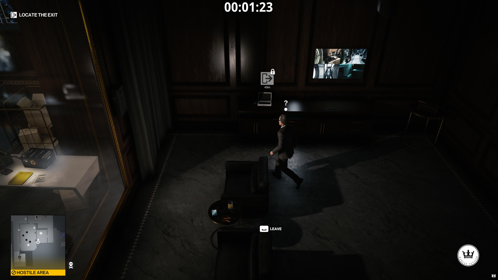

We can see that the guard avoids the new chair now.

## Next Steps
Now that we can have NPCs use our custom level geometry, let's add a new NPC that will be our target.