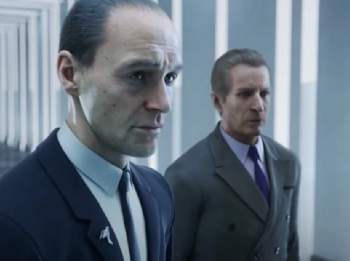

# Mission Contract

For this tutorial, we will go over creating a custom mission contract.

## Creating the `mission_bank.contract.json` file

In GlacierKit, in the `content/chunk0/` folder, create a new folder named `Mission Contracts`. In that folder create a new file named `mission_bank.contract.json`, click it, and set its contents to:

```json
{
	"Data": {
		"EnableSaving": true,
		"Objectives": [],
		"GameDifficulties": [
			{ "Difficulty": "easy", "Bricks": [] },
			{ "Difficulty": "normal", "Bricks": [] },
			{ "Difficulty": "hard", "Bricks": [] }
		],
		"Bricks": [],
		"DevOnlyBricks": [],
		"Entrances": ["[INSERT NEW UUID FOR THE ENTRANCE]"],
		"GameChangers": [],
		"GameChangerReferences": []
	},
	"Metadata": {
		"Id": "[INSERT UUID FOR THE MISSION]",
		"IsPublished": true,
		"Title": "UI_BANK_TITLE",
		"Description": "UI_BANK_DESC",
		"CodeName_Hint": "New York",
		"ScenePath": "assembly:/_pro/scenes/missions/hitman_campaign_demo/mission_bank/scene_bank.entity",
		"TileImage": "images/campaign_demo/bank/tile.jpg",
		"Location": "LOCATION_GREEDY_RACCOON",
		"LastUpdate": "2025-05-02T19:44:00.000Z",
		"CreationTimestamp": "2025-05-02T19:44:00.000Z",
		"CreatorUserId": "[INSERT GENERATED CREATOR USER ID]",
		"Type": "mission",
		"Release": "3.0.0",
		"Entitlements": ["H2_LEGACY_EXPANSION"]
	},
	"UserData": {},
	"SMF": {}
}
```

In the `Entrances` field enter a new UUID for the new entrance, for instance:
`"Entrances": ["8e2bdc62-905d-43c1-8d91-3dceb8506a77"],`    

In the `Id` field enter the same UUID for this mission that you created for the `storyconfig.JSON.patch.json` file.

In this example, we are creating a custom mission for the New York location, so the `Location` field is set to `LOCATION_GREEDY_RACCOON`, the `CodeName_Hint` field is set to `New York`, and the `Entitlements` field list is set to `H2_LEGACY_EXPANSION`.

Set the `CreatorUserId` to your personal `CreatorUserId` if there is one that you use, or a new UUID generated with GlacierKit. It's not really used anywhere currently, but maybe down the line it will be.    

Press the save button.

## Create the mission tile image
In the `blobs/images/campaign_demo` folder, create a new folder named `bank`, and in that folder, create a new image file for named `tile.jpg` with a resolution of 693 by 517.

> Here is an example you can use for the `tile.jpg` file 

## Deploying mod
Let's deploy the mod and see what it looks like.

Go to the `Campaigns` tab and you will see the new `Hitman Campaign Demo` campaign.

When you click on the `Hitman Campaign Demo` tile, you will see the new bank mission.  


If you click on that mission, you will see the mission menu on the Objectives tab.


If you click on the briefing tile, you will see our custom briefing.


If you click the Planning tab, you will see that it shows our new starting location.


If you click the new location, it will show our new starting location as the only option.


If you go back and press the Play button, the game will crash, as we haven't actually created this scene.

## Committing and merging into the `next-release` branch
Now seems like a good time to make another commit if you haven't yet. This time let's commit to our `more-setup` branch and merge it into our `next-release` branch, but let's not make a new release.

In WebStorm opened to your mod folder, open the `Commit` tab. Select every file, right-click one and press `Add to VCS`.

Press the `Terminal` button and in the terminal enter:
```batch
git commit -am "Added menu items, repository, unlockables, and planning and mission contracts"
```
and press enter. Then enter:
```batch
git push -u origin head
```
Click the `Create a pull request for 'more-setup'` link and create a new pull request with the base branch set to `next-release`.

We only have one commit, but just to build some muscle memory, let's change the merge button dropdown to `Squash and Merge`, and click that button.

For the commit message, use your original commit message but add `feat: ` at the beginning, so it says:
`feat: Added menu items, repository, unlockables, and planning and mission contracts`
and continue with the merge. Also delete the branch when prompted.

Back in WebStorm, on the terminal enter:
```batch
git pull
```
It will say that your `more-setup` branch is not on the remote. This time, since the `next-release` branch still exists on the remote, and has our changes, let's check out that branch instead of `main`. Enter:
```batch
git checkout next-release
```
Let's also delete our local copy of the `more-setup` branch. Enter:
```batch
git branch -D more-setup
```
> Note: We need to capitalize the `-D` flag this time to force the branch deletion, because we merged the `more-setup` into the `next-release` branch, but not into the `main` branch.

The next step we'll be taking is creating a new scenario and scene, so let's check out a new branch. Enter:
```batch
git checkout -b create-scenario-and-scene
```
This creates a new branch based on our `next-release` branch.

## Next Steps
Now that we have the menus set up for our new mission, lets make a new scene file and a new scenario file for it.